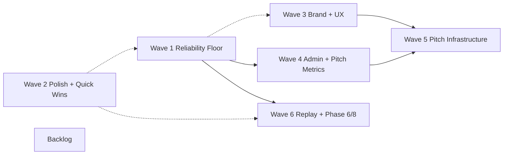

# Release roadmap — solo tutor floor → university pitch readiness

**Last updated:** 2026-06-12

> Audience: orchestrators, executors, and Andrew sequencing work across
> the tutoring-notes pilot through Aug 2026. This doc is a **thin
> orchestration overlay** on the canonical master plan — not a substitute
> for phase-spec depth.

---

## Strategic refresh — Experience-Driven Wedge (2026-06-12)

> **READ ALONGSIDE this roadmap.** A 2026-06-12 strategy brainstorm **refined the compass** (refinement, NOT pivot — the original sequencing was market-research-aligned and still is). The current strategic overlay is the **Experience-Driven Wedge** program: `~/.cursor/plans/experience-driven_wedge_ae2776e1.plan.md` (full rationale: [continuity-wedge brainstorm](research/continuity-wedge-brainstorm-2026-06-12.md)).
>
> **What changed:**
> - **Publicity-driven re-sequencing de-emphasized** — backlog is ~1 month from complete; sequence by *practical* concern, not pitch optics.
> - **The wedge is now named:** experience-driven competition. WB + reliability = **ground floor (a GATE)**; the win is an **accreting, honest, transparent, seamless** experience (**tutor-first** → parent/student).
> - **Founding principle (supersedes all):** no dark patterns; **total honesty + total transparency** — engagement claims derived-from-evidence with drilldowns.
>
> **How the program maps onto this roadmap (no row deletions — this is an overlay):**
> - **Program Phase 1 (WB reliability floor)** = existing **Gate A2 (waiting room)** + **Gate A5 (live bidirectional sync)** + **Gate A6 (replay fidelity + AV/timer sync)** + the **audio-clock fix** (`useAudioMsClock` perf.now surrogate = root cause under A6). Still the master-cut gate.
> - **Program Phases 2–3 (continuity engine + note-quality)** = **NEW strategic overlay**, not previously in the wave map — this is the moat. **Note-quality is elevated from Wave 6 polish to a first-class wedge.**
> - **Program Phase 4 (instrumentation)** = reframes deferred **Backlog "Phase 11a PostHog"** to **first-party, learner-type-keyed** capture (sub-learner = zero 3rd-party egress).
> - Engagement/dopamine, parent progress arc, marketplace = **design-compatible-for now, NOT near-term scope.**
>
> **Cadence: rolling-wave** — detailed-plan only the *next* phase. This roadmap's wave/gate ledger remains valid as depth; the program is the current compass.

---

## Purpose

Capture the Opus orchestrator's **sequencing decision** (2026-05-20) for
path from current pilot state to **mid–late Aug 2026** readiness to
credibly present to a university tutoring department head (BYU-shaped
example; no specific meeting committed).

Use this doc to answer: *what ships in what order, what can run in
parallel, and what stays deferred with an explicit reason.*

**Pilot readiness has three stages** — (1) **private pilot** with attested users (current: Sarah + trusted tutors), (2) **paid + scaled** (post–Wave 1 reliability floor + legal/OAuth hardening), (3) **self-serve** (post–brand/UX refresh + billing + verification). Each stage has a different reliability and legal bar; do not treat stage-3 requirements as blockers for stage 1. For scale-readiness checklist items see [`docs/COMMERCIAL-LAUNCH-CHECKLIST.md`](COMMERCIAL-LAUNCH-CHECKLIST.md); for minimum pilot deploy bar today see [`docs/DEPLOY.md`](DEPLOY.md) § Pilot readiness checklist.

Re-validate wave ordering **quarterly** or when Sarah pilot adds
significant new feedback. Update at end of any session that ships items
from a wave.

---

## Two audiences

| Audience | Priority | Goal |
|---|---|---|
| **Solo tutors** (Sarah pilot + similar) | Primary, ongoing | Reliability floor: Sarah uses with confidence — **no backup recorder needed.** Original pilot value prop; everything else builds on this. |
| **University tutoring departments** (e.g. BYU) | Secondary, Aug 2026 target | Be ready to credibly pitch a department head by **mid–late Aug 2026** (summer term ends; fall usage if pitch lands). **Soft deadline** — no commitment from any specific buyer. |

---

## North Star

> *"People need to use the app with confidence. Sarah is being patient,
> but that won't last forever."*

If a tutor would need to run a backup recorder alongside our app, the
feature is not done. Every wave that touches capture, upload, transcribe,
or end-session must be judged against the
[5-axis reliability bar](../../agenticPipeline/.cursor/rules/reliability-bar.mdc)
(referenced from [AGENTS.md](../AGENTS.md)).

---

## Decision criteria (ordering)

Applied in priority order when assigning or moving work:

1. **Solo-tutor reliability floor first** — Phase 2 BLOCKER-PRODs + iOS +
   Whisper. Floor = "no backup recorder."
2. **Polish + quick-wins** — XS–S items, mechanical, decoupled; parallelizable
   anywhere.
3. **Brand + UX refresh** — gated on **Sarah's full action list** (target
   Friday 2026-05-22+). Once unblocked, runs in parallel with reliability.
4. **Admin platform + pitch metrics** — after Wave 1 reliability stable;
   needs real session data + cost rollups for department pitch.
5. **Pitch-ready infrastructure** — Stripe, Phase 12 org MVP, pricing page,
   competitive doc, demo flow — after Brand + UX + Admin.
6. **Replay UX + Phase 6 completion + Phase 8 polish** — parallel-shippable
   any time after Wave 1.
7. **Backlog** — external deps (legal umbrella, pen-test vendor); needs
   real-session data not yet collected; conflicts with current architecture;
   explicitly out of scope per master plan; "after X" where X isn't done.

---

## Source-of-truth references

Cite these for depth; do not duplicate phase specs here.

| Doc | Role |
|---|---|
| `~/.cursor/plans/tutoring_notes_pilot_ready_master_plan_9aaca460.plan.md` | Canonical phase spec (~257KB). Status block **2026-05-19 ~02:30** is authoritative for plan-vs-shipped reconciliation. |
| [BACKLOG.md](BACKLOG.md) | Pilot feedback + reliability gaps |
| [AGENTS.md](../AGENTS.md) | Model usage protocol, reliability bar pointer, conventions |
| [reliability-bar.mdc](../../agenticPipeline/.cursor/rules/reliability-bar.mdc) | 5-axis adversarial review standard |

**Per-feature STATUS / architecture handoff:**

- [WHITEBOARD-STATUS.md](WHITEBOARD-STATUS.md)
- [RECORDER-LIFECYCLE.md](RECORDER-LIFECYCLE.md)
- [PHASE-1B-STATUS.md](PHASE-1B-STATUS.md)
- [PHASE-4A-STATUS.md](PHASE-4A-STATUS.md) (+ 4b/4c/4d companions)
- [RECORDER-REFACTOR-STATUS.md](RECORDER-REFACTOR-STATUS.md)
- [PHASE-PDF-STATUS.md](PHASE-PDF-STATUS.md)
- [PHASE-6-TIER-1-STATUS.md](PHASE-6-TIER-1-STATUS.md)
- [PHASE-LIVE-AV-DEVICE-MGMT-STATUS.md](PHASE-LIVE-AV-DEVICE-MGMT-STATUS.md)
- [COST-OBSERVABILITY.md](COST-OBSERVABILITY.md)
- [UX-REFRESH-PLAN.md](UX-REFRESH-PLAN.md) (superseded for Phases 1+)
- [UX-AND-A11Y-SPEC.md](UX-AND-A11Y-SPEC.md)

**Brand:**

- [BRAND.md](BRAND.md)
- [MYNK-BRAND-PHASE-2-DECISIONS.md](MYNK-BRAND-PHASE-2-DECISIONS.md)
- [MYNK-BRAND-NAME-VALIDATION-NOTES.md](MYNK-BRAND-NAME-VALIDATION-NOTES.md)
- [DESIGN-TOKENS-PLAN.md](DESIGN-TOKENS-PLAN.md)
- [MYNK-ORG-PILOT-BACKLOG.md](MYNK-ORG-PILOT-BACKLOG.md)
- [Mynk-Pre-Trademark-Implementation-Backlog.md](Mynk-Pre-Trademark-Implementation-Backlog.md)

**Recent orchestrator handoffs:**

- [docs/handoff/v1-design-session-2026-05-19-pm-orchestrator-report.md](handoff/v1-design-session-2026-05-19-pm-orchestrator-report.md)
- [docs/handoff/reliability-and-prompt-v7-2026-05-20-orchestrator-report.md](handoff/reliability-and-prompt-v7-2026-05-20-orchestrator-report.md)
- [docs/handoff/posthog-analytics-tier-0-1-bootstrapper.md](handoff/posthog-analytics-tier-0-1-bootstrapper.md)
- [docs/handoff/ai-edit-signal-phase-1-bootstrapper.md](handoff/ai-edit-signal-phase-1-bootstrapper.md)

---

## Wave map (overview)

- **W1** is the gate for solo-tutor confidence and unlocks W4/W6 parallel work.
- **W2** runs alongside anything; no hard dependency except common files.
- **W3** blocked on Sarah's full action list; parallel with W1/W2 once unblocked.
- **W4** after W1 stable (real sessions + cost data).
- **W5** after W3 + W4 (credible dept-facing demo + commerce).
- **W6** after W1; not blocked on W3–W5.

---

## Wave 1 — Reliability Floor

Solo-tutor **"no backup recorder"** North Star. Phase 2 BLOCKER-PRODs,
iOS/WebKit transcribe path, Whisper guardrails, account-takeover surfaces,
and prompt v7 hygiene. Nothing in Waves 3–5 should pull engineers off
this floor until these rows are stable in Sarah's real sessions.

| Item | Source | Size | Notes |
|---|---|---|---|
| Audio crash/refresh durability — IDB partial segments + recovery banner | BACKLOG #1 / Phase 2 task 3 | L | BLOCKER-PROD; pairs naturally with #2 |
| Upload-failure persistence — IDB hold blob until retry | BACKLOG #2 | M | BLOCKER-PROD; same architectural surface as #1 |
| Hot-swap mic / unplug silent — `track.onended` + banner | BACKLOG #7 | M | BLOCKER-PROD; partial via Phase 5 task 9 camera path |
| `rid` on mutating actions | BACKLOG #13 / Phase 2 task 4 | S | Mechanical; correlates server-action logs |
| Recording lifecycle log format — grep-friendly phase lines | BACKLOG #14 / Phase 2 task 4 | S | Mechanical |
| Lifecycle observability API (`/api/wb/lifecycle-event` + ops page) | Phase 2 task 4 | M | Persists FSM transitions beyond console |
| iOS Safari real-hardware matrix | BACKLOG #10 / Phase 2 task 2 | M | Real-device test pass + limitations doc |
| Sarah iPhone transcribe path | BACKLOG | L | WebKit-specific; depends on iOS matrix |
| Whisper pin `language: en` | BACKLOG / Phase 6 task 7 | XS | CJK false-positive guard |
| Whisper repetition-loop sliding window | Phase 2 task 5 | S | Extends `whisper-guardrails.ts` |
| Native image insert + cold refresh verification | BACKLOG / Phase 5 task 2 | M | Sarah-essential per pilot feedback |
| Account-takeover defense — email-confirmation signup | BACKLOG | M | Wires to v1 signup confirmation surface |
| Account-takeover defense — notify on password reset | BACKLOG | S | Wires to forgot-password/reset surfaces |
| Resend wiring (email infra prerequisite) | BACKLOG | M | Required by both account-takeover items |
| Long-form transcribe 60–90 min smoke | BACKLOG / Phase 6 | S | Validates Tier 1 under Vercel Pro 300s |
| AI prompt v7 fixture tests + remaining v7 work | `docs/handoff/reliability-and-prompt-v7-2026-05-20-orchestrator-report.md` | S–M | Partial in `939b1e3`; finish |
| Assessment-pivot regression tests | Phase 6 task 8 | S | Prompt hygiene for mid-sentence pivots |

**Wave 1 exit signal:** Sarah completes real sessions on iPhone + desktop
without parallel backup recording; BLOCKER-PROD rows closed in
[BACKLOG.md](BACKLOG.md); long-form smoke passes on Preview/Prod.

---

## Wave 2 — Polish + Quick Wins

XS–S mechanical fixes, operator guardrails, doc/deploy hygiene. Safe to
dispatch in parallel with Wave 1 whenever file overlap is low. Prefer
batching doc-drift + brand-doc commit items in one session.

| Item | Source | Size | Notes |
|---|---|---|---|
| Active-ping 409 cleanup | Captured 1b smoke | XS | Log noise teardown |
| "Saving last 0 segments…" copy fix | Captured 1b/4c | XS | Cosmetic count |
| Auth rate-limit normalization (10→30 or bucket split) | Phase 2 task 10 | XS | Prevents login lockouts on flaky WiFi |
| `_prisma_migrations` duplicate-row cleanup | Phase 2 task 14 | XS | NULL `finished_at` row investigation |
| `scripts/dev-join-link.mjs` | Phase 5 task 4 | XS | Dev student-join URL with correct CSP/sync |
| Tutor-tab follow on dashboard session create | Phase 5 task 5 | XS | Auto-navigate to new workspace |
| MathInsertButton first-open white-box | Phase 5 task 7 | XS | MathLive race fix |
| Snapshot link discoverability in replay | Captured 1c | XS | Promote toolbar action |
| Session note UTC vs local time | Captured / Phase 6 | XS | Parent confusion fix |
| Operational cost alerts (Neon/Vercel $25/$50) | Captured 1c | XS | Andrew operator task — billing guardrails |
| Stale STATUS doc cleanup (Phase 1b/4a "awaiting push" headers; UX-AND-A11Y-SPEC § 14.7 stale) | Doc-drift sweep | S | Reconcile with shipped reality |
| Untracked brand/UX docs commit (CTA Option A + parent scope + Sarah top-2 + 4 updated docs) | `docs/handoff/v1-design-session-2026-05-19-pm-orchestrator-report.md` § Git state | S | Cleanup multi-session backlog of uncommitted brand work |
| Sync deploy hygiene (`whiteboard-sync` pin verify script + deploy doc) | Phase 2 task 9 | S | 90-day upstream sha cadence |
| Preview DB env-scoping + `safe-migrate.mjs` | Phase 2 task 13 | S | Prevent Preview migrations hitting prod |
| Separate Vercel Blob stores per environment | Phase 2 task 15 | S | Preview vs prod blob isolation |
| Events.json content-aware orphan detection | Phase 2 task 16 | S | Refine blob-cleanup for asset URLs in events |
| Stale deploy chunk prompt (`VERCEL_GIT_COMMIT_SHA` footer + hard-refresh) | New backlog / Phase 2 captured | S | Reliability-driven UX nudge |
| Replay scrub 429 + AbortController | Phase 3 task 5 | S | Drag-thrash on audio API |
| Audio playback in AI panel post-transcribe | Phase 2 task 7 | S | Player on transcribed recording UI |
| Gap detection badge on pending segments | Phase 2 task 8 | S | Surface >1s audio gaps |
| Audio scrub / 0:00 duration completion | Phase 2 task 6 | S–M | WebM/MP4 seek metadata; partial in 1b hotfixes |
| `rotateJoinToken` in workspace header | Phase 8 task 9 | S | Invalidate join link without ending session |

---

## Wave 3 — Brand + UX Refresh

**Gated on Sarah's full action list** (target Friday 2026-05-22+). Until
unblocked, do not lock IA or burn L-sized public/tutor spec work. Once
unblocked, runs **in parallel** with Wave 1 reliability — separate
executors/branches recommended.

| Item | Source | Size | Notes |
|---|---|---|---|
| Mynk Brand Tier 2 social sweep | Master plan "what's next" / `Mynk-Pre-Trademark-Implementation-Backlog.md` | S | Domains, handles, social availability |
| Mynk P0 in-app wiring (`usemynk.com`, package metadata) | Brand + Mynk-Pre-Trademark backlog | M | Production-route brand surface |
| DESIGN-TOKENS Phase 0 (Tailwind + shadcn foundation) | UX Refresh / DESIGN-TOKENS-PLAN | M | Unblocks token migration |
| DESIGN-TOKENS Phase 1 (token migration on prod routes) | UX Refresh / DESIGN-TOKENS-PLAN | M | Replaces inline hex; ESLint hex ban per spec |
| Resume v1 IA design session (Sarah's full list trigger) | `docs/handoff/v1-design-session-2026-05-19-pm-orchestrator-report.md` | M | 5 remaining IA decisions (scheduling Y/N **locked** — post-V1/pre-release; see § V1 sequencing tiers) |
| **Scheduling + external calendar integration** | Sarah live feedback 2026-06-08; [`docs/BACKLOG.md`](BACKLOG.md) § Scheduling proposal | L | **DECISION (Andrew 2026-06-08): post-V1, pre-release** — not a master-cut gate; required before recruiting new pilots. Full spec in BACKLOG. Sync with tutor's existing calendar (e.g. Google); in-app upcoming sessions + start/join links; soft duration; needs design pass + sequencing within pre-release window |
| Phase 1 public-surface design specs (`docs/UX-DESIGNS-PHASE-1.md`) | v1 design bootstrapper | L | After IA locked; 8 surfaces |
| Phase 2 tutor-surface design specs (`docs/UX-DESIGNS-PHASE-2.md`) | v1 design bootstrapper | L | After IA locked |
| Public surface visual refresh (login, signup, forgot-password, reset-password, privacy, terms, parent-share, feedback, setup) | UX Refresh / v1 specs | L | Implement Phase 1 specs |

**Wave 3 unblock:** Sarah completes full pilot action list; orchestrator
confirms IA decisions in v1 design handoff.

**V1 sequencing tiers (ratified 2026-06-08):** Use this vocabulary consistently in orchestrator chats, STATUS docs, and backlog rows:

| Tier | Also called | Meaning |
|---|---|---|
| **V1** | master cut | `v1-redesign → master` = Sarah's complete redesigned live site. Gate A items only. |
| **Post-V1 / pre-release** | Gate B era | After master cut, before opening to recruit/advertise **new** pilots. Approval-gating, parent consent, security cleanups, **scheduling + external calendar** (see BACKLOG). |
| **Release** | recruiting new pilots | Opening the doors to recruit/advertise beyond Sarah/trusted pilots. Requires Gate B complete. |

**V1 `v1-redesign → master` cut:** Two-tier gate checklist — **canonical operational list:**
[`docs/handoff/ORCHESTRATOR-STATE.md`](handoff/ORCHESTRATOR-STATE.md) §
Pre-master gates. **Merge to master = reveal to Sarah:** production
(`tutoring-notes.vercel.app` and `usemynk.com` share the same Vercel
deployment alias on `master`; no UI-skin feature flag exists). Build on
`v1-redesign`; cut `master` only when the whole site is one cohesive release.

**Gate A — blocks master cut (V1)** (Sarah's live site complete + coherent):

1. Visual redesign + whiteboard chrome + theme parity (in flight).
2. **Waiting room** — green-room A/V verify + admit flow; timer starts when
   student leaves waiting room (designed, not built).
3. **Pass-2 in-context end-session (Gate A3)** — shared session shell; end-session
   transitions same shell to review in place (Pass-1 interim = separate review
   page today). **Deferred from `feat/wb-chrome-redo` — v1-required.** P2 git
   search (2026-06-09): no production notes-only implementation on
   `feat/wb-chrome-p2`; reconstruct from
   [`whiteboard-session-shell-design-2026-06-08.md`](handoff/whiteboard-session-shell-design-2026-06-08.md).
4. **PDF page-tab indicator (Gate A3a)** — PDF board tabs show PDF icon;
   blocked on `isPdf` field on `PageStripRow` + data propagation. **V1-required;
   deferred from `feat/wb-chrome-redo`.**
5. **SR-04a video-tile sizing (Gate A3b)** — live-A/V video fills panel /
   multi-tile auto-expand. **V1-required; deferred from `feat/wb-chrome-redo`.**
   Parent req SR-04 in
   [`whiteboard-chrome-requirements.md`](handoff/whiteboard-chrome-requirements.md).
6. **Live bidirectional whiteboard sync completeness (Gate A5)** — comprehensive
   *enumerated* audit-and-fix: every tutor action appears on the student view
   live and timely, and vice versa (freedraw, shapes, lines/arrows, text,
   eraser, move/resize/rotate, style/z-order, page CRUD, PDF, math, graph +
   expression edits, images, undo/redo, select+delete). **Sub-item (Andrew
   2026-06-10): peer-visible laser/pointer** — tutor→student + bidirectional
   student laser (**ST-05**), per-role colors tutor=coral / student=cyan;
   never built (not a regression); fix via `sync-client.ts` IMMEDIATE pointer
   envelope + `onPointerUpdate`/`isCollaborating` + `appState.collaborators`
   on both sides (see Gate A5 in
   [`ORCHESTRATOR-STATE.md`](handoff/ORCHESTRATOR-STATE.md)). **Acceptance:**
   each type verified bidirectionally via hermetic relay on real browser (**not**
   jsdom); stated timeliness bound; all gaps fixed; extend `test:wb-sync`
   invariants where feasible + manual matrix for the rest. **Starting baseline:**
   [`whiteboard-live-sync-regression.spec.ts`](../tests/integration/whiteboard-live-sync-regression.spec.ts)
   inv 1–12 (partial). **Not yet started — v1-required.**
7. **Replay fidelity + AV/timer sync (Gate A6)** — replay reconstructs every
   whiteboard action in correct order and timing, aligned with session timer
   and recorded audio (same action-type enumeration as A5). **Acceptance:**
   temporal alignment within stated tolerance; no missing/dropped/reordered
   events; verified on real recorded sessions. **Starting baseline (partial):**
   [`recording-end-to-end.spec.ts`](../tests/integration/recording-end-to-end.spec.ts),
   replay event-log unit tests, [`WHITEBOARD-STATUS.md`](WHITEBOARD-STATUS.md)
   § 1.4. **Not yet started — v1-required.** Both A5 and A6 embody the
   north-star reliability bar (no backup recorder alongside our app).

**Design note:** waiting room, live board, and Pass-2 review = **one session
shell, three modes** — design together
([`session-lifecycle-consent-design-2026-05-31.md`](handoff/session-lifecycle-consent-design-2026-05-31.md)).

**Gate B — post-V1 / pre-release** (before **release** = recruiting new pilots;
some urgent because site is already live, just unadvertised):

6. **Approval-gating / waitlist** — sign-up parks on waitlist; no cost until
   Andrew approves (cost exposure exists today).
7. **Parent privacy consent** — real `ConsentRecord` architecture;
   V1 toggles only for shipping features (`allowAudioRecording`,
   `allowWhiteboardRecording`, `allowNoteSending`, `allowLiveSession`).
8. **Security checks + final cleanups** — before new pilots.
9. **Scheduling + external calendar integration** — post-V1, pre-release; not a
   master-cut gate. Full spec: [`docs/BACKLOG.md`](BACKLOG.md) § Scheduling
   proposal. Needs design pass + sequencing within this window.

**Escape hatch (not building now):** per-email allowlist if a prod fix must
ship before full reveal. **Accepted cost:** long-lived `v1-redesign` branch
until Gate A complete. Chrome requirements:
[`docs/handoff/whiteboard-chrome-requirements.md`](handoff/whiteboard-chrome-requirements.md).
Durable rows: [`docs/BACKLOG.md`](BACKLOG.md) § V1 redesign — pre-master.

---

## Wave 4 — Admin Platform + Pitch Metrics

Starts after **Wave 1 reliability stable** — dashboards need real
session volume, CostEvent rows, and trustworthy FSM/outbox behavior for
a department-head conversation.

| Item | Source | Size | Notes |
|---|---|---|---|
| SystemEvent table + `logEvent()` wrapper | Phase 9b | M | Server-side event stream beyond stdout |
| `/superadmin/metrics` (system / tutor / student tabs) | Phase 9c | M | Operator metrics; needs real session data |
| `/admin/insights` cost-per-session dashboard | Phase 9d / Phase 11e | M | Joins CostEvent + SystemEvent; demoable for pitch |
| User mgmt + impersonation | Phase 9e | M | Onboard tutor #2 without SQL |
| Security Tier B audit + incident/secret runbooks + 2FA design (design-only) | Phase 9f | M | After Tier A merged |
| Pricing model decision (`docs/PRICING-MODEL.md`) | Phase 10a | XS as decision | Defensible dept-facing pricing framing; needs CostEvent data |
| React #418 hydration on critical surfaces | Captured 4a / Phase 8 | M | Admin + workspace hydration |

---

## Wave 5 — Pitch-Ready Infrastructure

After **Wave 3 + Wave 4** — credible university demo needs refreshed
public surfaces, cost/session metrics, and commerce/org scaffolding.

| Item | Source | Size | Notes |
|---|---|---|---|
| Stripe checkout + subscription | Phase 10b–10e | L | Full commerce |
| Phase 12a–12g org MVP (15-min dept onboarding) | Phase 12 | L | Org entity, members, invites, pool, admin UI, manual Stripe |
| `assertOrgMember` auth boundary | Phase 12 | M | Sonnet/Opus-tier design |
| Per-org theming | DESIGN-TOKENS-PLAN / Phase 12 | M | Foundation for university pilot visuals |
| Public landing **pricing page** (visual) | Schools-pitch / Phase 10a | M | Not in master plan; orchestrator scope |
| Competitive positioning doc (TutorBird / Teachworks / Wyzant) | BACKLOG research / Schools-pitch | S | Not in master plan; orchestrator scope |
| University-department demo flow / scripted walkthrough | Schools-pitch | S–M | Not in master plan; orchestrator scope |

---

## Wave 6 — Replay + Phase 6 Completion + Phase 8 Polish

Parallel-shippable **any time after Wave 1**. Improves tutor/parent replay
and live-session polish; not on the Aug pitch critical path unless pilot
feedback elevates a row.

| Item | Source | Size | Notes |
|---|---|---|---|
| Multi-page replay schema v2 + page tabs | Phase 3 task 2 | M | `pageId` on WBEvent; full replay tabs |
| Replay theme user preference (not OS-only) | Phase 3 task 3 | S | localStorage toggle |
| Unsaved-note navigation guard on replay | Phase 3 captured | S | Prevent losing generated notes |
| FSM-state-aware empty-replay copy | Phase 3 task 7 | XS | Distinguish gate-held vs never-started |
| Snapshot multi-page composite thumbnail | Captured 1c | S | Misleading single-page PNG |
| Per-segment transcription resilience UI | Phase 6 task 3 | M | Ordering, dedupe, visible per-segment errors |
| Diarization decision (multi-track / Whisper diarization) | Phase 6 task 6 | M | Architecture choice; design pass |
| AI link extraction | Phase 6 task 4 | S | From BACKLOG |
| Stroke styling on replay (sloppiness, fillStyle) | Captured 1b | S | Extend WBElement |
| Phase 5 task 3 follow-mode v2 | Phase 5 | M | Independent peer view-state |
| Phase 5 task 6 remote tile cam-off initials | Phase 5 | XS | Polish |
| Phase 5 task 10 rehearsal recording mode | Phase 5 | S | Prep-before-student-joins replay gap |
| Phase 5 task 11 per-viewer view state | Phase 5 | M | After follow-mode v2 |
| Phase 8 mobile audit + pilot playbook | Phase 8 | M | UX consistency on phones/tablets |
| Phase 8 orphan blob scheduled job (recurring) | Phase 8 task 4 | M | One-off cleanup already shipped |
| Note form divergence audio vs WB | Captured | S | UX consistency |
| AVTile "Tap to hear" autoplay detection | Phase 4c smoke | S | iPhone asymmetric audio |
| Workspace SSR 500 investigation | Phase 4c smoke | S | Opportunistic Vercel log dig |
| TURN server deployment | Phase 4 follow-up | M | Only if NAT failures reported |

---

## Backlog (deferred)

Explicit deferral reasons — do not silently pull into a wave without
orchestrator re-sequence (e.g. legal umbrella publishes → Phase 11 moves
to Wave 4/5).

| Item | Source | Reason for deferral |
|---|---|---|
| Phase 11a PostHog instrumentation | `docs/handoff/posthog-analytics-tier-0-1-bootstrapper.md` | Blocked on mortensenapps.com legal umbrella publish (Andrew controls). Resume when published. |
| Phase 11b–11d AiNoteEditSignal | `docs/handoff/ai-edit-signal-phase-1-bootstrapper.md` | Same legal block + needs 50–100 signal rows + UX refresh first. |
| Unified `/admin/insights` (Phase 11e) | Phase 11 | Joins PostHog + Cost + AI signals + SystemEvent — depends on 11a–11c. Deferred component lands in Wave 4 partial. |
| Phase 7 status model + auto-email cron | Phase 7 | Depends on Phase 6 background queue architecture decision (Tier 2). Not on critical path. |
| Phase 10-pre external pen-test ($2–5k) | Phase 10-pre | Vendor scheduling XL calendar; required before paying customers but not before pitch demo. |
| Phase 8 task 8 — privacy/terms redirect to mortensenapps | Phase 8 | Conflicts with current `docs/LEGAL-SYNC.md` subordinate-facade model. Skip as written; revisit if umbrella strategy shifts. |
| TranscribeJob Tier 2 background queue | Phase 6 task 2 | Tier 1 + 300s likely sufficient post-Vercel-Pro; smoke first. |
| Multi-page replay event log (full) | Captured | Large polish; defer unless pilot demands. |
| Desmos state capture (Phase 1.5) | Smoke list | Polish; not pilot-blocking. |
| Whiteboard Phase 2 (collab text/code/Office/Wolfram) | `docs/WHITEBOARD-STATUS.md` | Separate `agenticPipeline` whiteboard plan; demo gate = 3 real Sarah sessions. |
| Option C multi-tier page model spike | New backlog | Future PDF/page architecture. Deferred. |
| SFU / Cloudflare DO / tldraw / PWA | Master plan out-of-scope | Explicitly out of pilot. |
| Video-track recording | Master plan deferred | Until Sarah requests. |
| PDF position lock / pan-clamp design spike | PDF captured backlog | Polish. |
| Vercel Blob rate limit on 30-page PDF import | PDF captured | Reliability polish; uncommon path. |
| In-app onboarding polish | BACKLOG | Wave 3+ UX refresh subsumes. |
| Google OAuth sign-in + sign-up (parents + tutors) | BACKLOG § Identity/access | Post-V1 fast-follow after Wave 3 ships; credentials-only today; provider in `auth-options.ts` not on login/signup UI. |

---

## Stale plan items — do NOT re-execute

Master plan body can lag shipped reality. Treat **plan status block
2026-05-19 ~02:30** plus git history as tie-breaker. These are explicitly
**done or superseded** — do not open fresh branches for them.

| Stale item | Reality |
|---|---|
| **Security Tier A** — plan says branch not merged (`8cdbe58`) | Shipped as `4118f3e`. ✅ |
| **Phase 4d / device management** — plan says "4d remains" | Shipped (`41bf006`, `ac92137`). ✅ |
| **Phase 8 orphan sweep one-off** | Done in Phase 2 task 11 (`22d9afc`); only **scheduled** sweep remains (Wave 6). |
| **Phase 8 task 8 privacy/terms redirect** | Conflicts with [LEGAL-SYNC.md](LEGAL-SYNC.md) subordinate-facade model. In Backlog above. |
| **`ignoreCommand` docs-only skip builds** | Shipped per master plan status block (`477e22a`). ✅ |
| **Recorder refactor B1–B5** | Not in master plan TOC; already done. |
| **Whiteboard Phase 2 demo gate** | Not in master plan; lives in separate whiteboard plan. |

---

## Doc maintenance

**When to update this file**

- End of any session that ships, defers, or re-classifies items from any
  wave (move row between waves or into/out of Backlog with reason).
- Quarterly review, or immediately when Sarah pilot adds significant new
  feedback that changes reliability or UX gating assumptions.

**How to update**

- Keep item tables in sync with orchestrator decisions — do not let this
  doc drift into a second master plan. Phase depth stays in
  `~/.cursor/plans/tutoring_notes_pilot_ready_master_plan_9aaca460.plan.md`.
- When moving items: note blocker cleared (e.g. legal umbrella → unblock
  Phase 11) or assumption shift (e.g. NAT failures → promote TURN within
  Wave 6).
- Cross-link shipped work in the relevant `*-STATUS.md` and trim stale
  "awaiting push" headers (Wave 2 doc-drift item).

**When to revisit ordering**

- Sarah completes full action list → ungate Wave 3.
- Wave 1 exit signal met → accelerate Wave 4.
- Aug 2026 pitch date firming → confirm Wave 5 scope vs demo-only subset.
- New BLOCKER-PROD from pilot → insert in Wave 1; do not bury in Wave 2.

---

## Executor dispatch notes

- **Wave 1** items touching FSM/outbox/end-session: read
  [RECORDER-LIFECYCLE.md](RECORDER-LIFECYCLE.md) before editing.
- **5-axis review** required for any new capture/upload/transcribe
  surface per [AGENTS.md](../AGENTS.md); BLOCKERs are Phase-1 acceptance,
  not follow-ups.
- **Auth-boundary / org work** (Wave 4–5): escalate per AGENTS.md model
  protocol (Composer default; Sonnet for `assertOrgMember` design).
- **Brand/legal**: follow [LEGAL-SYNC.md](LEGAL-SYNC.md) for privacy/terms;
  Wave 3 public refresh must not violate subordinate-facade model.

---

## Changelog

- **2026-06-12:** Added "Strategic refresh — Experience-Driven Wedge" overlay (top). Compass refined (not pivoted): publicity-driven re-sequencing de-emphasized; wedge named (experience-driven competition, tutor-first); founding principle (no dark patterns / total honesty + transparency); program-to-wave mapping (Phase 1 = Gate A2/A5/A6 + audio-clock; Phases 2-3 continuity + note-quality = new moat overlay; Phase 4 = first-party instrumentation reframing Phase 11a). Rolling-wave cadence.
- **2026-05-20:** Initial roadmap committed during release-pivot orchestration session.
