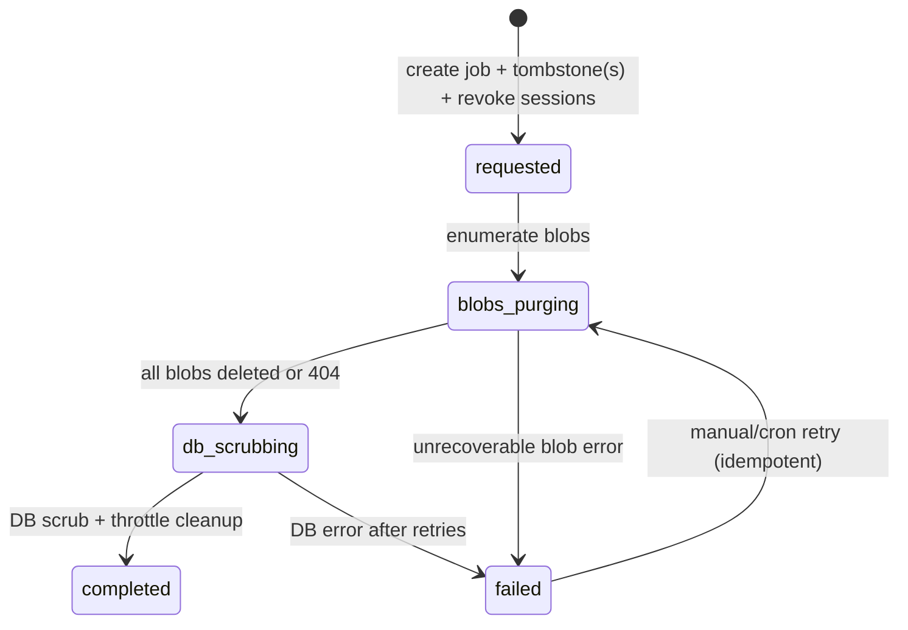

# Learner / family right-to-erasure — implementation plan

> **Status:** Implementation plan (design doc only — no code in this commit)  
> **Branch:** `wb-wave5-polish`  
> **Authored:** 2026-06-30  
> **Sarah-merge blocker:** 4th pre-Sarah **consent-honesty** workstream (COPPA/GDPR right-to-erasure)  
> **Companion plans:** [Block B — client audio-consent gate](wb-block-b-consent-gate-plan.md) (part a); [CC-1 / CC-2 — consent-record gate](cc1-cc2-consent-gate-plan.md) (parts b/c)

---

## 1. Context — why pre-Sarah

Real minor signups begin at the Sarah cutover — **no going back** territory. Parents need a full **“delete everything”** option the moment they sign up. COPPA/GDPR right-to-erasure is not a post-launch nice-to-have.

**Today (verified 2026-06-30):**

| Gap | Evidence |
|---|---|
| No product erasure action | No server action or account-dashboard flow performs tombstone + content purge |
| Tombstone **WRITE** path unbuilt | `AccountHolder.tombstonedAt` / `LearnerProfile.tombstonedAt` exist in schema ([`prisma/schema.prisma:830-832`](../../prisma/schema.prisma), [`879-880`](../../prisma/schema.prisma)) but no production code sets them |
| Tombstone **READ** enforcement live | See §2.3 — gates deny access when `tombstonedAt` is set |
| Every existing delete surface is inadequate | See §3.4 — orphans blobs, destroys billing rows, or hits `Restrict` FKs |

This plan is the **fourth** consent-honesty workstream alongside Block B, CC-1, and CC-2. All four should land before Sarah merge.

**Prerequisite reads:** [`docs/LEGAL-SYNC.md`](../LEGAL-SYNC.md) (minor-data / tutor-consent sections), [`prisma/schema.prisma`](../../prisma/schema.prisma) Identity + B2 consent blocks, [`src/lib/blob.ts`](../../src/lib/blob.ts).

---

## 2. Ratified semantics (Andrew 2026-06-30 — do not re-open)

**Option A + preserve-headless-business-data:** *“Follow the law completely, but don't delete more than is compliant.”*

### 2.1 DELETE / SCRUB set (PII-bearing content + identity)

| Entity / surface | Action |
|---|---|
| **AccountHolder** | Redact `email`, `passwordHash`, `displayName`, `familyId`; set `tombstonedAt` ([`schema:812-832`](../../prisma/schema.prisma)) |
| **LearnerProfile** | Redact `displayName` → placeholder (`"Deleted learner"`); set `tombstonedAt` ([`schema:874-880`](../../prisma/schema.prisma)) |
| **LearnerCredential** | Delete (Cascade from LP) ([`schema:908-911`](../../prisma/schema.prisma)) |
| **LearnerDeviceSession** | Revoke / delete all for profile |
| **AccountHolderSession** | Bulk-revoke via existing helper ([`account-holder-session.ts:200-205`](../../src/lib/account-holder-session.ts)) — **not wired from any tombstone path today** |
| **AccountHolderEmailToken** | Delete (Cascade) |
| **PasswordResetToken** | Delete rows whose `email` matches redacted AH email (no FK; email-scoped sweep) |
| **Student** | Scrub PII in place: `name` → placeholder, `parentEmail` → `null` — **row kept** (opaque `id` preserved for headless FKs). No `tombstonedAt` column today (see §4.3) |
| **SessionNote** | Scrub text: `topics`, `homework`, `assessment`, `nextSteps`, `linksJson` → empty/placeholder ([`schema:140-155`](../../prisma/schema.prisma)) |
| **SessionRecording** | Delete row **after** blob delete; scrub `transcript` if row retained transiently ([`schema:227-231`](../../prisma/schema.prisma)) |
| **TranscriptChunk** + **TranscriptChunkExtraction** | Delete rows; purge `chunkBlobUrl` blobs ([`schema:418-487`](../../prisma/schema.prisma)) |
| **TutorNote** | Delete or scrub `content` ([`schema:494-514`](../../prisma/schema.prisma)) |
| **WhiteboardSession** | **Keep row**; null `eventsBlobUrl` / `snapshotBlobUrl` **after** blob delete; billing slice preserved ([`schema:294-370`](../../prisma/schema.prisma)) |
| **SessionParticipant**, **WhiteboardJoinToken**, **ShareLink**, **NoteView** | Delete / revoke (Cascade-safe or explicit) |
| **ConsentRestriction** | Delete (Cascade from LP — optional child-narrowing; not a legal record) |
| **AuthThrottle** / **LearnerLoginThrottle** | Delete rows whose `scopeKey` embeds PII (`ah-login:<email>`, `hard:<familyId>:<username>`, `soft:<username>:…`) ([`schema:1018-1053`](../../prisma/schema.prisma)) |
| **All Vercel Blobs** | Enumerate family/learner scope → `deleteBlob` ([`blob.ts:14-24`](../../src/lib/blob.ts)) |

### 2.2 PRESERVE set (de-identified / legal / audit)

| Entity | Rationale | Anchor |
|---|---|---|
| **WhiteboardSession** billing slice | `activeMs`, `durationSeconds`, `startedAt`, `endedAt`, `activatedAt`, `bothConnectedAt`, `lastActiveAt`, `sessionPhase`, `sessionMode`, `createdAt` — headless per-session financials | [`schema:294-370`](../../prisma/schema.prisma) |
| **CostEvent** | FKs `SetNull` on delete — rows survive artifact deletion | Migration [`20260517120000_add_cost_events`](../../prisma/migrations/20260517120000_add_cost_events/migration.sql) L28-31; [`cost-events.ts`](../../src/lib/observability/cost-events.ts) |
| **ConsentRecord** | Legal record; `onDelete: Restrict` | [`schema:1069-1092`](../../prisma/schema.prisma) |
| **SessionConsentSnapshot** | Legal record; `onDelete: Restrict` — **not a blocker** because we keep the `WhiteboardSession` row | [`schema:1114-1128`](../../prisma/schema.prisma) |
| **StudentClaimInvite** (claimed audit) | `claimedAt`, `claimedByAccountHolderId` — no PII in row after AH redaction | [`schema:951-967`](../../prisma/schema.prisma) |
| **ImpersonationLog** | Operator audit | [`schema:698-711`](../../prisma/schema.prisma) |
| **AdminUser** / tutor state | Unaffected |

### 2.3 “Redacted learner” bucket intent

After erasure, tutors **permanently lose** session **content** and learner **identity** but retain **de-identified per-session financials** keyed by opaque `Student.id` / `WhiteboardSession.id`. Future cost-vs-minutes-billed tooling can aggregate on `WhiteboardSession.activeMs` + `CostEvent` without re-identifying the minor. `Student.name` becomes a non-identifying placeholder; `learnerProfileId` may be `SetNull` (already [`schema:118`](../../prisma/schema.prisma)).

### 2.4 Tombstone read-enforcement already live (WRITE path is the gap)

| Surface | Tombstone check | Lines |
|---|---|---|
| `assertOwnsLearnerProfile` | `profile.tombstonedAt !== null` → 404 | [`learner-profile-scope.ts:47-50`](../../src/lib/learner-profile-scope.ts) |
| Learner device session | `learnerProfile.tombstonedAt` → null session | [`learner-session.ts:76`](../../src/lib/learner-session.ts), [`135-137`](../../src/lib/learner-session.ts) |
| AccountHolder session | `accountHolder.tombstonedAt` → invalid | [`account-holder-session.ts:128-130`](../../src/lib/account-holder-session.ts) |
| AH login | tombstone → `invalid_credentials` | [`api/auth/account-holder/login/route.ts:81-83`](../../src/app/api/auth/account-holder/login/route.ts) |
| Learner login | AH + LP tombstone checks | [`api/auth/learner/login/route.ts:116-150`](../../src/app/api/auth/learner/login/route.ts) |
| Share access | LP tombstone → deny | [`share-access-scope.ts:148`](../../src/lib/share-access-scope.ts), [`301`](../../src/lib/share-access-scope.ts) |
| Join scope | LP tombstone → deny | [`join-scope.ts:88`](../../src/lib/join-scope.ts) |
| Claim pages / complete route | AH + LP tombstone | [`claim/[token]/page.tsx`](../../src/app/claim/[token]/page.tsx), [`api/claim/.../complete/route.ts`](../../src/app/api/claim/[token]/complete/route.ts) |
| Consent scope | LP tombstone on record fetch | [`consent-scope.ts:358`](../../src/lib/consent-scope.ts) |

**Implication for erasure:** Setting `tombstonedAt` **first** immediately denies access via existing gates — even if blob/DB purge is mid-flight.

---

## 3. Design

### 3.1 Orchestrated erasure action (new server action)

**Module:** `src/lib/erasure/` (service layer) + thin server actions:

| Entry point | Principal | Assertion |
|---|---|---|
| `requestLearnerErasureAction(learnerProfileId, confirmToken)` | AccountHolder (parent) | `assertOwnsLearnerProfile` **before** tombstone — extend with erasure-specific path that allows idempotent retry when profile already tombstoned but job incomplete |
| `requestFamilyErasureAction(confirmToken)` | AccountHolder | Must own AH row; tombstones AH + **all** non-fixture `LearnerProfile` children |
| `requestErasureByAdminAction(learnerProfileId \| accountHolderId)` | Operator (`ADMIN` role) | Separate assertion; support path for verified parental requests |

**UX (both surfaces):**

- Irreversible confirmation: typed phrase (`DELETE` / learner display name) + CRITICAL_ACTION email token **or** re-auth (match existing consent critical-action pattern in [`AccountHolderEmailTokenPurpose.CRITICAL_ACTION`](../../prisma/schema.prisma)).
- Clear copy: content permanently destroyed; billing metadata retained de-identified; tutors lose session history.
- Post-submit: redirect to logged-out / confirmation page; session cookies cleared via revoke helpers.

**Scopes:**

1. **Per-learner erasure** — one `LearnerProfile` + all linked `Student` rows (multi-tutor) + their content/blobs.
2. **Full family erasure** — `AccountHolder` + all `LearnerProfile` children + all linked students.

Do **not** call existing `deleteStudent` or `deleteWhiteboardSessionAndDataAction` — they implement the wrong semantics (§3.4).

### 3.2 Tombstone WRITE path

New `tombstoneAccountHolder(tx, accountHolderId)` and `tombstoneLearnerProfile(tx, learnerProfileId)` in `src/lib/erasure/tombstone.ts`:

```text
AccountHolder:
  email        → deterministic tombstone "deleted+<uuid>@erased.invalid"
  passwordHash → null
  displayName  → "Deleted account"
  familyId     → null  (frees unique constraint; scrub throttle keys first)
  tombstonedAt → now()
  → revokeAllAccountHolderSessions(accountHolderId)  // EXISTING helper — wire here

LearnerProfile:
  displayName  → "Deleted learner"
  tombstonedAt → now()
  → revoke all LearnerDeviceSession for profile (new helper mirroring AH pattern)
  → LearnerCredential cascades on profile delete OR explicit delete before tombstone
```

**Order:** Tombstone identity **before** blob purge begins (same transaction as erasure-job row creation — §4.1). Revoke sessions in the same transaction so no in-flight request retains access.

### 3.3 Student PII scrub decision

**Recommendation: scrub-in-place (no `Student.tombstonedAt` migration).**

| Approach | Verdict |
|---|---|
| Scrub-in-place | **Preferred.** Row kept for `WhiteboardSession.studentId`, `CostEvent.studentId` SetNull semantics, claim-invite audit. `name` → `"[Deleted learner]"`, `parentEmail` → `null`. Tutor UI already shows student name — placeholder is sufficient. |
| Add `Student.tombstonedAt` | Rejected for v1 unless tutor surfaces need an explicit gate. Tombstone gates run on `LearnerProfile`; after erasure `learnerProfileId` is `SetNull` ([`schema:118`](../../prisma/schema.prisma)). No migration required. |

If tutor student list should hide erased students, filter `Student.learnerProfileId IS NULL AND name = placeholder` or add optional `erasedAt` in a follow-up — **not Phase-1** unless Andrew wants list hygiene in v1.

### 3.4 Why existing delete surfaces are inadequate

| Surface | Location | Why inadequate |
|---|---|---|
| `deleteWhiteboardSessionAndDataAction` | [`notes-actions.ts:391-464`](../../src/app/admin/students/[id]/whiteboard/notes-actions.ts) | Deletes `SessionNote` + `WhiteboardSession` row entirely — **destroys** headless billing slice; **never deletes blobs** (`eventsBlobUrl`, `snapshotBlobUrl`, audio, chunk blobs, embedded assets); **fails** on `SessionConsentSnapshot` `Restrict` FK if snapshot exists |
| `deleteStudent` | [`actions.ts:810-814`](../../src/app/admin/students/[id]/actions.ts) | `db.student.delete` — Cascade destroys `WhiteboardSession`, `SessionRecording`, notes; **orphans all blobs**; **destroys** `CostEvent` FK targets; no AccountHolder/LearnerProfile tombstone |
| `deleteFixtureAccountHolder` | [`dev-fixtures.ts:323-351`](../../src/lib/dev-fixtures.ts) | Hard-deletes fixture LP → hits `ConsentRecord` `Restrict`; no blob cleanup; fixture-only |
| `scripts/blob-cleanup.mjs` | [`loadReferenceSet` L199-223](](../../scripts/blob-cleanup.mjs) | Orphan **sweep only** (not erasure); reference set omits `TranscriptChunk.chunkBlobUrl`, checkpoint prefix, events.json embedded assets |

### 3.5 Content purge (DB text)

For each `Student` linked to the erased `LearnerProfile`(s):

1. **SessionNote** — `updateMany` scrub text fields to `""` / `"[]"` (do not delete row if `WhiteboardSession.noteId` still references — prefer scrub over delete to keep FK graph stable).
2. **SessionRecording** — delete rows (after blob delete) OR scrub `transcript` then delete; `CostEvent.sessionRecordingId` already `SetNull`.
3. **TranscriptChunk** + **TranscriptChunkExtraction** — delete (Cascade from session — but session is **kept**, so explicit `deleteMany` by `sessionId` IN scope).
4. **TutorNote** — `deleteMany` by `sessionId` OR scrub `content`.
5. **WhiteboardSession** — `update` null blob URL columns; keep billing columns.
6. **ShareLink** — `updateMany` set `revokedAt`; **NoteView** — delete.
7. **WhiteboardJoinToken** — delete or revoke.
8. **SessionParticipant** — delete (PII is `learnerProfileId` link — session kept headless without participant row).

Run in idempotent transactions keyed by erasure-job phase (§4.1).

### 3.6 Blob enumerator + purge

**New:** `enumerateLearnerFamilyBlobs(scope): Promise<Set<string>>` in `src/lib/erasure/blob-inventory.ts`.

| Source | How to enumerate | Anchor |
|---|---|---|
| `SessionRecording.blobUrl` | Query by `studentId` IN scope | Upload path [`recording/upload.ts:76`](../../src/lib/recording/upload.ts) `sessions/${studentId}/…` |
| `WhiteboardSession.eventsBlobUrl` / `snapshotBlobUrl` | Query by `studentId` IN scope | Create path [`whiteboard/actions.ts:152-170`](../../src/app/admin/students/[id]/whiteboard/actions.ts); upload [`whiteboard/upload.ts:98`](../../src/lib/whiteboard/upload.ts), [`115`](../../src/lib/whiteboard/upload.ts) |
| Embedded assets in `events.json` | Fetch each `eventsBlobUrl` (server-side token); parse with **`collectReplayAssetUrls`** pattern | [`replay-helpers.ts:6-23`](../../src/lib/whiteboard/replay-helpers.ts); asset upload [`whiteboard/upload.ts:148`](../../src/lib/whiteboard/upload.ts) |
| `TranscriptChunk.chunkBlobUrl` | Query by `sessionId` IN scope | [`schema:424`](../../prisma/schema.prisma) — **missing from blob-cleanup today** |
| `whiteboard-checkpoints/` | `list({ prefix: \`whiteboard-checkpoints/${sessionId}/\` })` per session | [`checkpoint/route.ts:121`](../../src/app/api/whiteboard/[sessionId]/checkpoint/route.ts) — URLs **not** in DB |

**Purge:** For each URL, `deleteBlob(url)` ([`blob.ts:14`](../../src/lib/blob.ts)). Log `ers=` lines with **opaque ids only** (studentId/sessionId/uuid — never email, name, transcript snippet).

**blob-cleanup.mjs fix (same PR wave):** Extend `loadReferenceSet` to include `transcriptChunk.chunkBlobUrl` so scheduled sweeps catch stragglers. Checkpoints remain prefix-sweep only (no DB column by design — [`checkpoint/route.ts:139-144`](../../src/app/api/whiteboard/[sessionId]/checkpoint/route.ts)).

---

## 4. Reliability / atomicity (CRITICAL)

DB + Vercel Blob deletion is **not atomic**. Design: **resumable, fail-closed erasure** — access denied immediately; PII never left readable after tombstone; partial failure recoverable.

### 4.1 State machine

**New table (additive migration):** `ErasureJob`

| Column | Purpose |
|---|---|
| `id` | uuid |
| `scopeKind` | `learner_profile` \| `account_holder` |
| `scopeId` | LP or AH id |
| `status` | `requested` → `blobs_purging` → `db_scrubbing` → `completed` \| `failed` |
| `requestedAt` | immutable |
| `requestedByPrincipal` | `account_holder` \| `admin` + opaque principal id |
| `blobInventoryJson` | cached URL list (refreshed at start of `blobs_purging`; allows resume without re-query PII) |
| `blobsDeletedJson` | URL subset successfully deleted |
| `lastError` | sanitized — no PII |
| `completedAt` | nullable |

**Phases (strict order):**



1. **`requested` (synchronous, single transaction):** Create `ErasureJob`; tombstone AH/LP(s); revoke all sessions; scrub throttle keys that embed PII; **commit**. User sees success — access already denied via §2.4.
2. **`blobs_purging`:** Enumerate → iterate `deleteBlob`; mark each URL in `blobsDeletedJson`; tolerate 404. On transient Blob API error: stay in phase, retry later.
3. **`db_scrubbing`:** Scrub/delete content per §3.5; null blob columns on `WhiteboardSession`; delete `SessionRecording` rows; scrub `Student` PII.
4. **`completed`:** Set `completedAt`.

**Fail-closed rule:** While job ∈ `{requested, blobs_purging, db_scrubbing}`, all read paths for that principal/profile remain tombstone-gated. **Never** expose session content APIs for scrubbed sessions even if billing row exists — add erasure-aware guards on tutor replay/events/audio routes: if parent `Student` has no `learnerProfileId` and name is placeholder **or** `ErasureJob.completed` for linked LP, return 404 for content endpoints (billing summary may still show duration).

### 4.2 Crash recovery

| Crash point | Recovery |
|---|---|
| After tombstone commit, before blobs | Cron / admin “retry erasure” resumes at `blobs_purging`; re-enumerate or use cached inventory |
| Mid-blob delete | `blobsDeletedJson` idempotent skip; re-run delete for remainder |
| After blobs, mid-DB scrub | Re-run DB scrub phase (updates are idempotent empty-string scrubs) |
| Vercel function timeout | Phase boundary per invocation; job row tracks progress; **no** single long transaction spanning Blob API |

**Recovery worker:** `POST /api/internal/erasure/process` (cron or queue) + CLI `npm run erasure:resume -- --jobId=…` for support. Guard with `ERASURE_WORKER_SECRET` or Vercel cron auth.

### 4.3 Observability — log prefix `ers`

Per AGENTS.md convention, propose **`ers`** (erasure):

```text
[ers] ers=<jobId> action=requested scope=learner_profile scopeId=<uuid> principal=account_holder
[ers] ers=<jobId> action=blob_deleted url_hash=<sha256 prefix> studentId=<uuid>
[ers] ers=<jobId> action=phase_complete phase=db_scrubbing
[ers] ers=<jobId> action=completed
```

**Never log:** email, displayName, transcript text, blob URLs containing PII path segments (hash URLs if needed for correlation).

---

## 5. Commit sequencing (small, reviewable)

| Commit | Contents |
|---|---|
| **E1** | Migration: `ErasureJob` table only (additive) |
| **E2** | `src/lib/erasure/tombstone.ts` + session revoke helpers + unit tests |
| **E3** | `blob-inventory.ts` + `collectReplayAssetUrls` reuse + inventory tests (mocked Blob fetch) |
| **E4** | Erasure orchestrator (`processErasureJob`) + `ers` logging |
| **E5** | Server actions + account dashboard UI + admin support UI |
| **E6** | Tutor content-route guards (replay/events/audio 404 post-erasure) |
| **E7** | `blob-cleanup.mjs` reference-set fix + `scripts` test update |
| **E8** | Integration tests + smokebook |

**Migrations:** Additive only. No `Student.tombstonedAt` in v1 unless Andrew reverses §3.3.

**PLATFORM-ASSUMPTIONS.md:** Update if erasure worker cron, new env var (`ERASURE_WORKER_SECRET`), or documented Blob list/delete rate limits become load-bearing.

---

## 6. Test plan

| # | Test | Gate |
|---|---|---|
| 1 | After erasure: **no PII** in DB (`email`, `displayName`, note text, transcripts, `parentEmail`) for scoped learner/family | jest integration with fixture DB |
| 2 | After erasure: **no reachable blob bytes** for enumerated URLs (mock `del` + assert inventory complete) | jest |
| 3 | **Business data preserved:** `WhiteboardSession.activeMs`, `durationSeconds`, timestamps remain; `CostEvent` rows still queryable by `whiteboardSessionId` | jest |
| 4 | **Redacted bucket:** tutor can still aggregate session count / minutes for `studentId` placeholder; cannot load events/audio/transcript | jest + manual smoke |
| 5 | **Idempotent retry:** run `processErasureJob` twice — no error; no double-delete side effects | jest |
| 6 | **Simulated mid-erasure crash:** tombstone committed, job stuck in `blobs_purging` — resume completes; content APIs 404 throughout | jest |
| 7 | **Ownership:** non-owner AH cannot erase another family's LP; tutor cannot invoke parent erasure action | jest |
| 8 | **Tombstone gates:** login, share, join, `assertOwnsLearnerProfile` deny post-tombstone | extend existing identity tests |
| 9 | **Blob inventory:** fixture events.json with embedded `assetUrl` → enumerator returns main + asset URLs | jest (fixture JSON) |
| 10 | **chunkBlobUrl** included in inventory and blob-cleanup reference set | jest |

**`test:wb-sync`:** **Not required** unless erasure touches whiteboard apply-path / sync code (it should not). **jest-only** for this feature. Run `npx next build` before merge (new routes/actions).

---

## 7. 5-axis adversarial reliability review (Phase-1 acceptance)

| Axis | Risk | Mitigation (BLOCKER = must ship in Phase 1) |
|---|---|---|
| **Data durability** | Orphan blobs = PII leak; premature row delete = billing loss | **BLOCKER:** Enumerator covers all blob sources (§3.6); headless session row kept; `CostEvent` never deleted |
| **Recovery / resumability** | Vercel timeout mid-purge; partial blob delete | **BLOCKER:** `ErasureJob` phase machine + idempotent `deleteBlob` + resume worker |
| **Concurrency** | Parent clicks erase twice; erasure races active session | **BLOCKER:** Unique partial index on active job per scope OR idempotent job creation; tombstone + session revoke in one transaction |
| **Auth / ownership** | Cross-family erasure; tutor triggers parent delete | **BLOCKER:** `assertOwnsLearnerProfile` / AH ownership / admin role; CRITICAL_ACTION or re-auth confirmation |
| **Observability** | Cannot debug erasure without PII in logs | **BLOCKER:** `ers=` lifecycle logs with opaque ids only; job row `lastError` sanitized |

---

## 8. Open items for Andrew

1. **Parent self-service vs admin-only for v1?** Plan wires both; which ships first?
2. **Immediate hard-purge vs short grace/undo window** before blob phase starts? (Tombstone is immediate either way — grace only delays blob/DB purge.)
3. **Tutor notification** when learner content is erased? Email/in-app or silent?
4. **Per-learner vs full-family only?** Plan supports both scopes — confirm v1 UI exposes both or family-only.
5. **Tutor student list:** hide placeholder students or show `"[Deleted learner]"` for audit?

---

## 9. Fragile-surface note

| Surface | Touch? | Notes |
|---|---|---|
| Auth / identity / session revoke | **Yes** | Wire `revokeAllAccountHolderSessions`; add learner device revoke. Additive helpers — do not relax tombstone read checks |
| `assertOwnsLearnerProfile` | **Extend** | Allow erasure orchestrator to detect in-progress/completed job without exposing profile PII to non-owner |
| Blob delete | **Yes** | Irreversible; use existing `deleteBlob` 404-swallow semantics |
| Tutor replay / events / audio API routes | **Yes** | Add erasure-aware 404 — do not change apply-path or sync |
| `deleteWhiteboardSessionAndDataAction` | **No change in v1** | Tutor delete remains separate product decision; document that it is NOT erasure |
| `lifecycle-machine.ts`, `upload-outbox`, `peer-mesh` | **No** | Out of scope |
| Migrations | Additive only | `ErasureJob` table; no column drops |

**Escalation:** If erasure scope expands to hard-delete `WhiteboardSession` rows (violates ratified semantics) or touches consent `Restrict` deletes — stop and re-ratify with Andrew.

---

## Appendix A — Verified anchor drift (2026-06-30)

| Audit map claim | Verified location | Drift |
|---|---|---|
| AccountHolder tombstone ~L830-832 | `schema.prisma:830-832` | None |
| LearnerProfile tombstone ~L870-880 | `schema.prisma:879-880` | Comment block starts L870 |
| WhiteboardSession billing ~L346-370 | `schema.prisma:346-370` | None |
| ConsentRecord ~L1069-1092 | `schema.prisma:1069-1092` | None |
| SessionConsentSnapshot ~L1114-1128 | `schema.prisma:1114-1128` | None |
| `revokeAllAccountHolderSessions` ~L200-205 | `account-holder-session.ts:200-205` | None |
| `deleteWhiteboardSessionAndDataAction` ~L391-464 | **`app/admin/.../notes-actions.ts:391-464`** | Path was `src/lib/` in audit |
| `deleteStudent` ~L810-814 | **`app/admin/students/[id]/actions.ts:810-814`** | Path was `src/lib/actions.ts` |
| `eventsBlobUrl` put ~L152 | **`app/admin/.../whiteboard/actions.ts:152-170`** | Path was `whiteboard/actions.ts` in lib |
| CostEvent SetNull migration | **`20260517120000_add_cost_events`** L28-31 | Not `cost-events.ts` alone |

**Proposed log prefix:** `ers` (erasure job id in `ers=<jobId>`).

---

## Phase-1 acceptance addendum — 5-axis review (2026-06-30)

The following findings from the Sonnet 5-axis adversarial review are **folded into Phase-1 acceptance** for this plan. See [`consent-blocker-5axis-review-2026-06-30.md`](consent-blocker-5axis-review-2026-06-30.md) for full detail and remediations.

- **B-7** — `PasswordResetToken` swept by ORIGINAL email BEFORE redaction — fix tombstone-txn ordering
- **B-8** — `ErasureJob` partial unique index on active scope / upsert
- **H-2** — re-enumerate blobs after quiescence to catch in-flight uploads at tombstone time
- **H-3** — events.json asset enumeration: `WhiteboardAsset` table at upload OR per-session checkpoint to avoid Vercel timeout at scale
- **M-4** — add `Student.erasedAt` durable flag; route guards check it instead of heuristic
- **M-5** — `ErasureJobBlob` child table or batched count for large families
- **L-1** — `blob-cleanup.mjs` must include `chunkBlobUrl`

**Cross-plan gap:** erasure vs an ACTIVE session — `endWhiteboardSession` must short-circuit segment registration when an `ErasureJob` is in-progress for the student (or `db_scrubbing` cleans post-inventory segments).

**Additive migrations now expected:** `ErasureJob` + partial unique index, `Student.erasedAt`, optionally `WhiteboardAsset` / `ErasureJobBlob`.

**Required new tests:** T-new-H, T-new-I
