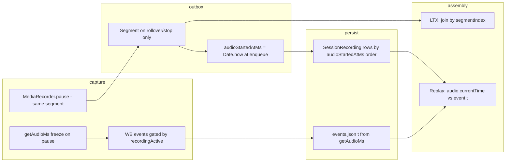

# Pause / disconnect / draw-during-disconnect — code analysis (P0 prep)

**Status:** CODE-HALF complete (read-only, `v1-redesign` @ `e485c4d`)  
**Branch:** `analysis/pause-disconnect-behavior`  
**Date:** 2026-06-04  
**Hardware-half:** Andrew — real tutor+student devices (see §6)  
**Do not edit:** `docs/handoff/ORCHESTRATOR-STATE.md` (orchestrator-owned)

**Built on (not re-derived):**

- [`session-lifecycle-redesign-brief-2026-06-02.md`](session-lifecycle-redesign-brief-2026-06-02.md) — P0 wall-clock invariant, freeze-vs-advance
- [`live-transcription-spike-STATUS.md`](live-transcription-spike-STATUS.md) — LTX assembly GAP @ `c3c627f`
- [`docs/RECORDER-LIFECYCLE.md`](../RECORDER-LIFECYCLE.md), [`docs/LIVE-AV.md`](../LIVE-AV.md)

**LTX spike code** read via `git show spike/live-transcription:…` (not checked out).

---

## Executive summary (code-confirmed)

| Layer | Pause / student sync disconnect behavior | Wall-clock gap preserved? |
|-------|------------------------------------------|-------------------------|
| **Session timer** (`liveTimerMs`) | **Freezes** when sync peer count = 0 or tutor socket down | **Yes** (presence-driven `activeMs`; gaps not credited across stale disconnect) |
| **`getAudioMs()`** | **Freezes** whenever `recordingActive === false` | **No** — elapsed audio timeline compresses pauses |
| **Whiteboard event log** | **Stops appending** when `recordingActive === false`; `pause`/`resume` markers at boundaries | **No** — same freeze as `getAudioMs` |
| **MediaRecorder (tutor mic)** | **`pause()` / `resume()`** on auto-pause / disconnect only; tutor **Pause** button finalizes via `stopAndUpload("final")` | **UNVERIFIED** in decoded audio — likely no silence inserted inside blob |
| **Upload outbox** | Segments from rollovers / stop; `audioStartedAtMs: Date.now()` at enqueue | Wall-clock stamp exists but **not** used for replay/LTX alignment |
| **LTX assembly** (spike only) | `transcripts.join("\n\n")` by `segmentIndex` | **No** — gap collapsed at assembly (and capture lacks `timelineStartMs`) |
| **Replay** | WB `t` ↔ `audio.currentTime`; replay uses **first** `SessionRecording` by `createdAt` | Aligns WB with **first audio blob only**; multi-segment + gaps **UNVERIFIED** |

**Precise gap-loss (P0 violation) for LTX:** `assembleIncrementalTranscript` in `src/lib/ltx-actions.ts` on `spike/live-transcription` — naive concat + sum of `durationSeconds` (see §3).

**Draw-during-disconnect (student left sync room):** Tutor can still draw and **live-sync** may still broadcast; strokes are **not** written to the event log while `recordingActive` is false; on reconnect a **snapshot** at frozen `t` may fold gap strokes into one jump (see §4).

---

## 1. Clock behavior matrix

Legend: **Freeze** = timeline used for WB `t` / `getAudioMs` does not advance. **Advance** = wall-clock or presence timer continues. **Diverge** = two clocks behave differently.

| Scenario | `getAudioMs()` | Session timer (`liveTimerMs`) | Wall-clock vs audio-clock | Code locus |
|----------|----------------|------------------------------|---------------------------|------------|
| **Normal recording** | **Advance** | **Advance** (both in room) | Track together while recording + both present | `useAudioMsClock(active)` with `active === recordingActive` (`WhiteboardWorkspaceClient.tsx` ~237–253, ~1441); timer `computeDisplayActiveMs` + `bothPartiesInRoom` (~728, ~2329–2338) |
| **User Pause** (`userWantsRecording === false`) | **Freeze** | **Advance** if student still on sync | **Diverge** — billing timer can run while capture clock stops | FSM `idle` → `recordingActive: false` (`lifecycle-machine.ts` ~420–422); `useAudioMsClock(recordingActive)`; timer still uses `bothPartiesInRoom` (~728), independent of recording (~2201–2248 comment) |
| **A/V disconnect** (WebRTC `disconnected` / `failed`, student still in sync room) | **Advance** (if FSM still `recording`) | **Advance** | No auto-pause from WebRTC alone | `lifecycleInputStreams` marks peer mic `degraded`/`failed` (`WhiteboardWorkspaceClient.tsx` ~1104–1116); FSM does **not** downgrade global state on stream health (`lifecycle-machine.ts` ~388–392) |
| **Student sync disconnect** (`peerCount === 0`, had participant) | **Freeze** | **Freeze** | Aligned for this case | FSM `paused` / `all_participants_disconnected` (~464–465) → `recordingActive: false`; `bothPartiesInRoom` false (~728); `useAudioMsClock` + audio bridge pause (~164–167 in `WhiteboardWorkspaceAudioBridge.tsx`) |
| **Reconnect** (student rejoins sync) | **Resume** from accrued ms | **Resume** counting | Gap not inserted in `getAudioMs` — continuous audio ms | `recordingActive` true again; `useAudioMsClock` resumes `performance.now()` delta (~241–246); timer pings `active: true` (~2239–2247) |
| **Chat-only / AV-fallback** | **N/A on branch** | **N/A** | Brief describes target semantics; **no chat-only mode in workspace code** | No `chat` / AV-fallback gate found in `WhiteboardWorkspaceClient.tsx` (grep 2026-06-04) — **design-only** per brief |
| **In-person solo** (`!syncUrl` / `syncEnabled: false`) | **Advance** when tutor wants recording | **N/A** (no `syncUrl` → timer effects return early ~2240, ~2296) | Solo uses recording clock only | FSM step 3: `syncEnabled === false` → `recording` (~425–427); no participant gating |

### `getAudioMs()` implementation (CODE-CONFIRMED)

```237:253:src/app/admin/students/[id]/whiteboard/[whiteboardSessionId]/workspace/WhiteboardWorkspaceClient.tsx
function useAudioMsClock(active: boolean): () => number {
  const startedAtRef = useRef<number | null>(null);
  const accruedMsRef = useRef(0);
  useEffect(() => {
    if (active) {
      startedAtRef.current = performance.now();
    } else if (startedAtRef.current !== null) {
      accruedMsRef.current += performance.now() - startedAtRef.current;
      startedAtRef.current = null;
    }
  }, [active]);
  return useCallback(() => {
    if (startedAtRef.current === null) return Math.floor(accruedMsRef.current);
    return Math.floor(
      accruedMsRef.current + (performance.now() - startedAtRef.current)
    );
  }, []);
}
```

- Wired as `useAudioMsClock(recordingActive)` (~1441), **not** `userWantsRecording` alone.
- Comment (~229–235): surrogate until `MediaRecorder.getElapsedAudioMs()`; accumulates across pauses in the sense of **not counting wall time while inactive** (freeze), not preserving wall gaps.

### Session timer (CODE-CONFIRMED)

- **Presence:** `bothPartiesInRoom = tutorSyncConnected && peerCount >= 1` (~728).
- **Display:** `computeDisplayActiveMs` (~2329) — freezes display when `!clientActiveNow`; advances with server `activeMs + (now - lastActiveAt)` while both present (~152–171 in `active-time.ts`).
- **Independent of recording** (~2201–2203): solo-rehearsal / auto-pause do not stop the timer if the student is still connected.

---

## 2. Recorder FSM transitions

### States on pause / disconnect / reconnect / end

| Event | FSM `state` | `recordingActive` | `shouldCaptureWB` | Segment finalize? |
|-------|-------------|---------------------|-------------------|-------------------|
| Tutor **Pause** (WB-session pills) | `idle` | `false` | `false` | **Yes** — `stopAndUpload("final")` finalizes the current audio segment (not `MediaRecorder.pause()`); next Start opens a new `SessionRecording`. Replay multi-segment gap fixed on `fix/replay-multi-segment` (`1936955`). |
| Student **sync leave** (after ever had peer) | `paused` (`all_participants_disconnected`) | `false` | `false` | **No** — same pause path |
| Student **reconnect** | `recording` | `true` | `true` | **No** — `resumeRecording()` (~1190–1195) |
| **End session** | `stopping` → `uploading` → `done` via `endIntent` | `false` | `false` during stopping except capture drain | **Yes** on final `stopAndUpload("final")` |
| **Network offline** | `paused` (`network_offline`) | `false` | — | **Not wired** — `networkOk: true` hardcoded (~1282) |

Evaluator precedence: `lifecycle-machine.ts` `evaluateLifecycle` (~394–467).

### Whiteboard log markers (CODE-CONFIRMED)

`useWhiteboardRecorder.ts` Section B (~767–817):

- **Off:** flush pending diff, `pushEvent({ type: "pause", t })` with `t = getAudioMs()`.
- **On:** snapshot at `t`, optional `resume` if log non-empty.

Sync socket markers (~859–876):

- `sync-disconnect` / `sync-reconnect` only if `recordingActiveRef.current` — during auto-pause (recording off), **disconnect markers are not logged**.

### Audio-flow gate (armed, not pause)

`awaiting_audio_flow` holds `armed` until WebRTC audio flows (~437–454). Separate from disconnect pause.

---

## 3. Gap-collapse mechanism (capture → outbox → assembly)

### End-to-end trace



### Where the wall-clock gap is lost

| Stage | What happens to a 30s student disconnect mid-session | Gap preserved? |
|-------|------------------------------------------------------|----------------|
| **Capture — WB** | `getAudioMs` frozen 30s; no stroke `t` advancement; `pause` at T | **No** in event timeline |
| **Capture — audio** | `pauseRecording()` stops encoder/timer; **no new outbox row** at pause | **No** in segment index timeline |
| **Outbox** | `audioStartedAtMs: Date.now()` (~832 `WhiteboardWorkspaceClient.tsx`) | Stamp is wall time, **unused** for alignment |
| **End session** | Multiple segments sorted by `audioStartedAtMs` (~592–597 `actions.ts`) | Order only; **no gap insertion** in replay |
| **LTX assembly** | **`assembleIncrementalTranscript`** — `transcripts.join("\n\n")`, `totalDurationSeconds` = sum of audio durations | **No — primary P0 break** |

**LTX gap-loss location (spike branch, CODE-CONFIRMED):**

`git show spike/live-transcription:src/lib/ltx-actions.ts` — function `assembleIncrementalTranscript` (~lines 241–305 in that file):

- Query: `orderBy: { segmentIndex: "asc" }`
- Assembly: `const assembled = transcripts.join("\n\n").trim()`
- Span: `totalDurationSeconds` += each segment's `durationSeconds` (null if any missing)

No `timelineStartMs` on schema/row in this path; six RED tests in `src/__tests__/ltx/ltx-timeline-assembly.test.ts` @ `c3c627f` document required behavior (30s gap → segment B at 35s, span 40s not 10s).

### Whiteboard ↔ audio replay coupling (v1-redesign)

`WhiteboardReplay.tsx` drives scene from `audio.currentTime * 1000` vs event `t`. Both WB `t` and decoded audio likely **compress** the same real-world pause → may **look aligned to each other** but **not** to session wall clock or `liveTimerMs`. **UNVERIFIED** on device for decoded pause gap inside single MediaRecorder blob.

### Multi-segment replay limitation (CODE-CONFIRMED)

Review page uses **first** recording only: `audioRecordings[0]` with `orderBy: { createdAt: "asc" }` (`page.tsx` ~113–128). Footer warns when `length > 1`. Later segments **not** in replay audio element.

---

## 4. Draw-during-disconnect

**Assumption:** Student **left sync room** → `recordingActive === false` (auto-pause). Tutor remains on workspace with sync up.

| Path | Behavior | CODE-CONFIRMED? |
|------|----------|-----------------|
| **Live canvas** | Excalidraw `onChange` still runs | Yes |
| **Live sync to student** | `handleExcalidrawChange` → `scheduleDocumentBroadcast()` when `sync && syncUrl` **without** `recordingActive` gate (~2918–2920) | Yes |
| **Event log (`events.json`)** | `flushPendingDiff` returns early when `!recordingActiveRef` — updates `prevElements` / scratch only (~569–572) | Yes |
| **Viewport log (`pvs`)** | `recordViewport` skips when inactive (~653–661) | Yes |
| **Remote student strokes** | `ingestRemote` → `applyRemoteToCanvas`; may return `{ recordScene }` only if `recordingActive` path in flush | Partial — apply runs; log only if recording |
| **On reconnect** | `recordingActive` true → snapshot at `getAudioMs()` (~776–802) includes board state via `preRecordingScratch` / `prevElements` | Yes — gap strokes may appear as **snapshot jump**, not timed diffs during gap |
| **sync-disconnect marker** | **Not** emitted while paused (~875) | Yes |

**Replay implication:** Strokes drawn during disconnect are **likely missing** from incremental timeline unless the **resume snapshot** captures them at reconnect `t` (compressed timing). **UNVERIFIED** — hardware replay scrub vs session timer.

**Student disconnected but still on sync** (hypothetical): If `peerCount >= 1` with broken WebRTC only, recording **may continue** and strokes **would** log — **UNVERIFIED** in production.

---

## 5. Freeze-vs-advance — decision inputs

### What the code does today

- **Freeze cohort:** `getAudioMs`, WB `t`, `recordingActive` gating — **one coupled freeze** on pause/disconnect.
- **Advance cohort:** Session billing timer (`activeMs`) on presence — **pauses only when sync says student gone**, not on tutor Pause.
- **A/V vs sync:** Disconnect pause is **sync peer count**, not WebRTC state (`peer-mesh.ts` documents ICE `disconnected` for future UI ~184–187; FSM ignores it today).

### Trade-offs for design pass

| Approach | Pros | Cons vs current code |
|----------|------|----------------------|
| **Freeze (status quo)** | WB replay ↔ single paused MediaRecorder blob stays self-consistent; minimal FSM change | Violates P0; LTX must not use naive concat; session timer **diverges** on tutor Pause |
| **Advance wall-clock** (align with `activeMs` / presence) | Matches brief session timer; preserves billing gaps; fixes LTX/WB stamping with one authority | Requires `timelineStartMs` on every segment/event; MediaRecorder must **split** or **pad silence** at pause boundaries; FSM may need `recordingActive` decoupled from “clock running” |
| **Dual clocks** (freeze audio ms + wall stamp) | Smaller change to replay loop | Two sources of truth; easy to mis-wire LTX/WB/audio; higher test burden |

### Recommendation (code-grounded, for design pass)

1. **P0 requires advancing a single wall-clock session timeline** for stamping (brief § P0) — **freeze-only `getAudioMs` is incompatible** with gap preservation for LTX and likely WB.
2. **Less invasive anchor for new stamps:** Reuse the **presence timer pipeline** already implemented (`bothPartiesInRoom` → `active-ping` → `activeMs` / `computeDisplayActiveMs`) as the **authoritative `timelineStartMs` source**, because it already freezes on student sync disconnect and matches Sarah’s “timer stops when student leaves.”
3. **Keep `getAudioMs` freeze only as a legacy replay axis** until replay/audio pipeline emits gap-aware media; do **not** treat it as the session wall clock for new features.
4. **Recording gate** (`recordingActive`) should remain separable from **clock advance** (brief chat-only case) — today they are incorrectly coupled for tutor Pause vs timer.

**Invasive work (cannot avoid for P0):** segment boundaries at pause/disconnect, `timelineStartMs` on outbox + LTX schema, replace `assembleIncrementalTranscript` join, replay multi-segment or gap-aware single blob — per spike STATUS fix outline.

---

## 6. Named hardware test cases (Andrew)

Use two devices (tutor + student), sync enabled, recording started after student joins. Record: session timer, pill/banner, Vercel logs (`wbsid`, `wba`, `pvs`, `rid`), replay scrub.

| ID | Scenario | CODE-expected | Suspect if |
|----|----------|---------------|------------|
| **H1 — Draw-during-disconnect** | Student closes tab 30s; tutor draws; student rejoins | Timer **frozen** ~30s; pill auto-paused; strokes **absent** in replay mid-gap or **bunched** at resume; audio **no** 30s silence | Timer keeps running; strokes smooth in replay during gap; audio continuous with no gap |
| **H2 — Audio resume placement** | Same as H1; note wall time of disconnect vs replay | After reconnect, audio at wall T+30s maps to WB/content at **same** replay offset | Audio continues immediately after pre-pause content (concatenated) |
| **H3 — Tutor Pause vs timer** | Student stays; tutor **Pause** 30s; tutor draws | `getAudioMs` frozen (no new `t` events); timer **keeps advancing** (CODE) | Timer freezes on tutor Pause |
| **H4 — A/V only down** | Mute/block WebRTC only; keep student page open on sync | Recording **may stay red**; strokes **logged** | Auto-pause despite student still “in room” on sync |
| **H5 — sync-disconnect markers** | Disconnect during active recording vs during auto-pause | `sync-disconnect` in log only when recording was active | Marker during auto-pause; or missing during active recording |
| **H6 — Segment boundary** | 30s disconnect crossing segment rollover boundary | **UNVERIFIED** — pause stops rollover timer | Unexpected extra `SessionRecording` row at pause |
| **H7 — Multi-segment replay** | Session with 2+ rollovers + pause | Review shows **first segment only** (CODE) | Replay audio contains later segments |
| **H8 — iOS background** | Tutor backgrounds tab 30s | `tab-hidden` events; clock/throttle **UNVERIFIED** | `getAudioMs` jumps or drifts vs timer |

---

## 7. Open questions / unknowns

| Question | Why code insufficient |
|----------|------------------------|
| Does `MediaRecorder.pause()` omit 30s of timeline in decoded WebM/MP4? | Encoder/browser behavior; not in repo |
| A/V failed but sync peer present — production frequency? | Depends on network; FSM keeps recording |
| Chat-only session active, recording paused, timer running | **Not implemented** — brief only |
| Student receives tutor strokes drawn during tutor auto-pause | Sync broadcast likely yes; student UX **UNVERIFIED** |
| Cross-device timer drift vs `activeMs` | Server heartbeats + 60s stale cap — needs two tabs |
| LTX on `v1-redesign` | **Absent** — analysis from `spike/live-transcription` only |
| Replay alignment when `audioRecordings.length > 1` | Only first blob wired — multi-segment policy undecided |

---

## Code reference index

| Topic | File | Functions / lines |
|-------|------|-------------------|
| Audio ms clock | `WhiteboardWorkspaceClient.tsx` | `useAudioMsClock` ~237–253; hook ~1441 |
| FSM | `lifecycle-machine.ts` | `evaluateLifecycle` ~394–467 |
| Workspace wiring | `WhiteboardWorkspaceClient.tsx` | lifecycle ~1275–1294; timer ~2165–2338 |
| Audio pause | `WhiteboardWorkspaceAudioBridge.tsx` | effect ~156–177 |
| MediaRecorder | `useAudioRecorder.ts` | `pauseRecording` ~1182; `resumeRecording` ~1190 |
| WB recorder | `useWhiteboardRecorder.ts` | `flushPendingDiff` ~569; pause/resume ~767–817; sync markers ~859–876 |
| Outbox enqueue | `WhiteboardWorkspaceClient.tsx` | `onWorkspaceAudioRecorded` ~804–833 |
| End segments | `upload-outbox-instance.ts` | `assembleEndSessionSegments` ~190–207 |
| End DB | `actions.ts` | `endWhiteboardSession` ~489–597 |
| Session timer | `active-time.ts` | `computeActivePingUpdate`, `computeDisplayActiveMs` |
| Live A/V reconcile | `useLiveAV.ts` | `onRoomPeersChange` ~1330–1380 |
| LTX assembly (spike) | `ltx-actions.ts` | `assembleIncrementalTranscript` |
| LTX RED spec | `ltx-timeline-assembly.test.ts` | `gapScenario`, six tests |

---

## Verification performed

- Read-only grep/read on `analysis/pause-disconnect-behavior` @ `e485c4d`
- `git show spike/live-transcription:src/lib/ltx-actions.ts` + `ltx-timeline-assembly.test.ts`
- No production code modified; no `tsc` run (docs-only)
