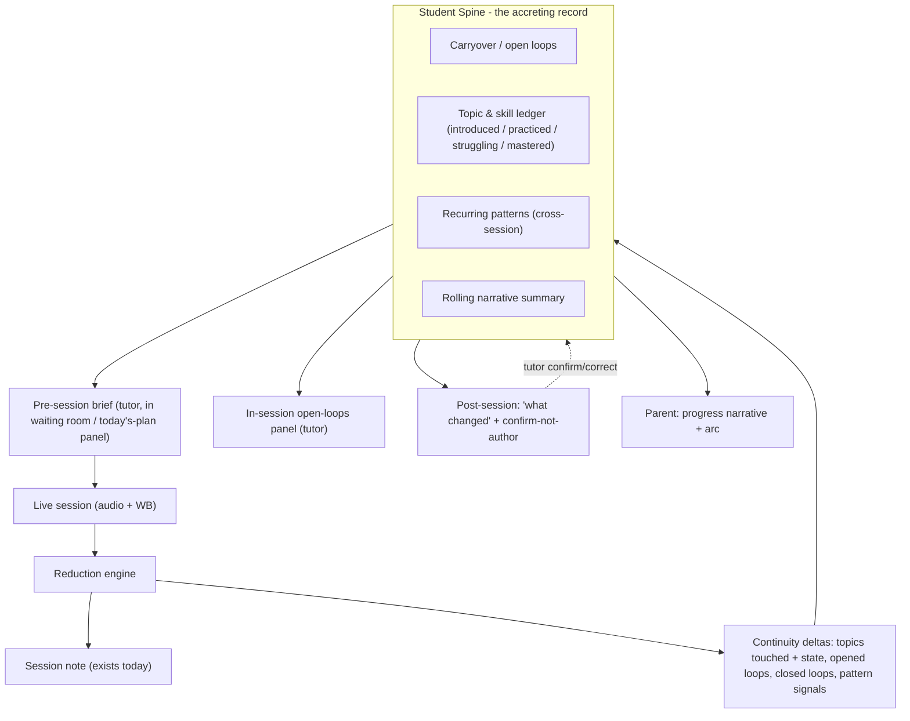

# Continuity wedge — raw brainstorm (LIVING)

> **Status:** LIVING brainstorm, started 2026-06-12. Raw capture of an orchestrator
> <> Andrew strategy conversation so we don't lose it mid-discussion. NOT a plan yet —
> the roadmap gets drafted (CreatePlan) after this thread settles. Append new thoughts
> at the bottom under dated headings; keep the early sections faithful to what was said.
>
> Companion to [`market-analysis-strategic-review-2026-06-12.md`](market-analysis-strategic-review-2026-06-12.md).

---

## FOUNDING PRINCIPLE — honesty + transparency (non-negotiable, supersedes everything below)

This is the value the entire product is subordinate to. Stated by Andrew, 2026-06-12:

> "I self-audit against dark patterns. My personality — for better and worse — is
> transparency and honesty. I DESPISE dark patterns, I despise tricking people into
> ANYTHING. I get that's how you can maybe drive cents; I get maybe I'm giving up some
> growth, some stickiness — I don't care. I HATE lying to people. I want them to WANT to
> use the product."

**No dark patterns. Total honesty. Total transparency.** Not a feature constraint — the
foundation. Every design decision in this doc (transparency-as-invariant, provable claims
with drilldowns, confirm-not-author, agree-only-propagates, no weaponized loss-aversion)
is a *consequence* of this principle, not an addition to it. If any future feature
conflicts with it, the feature loses.

**Strategic note (not just ethics):** in this category — K-12, anxious parents, minors'
data, a record parents make decisions from — **honesty is not a tax on the moat, it IS
the moat.** The "color vs black-and-white" stickiness comes from being the one product a
parent can *trust* about their kid. Dark-pattern competitors can buy cents and juice a
vanity chart, but the first time their graph contradicts a report card, trust is gone and
doesn't come back. The bet is not "honest despite the cost" — it's "honest *because* it
compounds." Some short-term tactics are genuinely forgone; that is the correct trade.

> **TODO (post-plan-mode):** elevate this principle into `AGENTS.md` / a `.cursor/rule`
> as a first-class product value, so every executor + future orchestrator inherits it.

---

## The wedge, in one paragraph (Andrew's words + one sharpening)

Andrew's framing (verbatim intent):

> "Our wedge is not the technical gates being met — we get no gold stars for having
> flawless tools. Our wedge and win is becoming an experience they can't live without.
> And we don't market/push that they can't live without it; we make it so seamless, so
> useful, so intuitive that they just want to keep using it."

Agreed. One screw tightened — there are two layers, and only one is the moat:

- **Seamless / intuitive = the price of entry.** Necessary, but a seamless tool is
  *replaceable* by another seamless tool. Earns no moat by itself.
- **Accumulation = the actual lock.** Every session deposits into a record that gets
  more valuable the longer they use it. After months, leaving doesn't mean "learn a new
  tool" — it means **abandoning the accumulated memory of every student** AND
  **re-shouldering the bookkeeping we removed**. That is the can't-live-without.

This is **benign lock-in**: it's the user's *own compounding value*, not hostage data.
Corollary: we should never fear data export — the moat is the *surfacing intelligence*,
not held-hostage records. (Also keeps us clean on a minor's data.)

**Double moat:** leaving costs them (1) the memory and (2) forces the admin burden back
onto themselves. Both user-aligned; neither a dark pattern.

Reframed sentence we're aligning on:

> We win by becoming the place their students' history lives and stays useful — and we
> earn that purely by being so seamless that depositing into it is effortless and
> pulling from it feels like magic.

---

## "No admin headache" — pinned definition (Andrew, 2026-06-12)

Selected meaning: **the notes/records burden.** AI reduction + continuity mean the tutor
does ~zero post-session bookkeeping — the system maintains the student's record,
progress, and carryover automatically. This is the original wedge.

Consequence for the plan: **note-quality and continuity are not two parallel tracks —
they are one engine.** Continuity *is* the accreting student record; note-quality is what
makes that record trustworthy enough to maintain itself. Same bar.

---

## Reliability = gate, not garnish

WB + reliability earns zero applause but **blocks everything above it**. A continuity
summary or a "perfect" replay built on a flaky board or a drifting audio clock is *worse
than nothing* — it launders garbage into something that looks authoritative. Floor must
be provably solid before the wedge features count.

(Known floor blocker surfaced in recon: WB stroke timestamps use a `performance.now()`
surrogate, not the audio recorder clock — drifts on long sessions / iOS background. Makes
"perfectly synced replay" unachievable until fixed. Treat as a Phase-1 gate, with a
*defined* drift threshold — e.g. <250ms over 50 min — rather than chasing asymptotic
perfection.)

---

## What continuity IS, mechanically

Not "a pile of session notes" — a **per-student accreting record (the Student Spine)**
that each session *mutates*. The key move: the **reduction's job expands** from
"summarize this session" to "emit deltas relative to prior state" — topics moved, open
loops closed, new loops opened, pattern signals. This is exactly where note-quality and
continuity become the same engine.

---

## The four components of the spine (by value / risk)

1. **Carryover / open loops** — *the MVP.* Highest value-to-effort ratio in the whole
   vision. "Here's what was left open last time" at session start + "did we close them?"
   after. Produces the "it remembers" feeling alone. Needs only: a carryover field on the
   session record, the reduction opening/closing loops, and one surface (today's-plan
   panel = the already-logged `sr-notes-in-session`, upgraded). No topic ontology, no
   pattern mining.
2. **Topic / skill ledger** — "what have we covered, where are they." Each topic has a
   state (introduced / practiced / struggling / mastered) + links back to the session
   moments that are the evidence. Powers tutor cold-start kill + feeds parent arc.
3. **Rolling narrative** — re-derived prose summary of the student's arc. The
   **parent-facing retention artifact** + tutor's 5-second "remind me who this kid is."
4. **Recurring patterns** — cross-session observations ("consistently drops negatives").
   Highest complexity (reduction-of-reductions + real corpus). Last.

---

## The principle that makes or breaks it: confirm, don't author

If the spine *confidently asserts something false*, tutor trust collapses and we've built
an anti-feature — worse, it's a record about a minor. Two non-negotiables:

- **Tutor role = lightweight verification, not authoring.** Post-session they
  confirm/quick-edit the deltas (thumbs-up / tweak), they don't write. That keeps the
  zero-bookkeeping promise. If they must fact-check every claim, we've *added* admin —
  so reduction quality literally decides whether this is a feature or a burden.
- **Corrections compound.** Every tutor edit feeds the record (and ideally reduction
  quality over time). Human-in-the-loop = trust/safety layer AND quality flywheel.

---

## Staging so the *feeling* ships early

- **V1 (ships the feeling fast):** carryover open-loops + pre-session / today's-plan
  brief. Real "it remembers" with minimal data model.
- **V2:** topic/skill ledger + rolling narrative -> parent arc + tutor cold-start.
- **V3:** recurring-pattern detection + student-facing review.

Lets us deliver the emotional payload (continuity *felt*) long before the deep record is
mature — while the deep record quietly accretes from session one.

---

## 2026-06-12 — Multi-sided engagement / honest-dopamine layer (Andrew)

**The expansion:** continuity isn't only tutor-facing institutional memory. If we become
indispensable to **tutors AND parents AND children**, retention stops running through a
single vector. Three independent love-vectors, two compounding payoffs:

- **Triple moat.** Leaving costs the tutor their records + the parent their dashboard
  habit + the kid their progress story / relationship with the mascot. All user-aligned.
- **Engagement surface = marketplace demand-gen.** A pool of parents + kids who already
  LOVE the experience is the warm demand we light up when a marketplace goes live. The
  thing that retains during pilot is the thing that seeds the network later.

**Honest dopamine is NOT a dark pattern — in its clean version.** Showing people the
progress they're *actually* making is making real value legible/felt — the opposite of
the social-media playbook (which manufactures compulsion against the user's interest).
"You did it" hits, charts, history, milestone celebration, mascot encouragement — all
built toward parent + student audiences. Make them WANT to log in beyond checking the
tutor's last notes.

### THE BRIGHT LINE (non-negotiable guardrail)

Showing a parent "your kid is progressing!" is **a claim about a child's learning** — the
trust bar goes UP, not down. Subject is a minor; reader is an anxious paying parent.

- **Fatal version (REJECT):** spin a flat result as progress to keep a parent paying.
  That IS a dark pattern, a liability the first time lived experience (grades) contradicts
  our chart, and reputationally lethal in K-12.
- **Clean version (BUILD):** never fabricate mastery. Celebrate the **honest signals**
  that are available even when mastery is flat — consistency (4 weeks straight), effort
  (30 problems attempted), coverage (5 new topics), specific small wins. Frame plateaus
  honestly as normal-and-surmountable (= growth-mindset pedagogy, what a good tutor
  already says).

**Safe architecture:** effort / engagement / coverage dopamine is *always* honest and
celebratable; **"mastery/progress" stays tutor-confirmed (human-in-loop)**; never imply
learning-outcome gains we can't back with data. Keeps the brand clean AND sticky.

### Design notes

- **Mynka mascot = the VOICE of honest encouragement.** "Nice work showing up four weeks
  straight!" lands warmly + honestly from a friendly character; lets us encourage without
  the *company* making clinical claims about a child. Strong K-12 fit.
- **One spine, audience-segmented surfaces.** 8-year-old (stars, mascot) vs 15-year-old
  (streaks, mastery map) vs parent (ROI, trajectory) = three renderings of the SAME
  underlying record. Build the spine once, render three ways.
- **No weaponized loss-aversion.** Don't build guilt-trip streaks that pressure a family
  for missing a session. Celebrate progress; don't punish absence.

### Sequencing impact (the ONE near-term hook)

Engagement layer = **V2/V3 payoff** — must NOT delay the floor (WB reliability) or V1
(carryover loops + trustworthy reduction). The single forward-looking obligation on the
early phases: **design the spine's event/delta schema to capture effort/coverage signals
from session one** (sessions attended, topics touched, problems attempted, loops closed),
even though the dopamine surfaces render later — so the data is already accruing and we
don't re-architect.

---

## 2026-06-12 — Total transparency + "would you agree?" + instrumentation (Andrew)

Andrew adds **total transparency** to total honesty, and the mechanism that makes it
enforceable.

### Transparency = honesty as an INVARIANT, not a guideline

**Unbreakable rule:** not one single claim in the praise/encouragement system is made
unless it's backed by specific PROVABLE data, with a **natural drill-down to the
evidence.** "Your child is improving" -> click -> the specific tutor-confirmed statements
that back it. A self-audit + safety net. *We don't say it if we can't back it.*

Architectural consequence (the strong version): claims are **derived from** evidence and
**carry their citations** (provenance/footnote pattern). A claim with no backing **cannot
be rendered** — fabrication is structurally impossible, not merely discouraged. Honesty
enforced by the data model.

**Two-tier evidence model (orchestrator refinement):**
- **System-provable facts** — attendance, problems attempted, topics covered, time. Auto,
  always honest, no confirmation. ("Showed up 4 weeks straight.")
- **Tutor-confirmed judgments** — mastery, progress, struggle. Sourced ONLY from the
  "would you agree?" mechanism. Each = a discrete confirmed atom.
- **Aggregate / narrative claims** ("improving overall") = **compositions** of the above,
  drill-down-able to constituents, **phrased never to exceed what the atoms support.**
  (The one place overstatement can sneak back: synthesis claiming more than its parts.)

### "Would you agree?" — the keystone interaction (one mechanism, three jobs)

A quick post-session section, **separate from the notes themselves**: the reduction
proposes 2-3 bounded evaluative statements ("real progress in addition", "mastered X but
struggling with Y"); tutor **agree / disagree / (optional) why**.

It is simultaneously: (1) the **human-in-loop trust gate** (nothing reaches a parent
unconfirmed), (2) the **zero-admin confirm-not-author** interaction (tutor reacts, never
writes), and (3) the **generator of the provable evidence atoms** powering every
transparency drill-down. This is the single most important interaction in the product —
where note-quality, continuity, trust, and the dopamine layer converge.

Design constraints:
- **Bounded, falsifiable statements** (scoped to a topic/skill), never vague — so each is
  evidence-linkable.
- **Fail-closed:** unconfirmed statement -> CANNOT surface to a parent. Silence never
  becomes a claim.
- **Disagreement is gold:** kills a false claim AND (with optional "why") feeds the
  reduction-quality flywheel.
- **A tap, not a form:** explanation strictly optional, or we re-add the admin we removed.

### Full instrumentation (must-have before go-live; almost-separate workstream)

Know exactly what people use / click / ignore. It's the **measurement loop for the entire
engagement thesis** (can't optimize "want to log in" without it), not a side quest.

Two conscious-choice flags:
- **Minor-data + egress lens:** instrumenting a child's clickstream is sensitive
  (COPPA-adjacent); a drop-in 3rd-party analytics SDK is exactly the external egress our
  hard-won lessons warn against (cf. 2FA-QR incident). Real decision = **first-party event
  capture vs 3rd-party vendor.** Orchestrator lean: **first-party, minimal/zero 3rd-party
  egress**, given tight CSP + minor-data posture.
- **Distinct from operational logging:** per-session ID logging (`rid`/`wbsid`/`nsi`/...)
  is *debugging*; product analytics is *usage* — parallel stream, reuse the discipline,
  keep conceptually separate.

---

## 2026-06-12 — Tutor incentive, confirm semantics, retraining loop, egress-by-learner (Andrew)

### Positioning line (keep)

Benign stickiness articulated: leaving the alternatives is **"like stepping out of a
world of color into black and white."** Sticky in a good way; users are not hostage —
the substitutes are just flat by comparison. Good marketing language. "When, not if" on
growth if we're this useful.

### Parents rate tutors (future / marketplace) + tutor incentive for "would you agree?"

Once marketplace lands, parents will rate tutors. So the "would you agree?" interaction
**must feel worth the tutor's 5-30 seconds.** Quick + easy + *useful*. Copy direction
(NOT final): "this helps us keep your pupil and/or parent informed" — TBD.

- **Honest primary motivator = compounding self-benefit:** the 15s spent now is why the
  tutor walks in next week already knowing where they left off (their own cold-start
  killer), every session, ratings or not. Lead with this; parent-informed/ratings is
  secondary.
- **[RISK — marketplace era] Over-confirmation bias:** once ratings exist, tutors have an
  incentive to over-confirm flattering statements. A *human* version of the fabrication
  risk. Defenses: bounded/falsifiable/**cited** atoms (hard to over-claim a specific
  evidence-linked statement; vague flattery is what enables inflation) + the drilldown
  itself exposes unsupported agreement. **Revisit when ratings go live:** decouple
  confirmation from rating if a bad feedback loop emerges. Don't-forget, not today.

### Confirm semantics — THREE states (Andrew, ratified; supersedes "fail-closed")

- **Agree -> PROPAGATES** (becomes a citable evidence atom). To start, **only explicitly
  agreed atoms propagate.**
- **Disagree -> does NOT propagate + HARD negative signal**, batched for refinement.
- **No-response -> INERT.** Genuinely ambiguous (unsure / didn't look / too rushed) — not
  a claim, not a training signal.
- **Addition:** no-response is inert as a claim but a **gold product-health metric** — a
  rising no-response rate = the mechanism isn't landing / trust+engagement thesis failing.
  Feeds the **instrumentation** layer (same event taxonomy), never a parent.

### "Improvement never >1 day from negative feedback" — honest mechanism

Ambition holds; mechanism clarified (we use a hosted model / OpenAI for reduction, so not
literal nightly model retraining):
- Every **disagreed atom + optional "why" -> continuously-growing correction/eval set.**
- Fast lever: **prompt + few-shot iteration** (genuinely <1-day loop).
- Slow compounding lever: accumulate into a **fine-tune dataset** when volume justifies.
- Do NOT scope "nightly model retraining" we don't need.

### Egress keyed on LEARNER TYPE (Andrew, ratified)

Maps onto existing model (sub-learner under family/parent acct vs self-managed learner):
- **Sub-learner (minor under a parent):** first-party only, **ZERO egress**, never leak
  child data.
- **Self-learner (adult/independent):** may loosen *slightly* — but **default first-party**,
  any 3rd-party egress consent-gated + documented (PLATFORM-ASSUMPTIONS / CSP).
- **Enforcement is architectural, not policy:** the analytics pipeline must know learner
  type and route/redact accordingly. Account distinction is the proxy (don't guess age).

---

## 2026-06-12 — Durability OVER TIME on the parent/student side (the churn problem)

Andrew's sharp question: tutoring is a **luxury, on-demand, intermittent** good. A parent
might tutor for 2 weeks then not need it for a year — or ever. Tutor-side value is
constant (sticky as long as they tutor); **parent/student-side durability across full
churn is a different, unsolved problem.**

**Reframe — two distinct durability problems (don't conflate):**
- **Durability A — during an engagement + short gaps.** The continuity moat (rest of this
  doc) nails this.
- **Durability B — after full churn.** No ongoing engagement to be sticky against. This is
  what the question is really about.

**Honest hard truth (keeps us clean):** you cannot, and must NOT try to, keep a dormant
non-customer "engaged." A parent whose kid doesn't currently need tutoring *shouldn't* be
logging in — manufacturing a reason to is the manufactured-need dark pattern (violates the
founding principle). So B is NOT "retain the dormant parent" (impossible + manipulative);
it's **"win the re-entry the moment need returns."**

### Winning the re-entry — three-part stack

1. **Never make them leave.** Record + account **persist FREE during dormancy** (it's just
   stored data; cheap). Pausing tutoring must never mean losing access/record. A
   dormant-but-intact account = warm, reachable, one-click reactivation. A deleted account
   = a stranger re-acquired from zero. Cheapest highest-leverage durability move.
2. **Make re-entry through us obviously better than starting over.** The record becomes a
   **re-acquisition** weapon: a returning parent's NEXT tutor (different subject, different
   person, a year later) **onboards instantly from the existing record** — skips the cold
   start that re-entering anywhere else (Wyzant / new private tutor) repeats. Record = "why
   us." **Marketplace = "how"** (the supply that makes "come back here for a tutor" a real
   option vs re-Googling). The two features carry Durability B together. Honest, not a trap:
   we're genuinely the lower-friction, higher-context option.
3. **Be honestly present at natural re-triggers (no nagging).** Tutoring need is seasonal /
   event-driven (new school year, a subject going sideways, exams, summer-slide). Clean
   version: rare, opt-in, parent-controlled, useful ("new school year — [kid]'s history is
   right where you left it"). Dark version: guilt/FOMO drip. Per founding principle: lean on
   *make the dormant artifact so useful + re-entry so warm they return on their own*; any
   proactive touch must pass "would a reasonable parent be GLAD we sent this?" Seasonal,
   useful, rare, killable.

### Bigger bet (parked, not decided)

Record value **outlives the tutoring relationship**: becomes *the kid's durable learning
history* a parent references with zero active tutoring (e.g. handing next year's teacher
"here's where my kid struggled + what helped"). Reframes identity from "the tutoring app"
to "home for my kid's learning story" — far stickier, answers dormancy structurally. BUT
bigger scope + real privacy weight (a minor's longitudinal record as a shareable artifact).
Exploratory expansion, not near-term.

### The two CHEAP obligations this imposes NOW (so we don't foreclose B)

Durability B is mostly a **later-phase** marketplace + persistence + warm-re-entry problem,
but bank these two now in the data model:
1. Account/record **persists free through dormancy** (no forced exit on pause).
2. Record is **portable to a future/next tutor** (instant re-onboarding).

### Communication / deliverability discipline (Andrew, 2026-06-12)

Email reputation is **shared collateral** — one unwanted send hurts the whole list, not
just one user:
- **Mark-as-spam** dings **domain sender reputation** -> degrades deliverability to *every*
  user + risks ecosystem-wide blocklisting. One right-click taxes the whole list.
- **Junk-without-flagging** = slow death; "delivered" but invisible, and providers learn to
  default-route you to junk.

Convergence (same as honesty-is-the-moat): **deliverability economics punish spam harder
than ethics do** — the technically-optimal path and the principled one are identical.

Three operational rules:
1. **Pull beats push; default to NOT sending.** Strongest "present at re-triggers" = when
   they return for *any* reason, warm re-entry + kid's history is right there. No email
   required. In-app / on-return presence carries the weight at zero reputation risk.
2. **Wall off transactional from marketing — ideally separate sending domains/subdomains.**
   Transactional (reminders, "notes ready", receipts, resets) is expected + protects
   reputation; marketing/re-engagement is risky. Shared domain => one marketing misfire
   poisons operationally-critical transactional deliverability.
3. **Every non-transactional send is an "earned send," metered + killable.** Explicit
   per-category opt-in, one-click instant unsubscribe, measure complaint/unsub/open rates
   (instrumentation), kill any campaign trending wrong. Each send spends reputation capital.

**Caveat on Durability-B "seasonal presence":** do NOT default it to email. Lean
pull/in-app; at most a *single explicitly-opted-into* touch the parent genuinely asked for
(e.g. end-of-engagement summary). 

**Infra to bank:** email provider + domain reputation (warmed domain, separated streams)
is a load-bearing platform assumption -> `PLATFORM-ASSUMPTIONS.md` when comms is built.

---

## 2026-06-12 — Strategic posture check: tutor-first, org, marketplace timing (Andrew)

Andrew floated three conclusions; orchestrator confirmed two, sharpened one.

**(1) Professional-tutor-first — CONFIRMED, load-bearing.** Tutor = constant-value user
whose loyalty compounds AND the one who does the "would you agree?" confirmations that
generate the trust atoms the entire parent/student layer is built on. Parent/student
durability is *downstream* of tutor adoption. No tutors -> no record -> no moat.

**(2) Org still important — CONFIRMED + newly linked.** Old reasons hold (concentrated
demand, university-pitch path). New sharper one: **orgs are the liquidity accelerant for
the marketplace** — they arrive with tutors AND students/recurring-need in one onboarding,
bootstrapping past the marketplace cold-start. Org is *how* you seed marketplace liquidity.

**(3) Marketplace promoted nebulous-future -> build-now — RIGHT, with a split:**
- **Substrate / primitives** (portable record, tutor identity/profiles, free-through-
  dormancy persistence, discoverability scaffolding, engagement-ready schema) -> **design +
  build for NOW.** Generalizes the "two cheap obligations." No caveat.
- **Live two-sided product** (matching strangers, ratings, booking, tutor payouts) ->
  liquidity + trust + ops + payments + legal weight. **"In place but not pushed / organic"
  ONLY works if NOT empty** — an empty marketplace is worse than none (sets an expectation
  we visibly fail -> violates the trust/quality bar). **Trigger to turn on = minimum
  liquidity, not calendar;** orgs reach it without a hard push.
- **Ordering truth:** the marketplace's advantage over Wyzant IS the continuity record
  ("why us"), so don't switch it on before the wedge is proven. Honest sequence:
  **prove wedge (tutor-first) -> design everything marketplace-compatible now -> soft-launch
  live marketplace when wedge is real + orgs seeded liquidity.** "Organic, not pushed" is
  exactly right for that launch + on-brand with restraint-as-strategy.

**Roadmap upshot:** does NOT add marketplace features to the near-term program; it
**sharpens the design constraints** on wedge work (portable record, tutor identity,
persistence, engagement-ready schema) so we never retrofit.

---

## Resolved (Andrew confirmed 2026-06-12)

- Design notes (mascot-as-voice, one-spine-three-renderings, no weaponized loss-aversion)
  — **agreed.**
- Near-term sequencing (engagement layer = V2/V3 payoff; only "engagement-ready schema"
  banked early) — **agreed.**
- No dark patterns; total honesty **+ total transparency** — **ratified.**
- Confirm semantics = three-state, **agree-only propagates** to start; disagree = hard
  retraining signal; no-response inert (but a health metric) — **ratified.**
- Instrumentation egress **keyed on learner type** (sub-learner zero-egress; self-learner
  first-party-default) — **ratified** (vendor choice still open).

## 2026-06-12 — Andrew's framing: refinement, not pivot (closing the brainstorm)

> "What I love about this is it's not so much a pivot as a refinement of focus. Since our
> initial direction was built on market research it fortunately still aligns with market
> research — we were heading north-ish, but I think we've refined our compass. I think this
> experience-driven competition will be our true wedge that gives us the time to grow into
> a true market force."

This is the correct frame: the original sequencing was directionally right (north-ish,
market-research-backed); tonight **refined the compass**, it did not reverse it. The wedge
is now named explicitly: **experience-driven competition** (seamless + accreting +
honest), which buys the time for organic growth into a market force. Brainstorm phase
CLOSED here; roadmap drafted next.

## Open threads / parking lot

- **[RESOLVED — orchestrator call, Andrew may override] Lead surface = tutor-facing
  carryover loops first** (not parent arc). Rationale: tutor-first is ratified; the lead
  surface should serve the tutor (lowest effort, highest "it remembers" payoff, AND it is
  what generates the confirmed trust atoms the parent layer later depends on). Parent arc
  follows in a later V.
- **[OPEN] Instrumentation vendor:** first-party event capture vs 3rd-party (PostHog-style)
  — decide with minor-data + CSP lens before go-live (egress policy already set above).
- **[REVISIT @ marketplace] Tutor over-confirmation vs parent-ratings** feedback loop.
- **[BANK NOW — Durability B]** data model must (1) persist account/record free through
  dormancy (no forced exit on pause), (2) keep the record portable to a future/next tutor.
- **[LATER-PHASE — Durability B]** marketplace + warm-re-entry + honest seasonal presence.
- **[PARKED — bigger bet]** record as the kid's durable, shareable learning history
  (school handoff) — identity expansion w/ minor-data privacy weight.
