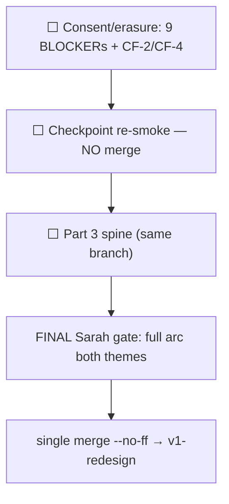

# ORCHESTRATOR STATE — canonical living bootstrap

> **READ THIS FIRST.** This file is the **single source of current orchestrator state** for tutoring-notes. We keep it current continuously (lightweight head every material turn; full restructure at milestones). A **brand-new orchestrator chat** must read it before dispatching work and must **NOT** ask Andrew for catch-up on what's done, where we are, what's next, or how we work — this doc, its reading list, and `git log` are authoritative.

> **Operating contract (`.cursor/rules/orchestrator-discipline.mdc`, explicit @ [`7341ff9`](https://github.com/Arangarx/tutoring-notes/commit/7341ff9)):** State durability is a **primary reliability obligation**, not a nicety. Andrew offloads project memory to the orchestrator on purpose — at any moment a session can be lost and a fresh orchestrator must resume with **minimal re-guidance** (ideally just "continue"). Keep this file continuously current; treat "I'll update state later" as a silent failure.

---

## ⏩ HEAD — 2026-07-02: PART 3 OVERNIGHT RUN COMPLETE (autonomous, Sonnet executor) — **branch ready for Part 3 hardware smoke.** All safely-shippable Part 3 waves LANDED + all automated gates GREEN on tip [`d299a6c`](https://github.com/Arangarx/tutoring-notes/commit/d299a6c): **`p3-clock`** [`1572983`](https://github.com/Arangarx/tutoring-notes/commit/1572983) (monotonic pause-aware clock), **`p3-perspeaker` A+B foundation** [`e92c9ac`](https://github.com/Arangarx/tutoring-notes/commit/e92c9ac)/[`8638c86`](https://github.com/Arangarx/tutoring-notes/commit/8638c86)/[`1df3258`](https://github.com/Arangarx/tutoring-notes/commit/1df3258) (additive schema + replay-isolation, no live runtime change), **`p3-model-abstraction`** [`f4cd9cb`](https://github.com/Arangarx/tutoring-notes/commit/f4cd9cb)/[`cefc5cd`](https://github.com/Arangarx/tutoring-notes/commit/cefc5cd) (config-swappable models + stronger prompts, wording Andrew-gated), **`p3-video-seam`** [`d299a6c`](https://github.com/Arangarx/tutoring-notes/commit/d299a6c) (docs-only). **Gates:** full `npx jest` **2742 pass** (only the 3 known pre-existing flaky suites), `next build` **exit 0**, `test:wb-sync` **107 pass/2 skip/1 known flake** (exit 0 — matches `5dd1793` baseline, clock change did NOT break live sync). **✅ `PERSPEAKER-C-TRANSCRIPTION-TRIGGER` RESOLVED 2026-07-02 — Andrew locked option (a) worker-driven** (2-party path + defensive cap ≤3; N>2 deferred; hybrid recovery = reduce-stage "prefer student, degrade to tutor" / Hybrid-B dual-capture deferred to instrumentation — see Open Andrew-confirms). **⇒ perspeaker sub-step C is now DESIGN-UNBLOCKED — ready to BUILD in a fresh chat** (additive outbox fields → `useRemoteMicRecorders` mount → worker-driven transcription trigger → **mandatory Sonnet 5-axis on the fragile-outbox diff**), which unblocks the downstream waves (`p3-vad-chunking`/`p3-consent-recording`/`p3-incremental-map` → `p3-finalize` → `p3-replay-scrub`). **One item still Andrew-gated:** map/reduce prompt WORDING (mechanism locked, text PROPOSED; smokebook item 6 gut-check). **Deliverables for Andrew:** smokebook [`part3-notes-reliability-spine-smokebook.md`](part3-notes-reliability-spine-smokebook.md) (verified preview alias) + overnight report [`part3-overnight-2026-07-02-orchestrator-report.md`](part3-overnight-2026-07-02-orchestrator-report.md). Perceptual items (audio↔stroke alignment, real-WebRTC disconnect timing, VAD, mixdown, notes quality) are hardware-smoke-only by the testing contract. **Heavy state-doc restructure DUE at next swap** (this HEAD + Last-action cell are bloated).

> **Active branch:** [`wb-wave5-polish`](https://github.com/Arangarx/tutoring-notes/tree/wb-wave5-polish) @ [`06b890e`](https://github.com/Arangarx/tutoring-notes/commit/06b890e) (Part 3 bootstrapper; code tip `4b1bfdd`) (+ state-doc commit on top). **Worktree:** `tutoring-notes-polishwt` (default `tutoring-notes` checkout is on `v1-redesign` — NOT current). **All remaining Sarah-gate work lands here; single `merge --no-ff` to `v1-redesign` at the FINAL full-arc gate only (no interim merge — Andrew reaffirmed 2026-07-01).** Integration base remains **`v1-redesign` @ [`7397abc`](https://github.com/Arangarx/tutoring-notes/commit/7397abc)**.
>
> **2026-07-01 — pre-merge smoke verdict: NOT PASS.** Andrew ran smoke against tip `8e38935` (code through [`e66c177`](https://github.com/Arangarx/tutoring-notes/commit/e66c177)). Annotations captured [`f85af03`](https://github.com/Arangarx/tutoring-notes/commit/f85af03)..[`e47f41a`](https://github.com/Arangarx/tutoring-notes/commit/e47f41a); triage [`consent-honesty-smoke-findings-2026-07-01.md`](consent-honesty-smoke-findings-2026-07-01.md). **Six merge-blockers** (MB-1..MB-6). Andrew ratified **safe-then-merge** + **reversible tombstone** (Option A). **5-axis reliability review COMPLETE** — 9 BLOCKERs + Option A folded into [`consent-honesty-safe-erasure-plan.md`](consent-honesty-safe-erasure-plan.md). Consent fixes **CF-1** ([`183f09b`](https://github.com/Arangarx/tutoring-notes/commit/183f09b)) + **CF-3** ([`7a9514f`](https://github.com/Arangarx/tutoring-notes/commit/7a9514f)) shipped.
>
> **Execution order (single consistent sequence — no interim merge):** (1) consent/erasure **9 BLOCKERs** + remaining **CF-2** / **CF-4**; (2) **checkpoint re-smoke** (NOT a merge trigger); (3) **Part 3 reliability spine on the SAME branch** `wb-wave5-polish` (fresh chat OK); (4) **full live-session arc both-themes hardware smoke** (FINAL Sarah gate); (5) **`merge --no-ff wb-wave5-polish → v1-redesign`**. Consent/erasure + erasure work stays unmerged until step 5. **POST-SARAH-PRE-RELEASE backlog** (out of mini-phase scope): C-1 replay Play/Pause overlaps Board tab; C-2 student mic-boost parity — see findings §C.

| Field | Value |
|---|---|
| **Last action completed** | **✅ PART 3 OVERNIGHT RUN COMPLETE @ [`d299a6c`](https://github.com/Arangarx/tutoring-notes/commit/d299a6c) — branch ready for Part 3 hardware smoke.** Shipped this run: `p3-model-abstraction` (config-swappable models `src/lib/ai-models.ts` + 6 `OPENAI_*_MODEL` env vars, defaults = current models → zero behavior change unless set; stronger map/reduce prompts, `REDUCE_PROMPT_VERSION` bumped — **wording PROPOSED/Andrew-gated**) [`f4cd9cb`](https://github.com/Arangarx/tutoring-notes/commit/f4cd9cb)/[`cefc5cd`](https://github.com/Arangarx/tutoring-notes/commit/cefc5cd); `p3-video-seam` docs-only design seam [`d299a6c`](https://github.com/Arangarx/tutoring-notes/commit/d299a6c). **`test:wb-sync` relay gate GREEN** on tip (107 pass/2 skip/1 known flake = `wb-session-lifecycle:1095` `ECONNRESET`-on-learner-login, passed retry #1; exit 0) — proves the `p3-clock` `WhiteboardWorkspaceClient` change did not break live sync. **Full `npx jest` 2742 pass** (only the 3 known pre-existing flaky suites) + **`next build` exit 0**. **Deliverables authored + committed:** hardware smokebook [`part3-notes-reliability-spine-smokebook.md`](part3-notes-reliability-spine-smokebook.md) (8 items, verified Vercel `branchAlias`, follows SMOKEBOOK-TEMPLATE) + overnight orchestrator report [`part3-overnight-2026-07-02-orchestrator-report.md`](part3-overnight-2026-07-02-orchestrator-report.md). — — — **Prior: ✅ `p3-perspeaker-capture` FOUNDATION (A+B) LANDED (tests + build green modulo the 3 known-flaky suites).** **Sub-step A** [`e92c9ac`](https://github.com/Arangarx/tutoring-notes/commit/e92c9ac): additive `TranscriptChunk.streamId @default("tutor:mic")` + `speakerId String?` + index `[sessionId,streamId]` (migration `20260702120000_transcript_chunk_speaker_labels`, applied LOCAL test DB only — production Andrew-gated); threaded optional `streamId`/`speakerId` through `enqueueChunkTranscriptionAction` → `enqueueChunkTranscribe` → `transcript-store` upsert (tutor path unchanged via `tutor:mic` default). **Sub-step B** [`8638c86`](https://github.com/Arangarx/tutoring-notes/commit/8638c86): additive `transcriptionOnly?: boolean` on `OutboxRow` (persisted in IDB); `assembleEndSessionSegments` EXCLUDES `transcriptionOnly` rows → per-speaker Whisper blobs can NEVER become `SessionRecording` replay rows (structural `89e0fe1`-bug prevention; `tutor:mic` mixdown stays sole replay). **LIVE-AV #6a** [`1df3258`](https://github.com/Arangarx/tutoring-notes/commit/1df3258): documents the tap-before-mix contract. Both A+B are pure additive foundations — **no live-session runtime change** (no rows flagged yet), so zero risk to tomorrow's hardware smoke. Full `npx jest` on B tip: 2737 pass (only the known `upload-outbox` concurrency flake). **5-axis on A+B deferred** to when the fragile sub-step C runtime wiring lands (A+B are low-risk additive + self-reviewed). — — — **Prior: ✅ `p3-clock` LANDED @ [`1572983`](https://github.com/Arangarx/tutoring-notes/commit/1572983)** — single monotonic pause-aware session clock (`src/lib/recording/session-clock.ts` `createSessionMsClock`); threaded into WB `t`, FSM `audioClockMs` (was hardcoded 0), transcription `recordingTimeOffsetMs` (segment-start offset, captured synchronously at callback entry to avoid concurrent-callback offset inversion — 5-axis M-2). `audioStartedAtMs` deliberately kept WALL-CLOCK (outbox mixdown sort key + draft-recovery consistency, documented at call site). Disconnect freeze: trigger stays existing **8s `REACHABLE_LOSS_DEBOUNCE_MS` → FSM `paused`** (Andrew confirmed — NOT the 6s peer-eviction timer the bootstrapper proposed); `deriveWbCaptureActive` keeps WB event capture running through the pause (broader than `wbSignal`) so gap strokes stamp at frozen clock (armed/idle CF-2.1 gate preserved). Observability: `clock_start` / `clock_paused (t_frozen+reason)` / `clock_resumed (t_resume+gap_ms)` (5-axis H-1). Tests: `session-clock.test.ts` + `wb-capture-gate.test.ts` (red-before/green-after) + CF-2.1 titles updated. **Gates:** targeted 79/79, `test:wb-jest` 773/773, `next build` exit 0; full `npx jest` 2727 pass + 3 pre-existing flaky suites (upload-outbox timing race + 2 shared-DB FK races — all pass in isolation, unrelated to diff). Sonnet 5-axis: SHIP-WITH-FIXES, H-1+M-2+L-2/L-3 applied. **NEXT wave: `p3-perspeaker-capture`.** — — — **Prior: ✅ CHECKPOINT FULLY GREEN — `test:wb-sync` fixed + green @ [`5dd1793`](https://github.com/Arangarx/tutoring-notes/commit/5dd1793).** Root cause was a **test-harness seed gap** (SEED-GAP verdict, ~95% → now confirmed): `seedWbLiveSyncSession` never seeded consent, but `/join` H-5 (`bded52e`) fail-closes claimed minors w/o a `SessionConsentSnapshot`. **Fix is TEST-ONLY** (+73 lines, `tests/integration/whiteboard-live-sync.helpers.ts`): new `seedHarnessConsentForJoin()` upserts `ConsentRecord` v1 (all flags true, `captureMethod=electronic`, `setByAccountHolderId` from `LearnerProfile.accountHolderId`) + `SessionConsentSnapshot` (upsert on `whiteboardSessionId`); called from `seedWbLiveSyncSession` after participant upsert; `seedSelfLearnerWbSession` untouched (self-learners skip the gate). **`test:wb-sync` result (local `tutoring_notes_test`):** wb-jest **773/773**; wb-regression **107 passed / 2 skipped / 1 flaky**; exit 0. **⚠️ Known flake (NOT consent, NOT blocking):** `wb-student-exit-rejoin.spec.ts` "fresh join…no reload guard while connected" — `wb-student-sync-pill` stuck on "Call reconnecting…" (never reached `Connected`) after 60s; student canvas DID mount → A/V-mesh reconnect flake under parallel workers, not the H-5 gate. Passed on retry. **⇒ All 4 automated checkpoint gates now GREEN** (jest `4b1bfdd`, `next build`, identity-e2e 16/16, `test:wb-sync` `5dd1793`). **wb-sync no longer gates the final merge.** Remaining before merge = SLIM hardware/jsdom-blind smokebook + full-arc both-themes hardware smoke. — — — **Prior: Part 3 execution bootstrapper committed @ [`06b890e`](https://github.com/Arangarx/tutoring-notes/commit/06b890e)** ([`part3-execution-bootstrapper.md`](part3-execution-bootstrapper.md)) — paste-in briefing: locked p3-* sequence, ratified constraints, fragile guardrails, testing contract, build-status (Block B BUILT / Part 3 UNBUILT), proposed `p3-clock` design (review-first), + the OPEN ~6s disconnect-trigger confirm. **⇒ To START Part 3: fresh chat, paste that file.** — — — **Checkpoint gate results @ `4b1bfdd`:** `next build` PASS; full `npx jest` GREEN (234 suites / 2715 pass, 1 quarantined); `test:identity-e2e` 16/16. **⚠️ `test:wb-sync` RED — 60 wb-regression relay specs fail, ALL on `student-whiteboard-canvas-mount` 90s timeout in `openTutorAndStudent` (student never mounts board); wb-jest slice + tutor-only specs PASS.** Middleware FIX-6 **exonerated** (build + identity-e2e JoinAuthGate/auth-wall all green — removing rate limits under harness can't break a mount). **Prime hypothesis: consent-enforcement seed gap** — arc shipped unconditional consent (`5acfb10`) + learner-join gating (`274f21a`, CC-1/CC-2), and the wb-regression seed (`openTutorAndStudent`/`seedWbLiveSyncSession`) likely doesn't create the `ConsentRecord`/`SessionConsentSnapshot` the now-unconditional gate requires → student denied. Same class as `b082882` relay-harness consent fix. **Read-only root-cause investigation RUNNING** (seed-gap vs real regression + exact fix). **wb-sync RED gates the FINAL MERGE only — does NOT block Part 3 execution** (Part 3 is more work on this same branch). — — — **Prior: Checkpoint remediation GREEN @ [`4b1bfdd`](https://github.com/Arangarx/tutoring-notes/commit/4b1bfdd)** — all RED-checkpoint regressions fixed (TEST/INFRA): erasureJob mocks (create/startWhiteboardSession) + `student.findUnique` erasure-context shape; `password-reset` scoped per-fixture FK teardown (ConsentRecord+trusted-devices before adminUser); 2 brittle source-string asserts updated (settingsLinks `href:`, AdminNav `navProps` spread); SharePage jsdom `jest.mock` on `assert-student-not-erased`; `auth.test.ts` worker flake fixed via new `jest.setup-env.ts` pinning local test DB in workers + `hasAdminUsers=false` mock; pre-existing `StudentLiveWorkspaceClient.dom` `describe.skip` (BACKLOG `WB-TESTENV-IDB-STUDENT-SUITE`). **`npx jest` 234 suites / 2715 pass (1 suite skipped); `test:identity-e2e` 16/16.** FIX-6 was the ONLY production touch — `src/middleware.ts` extends the existing `isPlaywrightHarnessActive()` learner-login rate-limit bypass to auth/2fa/api/setup; **orchestrator-reviewed & ACCEPTED: fully `WB_E2E_HARNESS`+`!VERCEL`-gated → inert on Vercel (VERCEL always set in prod/preview), real-traffic limits unchanged, Neon `LearnerLoginThrottle` still applies.** **Remaining gates on this tip:** `npx next build` (middleware changed) + full `test:wb-sync` relay phase (now unblocked). — — — **Prior: CHECKPOINT GATE RED @ `2197a18`** — full-suite gate caught real regressions (remediated above; PROCESS LESSON: earlier erasure waves ran targeted suites not full `jest`, so actions'-unit-test mock breakage slipped — validates the full-suite checkpoint). `next build` PASS; harness 2FA bypass confirmed fully `WB_E2E_HARNESS`+`!VERCEL`-gated. **Full `npx jest` FAIL: 8 suites / 23 tests.** Root causes — **all TEST/TEST-INFRA, no prod-logic bug:** (1) `create`/`startWhiteboardSession.test.ts` (9) — erasure guard calls `db.erasureJob.findFirst` but their Prisma mocks don't stub `erasureJob` (real DB returns null → prod happy-path fine) — **also killed `test:wb-sync` at its inner wb-jest gate in 12s**; (2) `password-reset.test.ts` (7) — `beforeEach` deletes `adminUser` before related `ConsentRecord` → FK violation (teardown order); (3) `identity-2fa-management.test.ts` + `impersonation-d.test.ts` (2) — brittle source-string asserts broken by admin-nav/settings refactor; (4) `SharePage.whiteboard.dom.test.tsx` — `Request is not defined` (share page now imports erasure guard → `next/server`; jsdom env gap); (5) `auth.test.ts` (1) — `DATABASE_URL` invalid in worker (env-isolation flake, confirm isolated). **Pre-existing (NOT this arc):** `StudentLiveWorkspaceClient.dom.test.tsx` AggregateError (last touched `f879da0`). **identity-e2e 14/16** — #8 share-link 200-after-restore got 429, #15 JoinAuthGate child timeout = **rate-limiter accumulation across the serial 16-spec run** (both pass individually). **PROCESS LESSON:** earlier erasure waves ran targeted suites, not full `jest`, so the actions'-unit-test mock breakage slipped to the checkpoint — validates the full-suite checkpoint. — — — **Prior — Workstream C COMPLETE @ [`5402e04`](https://github.com/Arangarx/tutoring-notes/commit/5402e04)** (16/16 identity-e2e green: 3 consent + 4 erasure + 8 routing + setup). Routing specs (`routing.spec.ts`): persona-distinct login pages, middleware auth wall (`/account/dashboard`→`/account/login`), parent root→`/account/dashboard`, learner root→`/join`, JoinAuthGate persona redirects (child→students login, self-learner→account login). `test:identity-e2e` now `--workers=1` (avoids middleware 429 flakes). **⇒ Workstream C (Playwright e2e for consent-save / erasure / routing) DONE — all deterministic session-experience flows now automated, red-before/green-after, asserting real DB rows + HTTP status + redirect URLs.** — — — **Prior — Workstream C slice 2 (erasure e2e) @ [`cf20015`](https://github.com/Arangarx/tutoring-notes/commit/cf20015)** — 4 Playwright specs, 8/8 green incl. consent: (1) admin request→grace via `/admin/erasure` UI + DB oracle (`ErasureJob.status=requested` + `purgeEligibleAt≈+7d` + `LearnerProfile.tombstonedAt` set + `LearnerCredential.disabled=true` + `Student.erasedAt` null); (2) admin cancel→restore (status=`canceled`, tombstone cleared, creds re-enabled); (3) tutor whiteboard-replay route 404 during grace → loads after cancel; (4) family share-link ×6 (3 `/s/...` pages + 3 public APIs) 404 during grace → 200 after cancel. Added erasure-admin `data-testid`s + `erasure.helpers.ts` fixtures + `erasure-admin.json` storageState + harness 2FA bypass for the erasure-admin email (**test-only, `WB_E2E_HARNESS`+`!VERCEL`-gated**); share fixtures use local `/api/setup-required` blob URLs to avoid Vercel-Blob dep (audio/snapshot restore = status-only during grace). ⚠️ checkpoint-note: `src/lib/playwright-harness.ts` is security-adjacent — verify the added bypass is fully harness-gated at the gate. — — — **Workstream C slice 1 shipped @ [`faebbfc`](https://github.com/Arangarx/tutoring-notes/commit/faebbfc)** — new `identity-e2e` Playwright project (testMatch `tests/integration/identity/**`; **excluded** from `integration`/`wb-regression` so the ~40-min WB gate stays lean) + `test:identity-e2e` script + parent/ADMIN seed fixtures (`seedParentAccountHolder`, `seedTestAdminWithRole('ADMIN')`, `seedClaimInvite`, `seedParentConsentFixture`, `readLatestConsentRecord`; parent `.auth/parent.json` via account-holder login) + `scripts/playwright-relay-or-stub.cjs` (:3002 stub when relay image absent). **Three consent specs assert REAL `ConsentRecord` DB persistence** (CC-1 Save → chosen flags v1; CC-2 Decline → all-off v1; parent per-child Save → persists across reload) — the "Save preferences visual stub" burn is now automated-caught. Added stable `data-testid`s to `ConsentSetupForm`/`ParentConsentEditor`. 4/4 Playwright green; pushed. — — — **CF-1/MB-1 regression test shipped @ [`c6d2568`](https://github.com/Arangarx/tutoring-notes/commit/c6d2568)** — 2 jsdom cases in `WaitingRoomOverlay.consent-gate.dom.test.tsx` lock the CF-1 generic Start-failure surfacing: non-Consent `notFound` (e.g. after impersonation-exit overwrites the shared session cookie) now renders tutor-friendly copy ("Couldn't start the session… if you recently switched or exited an impersonated account in another tab, reload this page first") + "Error ID:" digest line; tutor stays in waiting room; Start re-enables. Touched suite 5/5 green; no DB. **Split verdict:** the CF-1 *contract* is jsdom-covered now; the **full multi-tab impersonation-exit repro is a HARDWARE SMOKE item** (shared-cookie across browsing contexts — students on own machines don't hit it). Two pre-existing `src/__tests__/dom` failures (`StudentLiveWorkspaceClient` AggregateError, `SharePage.whiteboard` `Request is not defined`) untouched by this change — confirm pre-existing at checkpoint. — — — **Prior:** CF-2.1 mode-aware clock fix shipped @ [`b7c88ac`](https://github.com/Arangarx/tutoring-notes/commit/b7c88ac)** — resolves the CF-2 5-axis HIGH: `wbSignal = audioCapturePolicy !== "none" ? recordingActive : wbEventsActive` at the 3 call sites (`WhiteboardWorkspaceClient.tsx` ~2361 intermediate, 2551 clock, 2874 recorder prop, 2923/2948 viewport-anchor). Audio modes now track FSM `recordingActive` (pause-aligned); IN_PERSON (`policy=none`) keeps `wbEventsActive` (the CF-2 replay fix). Renamed the policy=none jsdom test + ADDED an armed-gate test (`policy=tutor_only` → recorder `recordingActive` follows FSM=false) — both clock-source branches covered deterministically. 28/28 jest; `next build` 0; ONLY `WhiteboardWorkspaceClient.tsx` + `audio-capture-policy.test.tsx` touched (no engine/bridge/apply/outbox). **⇒ ALL code-side merge-blockers DONE: erasure feature (A–I + UI/copy/docs) + CF-2/CF-2.1 (MB-4) + CF-4 (MB-5), each with a Sonnet 5-axis pass where fragile.** — — — **Prior:** CF-2/CF-4 @ `853bba4`/[`3c326d9`](https://github.com/Arangarx/tutoring-notes/commit/3c326d9); erasure Steps 1–5/6 (@ [`51e5bfd`](https://github.com/Arangarx/tutoring-notes/commit/51e5bfd)). |
| **Next action(s)** | **🅰️ ANDREW, TOMORROW (in priority order):** **(1)** Run the **Part 3 hardware smokebook** [`part3-notes-reliability-spine-smokebook.md`](part3-notes-reliability-spine-smokebook.md) on the preview (WB flow end-to-end: seamless arc, skeleton-within-seconds, clock↔stroke alignment, disconnect freeze/resume, notes-quality wording review). **(2)** ✅ done — `PERSPEAKER-C-TRANSCRIPTION-TRIGGER` locked to option (a) worker-driven (see Open Andrew-confirms for full resolution + hybrid decision). **(3)** Sign off (or edit) the **PROPOSED map/reduce prompt wording** ([`cefc5cd`](https://github.com/Arangarx/tutoring-notes/commit/cefc5cd), smokebook item 6). — — — **FRESH ORCHESTRATOR (C is design-unblocked, ready to build):** wire perspeaker sub-step C per the LOCKED option (a) — additive outbox fields `recordingTimeOffsetMs`+`speakerId` → `useRemoteMicRecorders` mount + `shouldCapture` gating + defensive peer cap ≤3 (2-party supported) → **worker-driven** transcription enqueue on `transcriptionOnly` upload-confirm → **mandatory Sonnet 5-axis on the fragile-outbox diff** (isolation / consent-gate / concurrency / replay-ordering) → deterministic tests + flag hardware residual. **Hybrid A** ("prefer student transcript, degrade to tutor-side inference") is a **reduce-stage** concern → build into `p3-incremental-map`/reduce, NOT into C. **Then** C-dependents in order: `p3-vad-chunking` → `p3-consent-recording` → `p3-incremental-map` → `p3-finalize` → `p3-replay-scrub`. Merge path unchanged: single `merge --no-ff wb-wave5-polish → v1-redesign` only after the **full-arc both-themes hardware smoke** (FINAL Sarah gate, separate from this Part 3 smokebook) — no interim merge. **Do the heavy state-doc restructure at the next swap** (HEAD + Last-action bloated). — — — **Prior (now done): PART 3 IN PROGRESS (overnight, Sonnet executor):** `p3-clock` ✅ `1572983`; `p3-perspeaker` A+B foundation ✅ (`e92c9ac`/`8638c86`/`1df3258`); `p3-model-abstraction` ✅ (`f4cd9cb`/`cefc5cd`); `p3-video-seam` ✅ (`d299a6c`). **DEFERRED for confirm: perspeaker sub-step C** (mount `useRemoteMicRecorders`, stamp `recordingTimeOffsetMs`, per-speaker transcription enqueue, peer cap ≤3–4, `shouldCapture` gating) — needs Andrew to confirm the **transcription-trigger design fork** (see Open Andrew-confirms `PERSPEAKER-C-TRANSCRIPTION-TRIGGER`); it touches the fragile outbox-worker/transcription-ordering path + is hardware-validated, so not gambled unsmoked overnight. **NOW → `p3-model-abstraction`** (reordered ahead of C's dependents: it's the only remaining wave independent of per-speaker capture; low-risk; serves the notes-quality pre-merge bar). After it, the C-dependent waves (`p3-vad-chunking`, `p3-consent-recording`, `p3-incremental-map`) await C; then `p3-finalize` → `p3-replay-scrub` → `p3-video-seam` (design-only). Each wave: explore-first → additive impl → deterministic jest (red/green) → gates (wb-jest/jest/build) → commit+push → update this head → 5-axis on fragile diffs. `test:wb-sync` relay at merge boundary (if Docker up). **Hardware-smoke-only residual (by testing contract):** audio↔stroke alignment, real WebRTC peer audio, VAD on real speech, mixdown quality, disconnect→resume timing. **Not auto-shipping:** `LIVE-SESSION-CONSENT-COPY` string + final map/reduce prompt wording (Andrew-gated). — — — ✅ **DONE prior session:** MB-1/CF-1 regression test (`c6d2568`); **Workstream C e2e COMPLETE** (consent-save `faebbfc` + erasure `cf20015` + routing `5402e04`, 16/16); checkpoint jest+build+identity-e2e GREEN (`4b1bfdd`); Part 3 bootstrapper (`06b890e`). ✅ **wb-sync fixed + GREEN @ `5dd1793` — checkpoint fully green; worktree clear.** **NOW / NEXT:** **(1) PART 3 EXECUTION — GO in a FRESH chat (nothing blocking it now):** paste [`part3-execution-bootstrapper.md`](part3-execution-bootstrapper.md); first step `p3-clock` — **confirm the ~6s debounced-disconnect pause trigger with Andrew before wiring** (proposed p3-clock design is review-first). **(2) SLIM smokebook** — hardware/jsdom-blind residual ONLY (stroke↔audio replay alignment, IN_PERSON replay, tutor_only mixdown, multi-tab impersonation-exit); fetch Vercel `branchAlias` (never guess). **(3) full-arc both-themes hardware smoke** → single `merge --no-ff → v1-redesign` (FINAL Sarah gate). **Track the `wb-student-exit-rejoin` A/V-reconnect flake** (BACKLOG entry, not blocking). **All DB-test runs override `DATABASE_URL`/`DIRECT_URL` to local `tutoring_notes_test` (never Neon).** **Heavy state-doc restructure due at the swap** (HEAD Last-action cell is bloated). |
| **Open Andrew-confirms** | **✅ RESOLVED 2026-07-02 — `PERSPEAKER-C-TRANSCRIPTION-TRIGGER`: Andrew LOCKED option (a) worker-driven.** After a `transcriptionOnly` row uploads, the outbox worker fires `enqueueChunkTranscriptionAction` (durable, fire-once tied to upload success, single path). Requires adding `recordingTimeOffsetMs`+`speakerId` to the outbox row (additive). **⚠️ Touches the fragile outbox drain → the C integration diff MUST get a Sonnet 5-axis review** (verify the added trigger is isolated — can't throw into the tutor-replay upload loop; respects the consent gate; handles N-recorder concurrency; doesn't touch replay ordering — already fenced by sub-step B). **Peer cap:** build the **2-party supported path** (single remote student lane) now, with a small **defensive code ceiling (≤3)** so stray extra peers can't spawn unbounded recorders — **this caps concurrent recorder LANES on the tutor device, it is NOT a limit on who can join a session**; real **N>2 group support is a deliberate future feature** (Andrew: "until we purposely support N>2 we're fine"). **BOTH-STREAMS model (Andrew clarified 2026-07-02 — CORRECTS an earlier wrong "fallback/prefer-one" framing):** map/reduce **ALWAYS consume BOTH streams as co-equal signals** — **tutor audio is often THE richest signal (NOT a fallback)**; **student audio enriches context when present (NOT a fallback)**. There is **no prefer-one/degrade-to-other hierarchy** — feeding both yields the most accurate notes; 99% case (parent consented) = full clean audio from both. **The real quality risk = note corruption from bad/nonsense transcription** (Whisper hallucinates on silence — phantom "Thank you." etc.; garbled dropout audio → junk). **Guard at the transcription/chunking layer: VAD-gate chunks (skip silence/noise) + optionally a confidence/no-speech filter — this is largely `p3-vad-chunking`.** VAD does **double duty**: skipping silent chunks both (1) prevents hallucinated-silence corruption AND (2) **cuts tutor-side load** (most of a session one party is listening) — which was Andrew's actual *mechanical* "hybrid" point (keep load down, NOT source-fallback). **Student-DEVICE pristine dual-capture** (record student mic pre-network + tutor-side received as backup) = a separate max-fidelity option, **DEFERRED to instrumentation** (a student upstream bad enough to wreck the recording also degraded the live call → tutor self-heals by asking for a repeat, which IS captured). **Architectural note for the C executor:** the per-speaker student lane is tapped **on the tutor's device from the received WebRTC stream** (post-network), so it degrades with the same packet loss as the live audio. — — — **Also still Andrew-gated:** map/reduce prompt **WORDING** (mechanism locked; text PROPOSED `cefc5cd`; smokebook item 6 is the gut-check — Andrew is NOT expected to prompt-engineer, real tuning = deferred eval flywheel). — — — **Prior — erasure UX defaults surfaced 2026-07-01 (proceeding on defaults unless Andrew redirects; all additive to change later):** (1) **Cancel is operator-only** (Admin→Erasure) — tutors see pending/suspended state + "contact operator", no tutor cancel button (no ADMIN role); (2) **no parent self-service deletion UI** — erasure is operator-mediated only, ER-6 "parent" copy became operator guidance; (3) post-purge roster badge reads "Deleted"; (4) suspended student-detail Start CTA → status text. **Resolved (2026-07-01):** remaining execution (Part 3 + erasure wave) runs in a **fresh chat on the same branch** `wb-wave5-polish`; Sarah merge gate = full live-session arc 100% reliable, then **single merge — no interim merge**. **Resolved (2026-07-01):** first-pass notes **quality** is a real Part 3 pre-merge acceptance bar (strong map/reduce leveraging per-speaker labeled transcripts + model abstraction); **only** the eval harness + flywheel iteration loop is deferred post-master. **Standing (unchanged):** debounced-disconnect pause trigger (confirm at `p3-clock`); **WB-LABEL-PARENT-SIGNIN**; **Sarah primary device** ([`SARAH-CALL-PREP.md`](../SARAH-CALL-PREP.md)); **Ship-to-Sarah gate**; **iOS student WB/A/V** ([`BACKLOG.md`](../BACKLOG.md) **WB-STUDENT-MOBILE-VALIDATION**). |
| **In-flight subagents** | **None running.** (Part 3 overnight run was conducted directly by the Sonnet executor chat, no subagents dispatched this run.) **Continuation bootstrappers:** Part 3 → [`part3-execution-bootstrapper.md`](part3-execution-bootstrapper.md); this arc → [`session-experience-arc-continuation-bootstrapper.md`](session-experience-arc-continuation-bootstrapper.md). **Latest handoff:** [`part3-overnight-2026-07-02-orchestrator-report.md`](part3-overnight-2026-07-02-orchestrator-report.md). |
| **Uncommitted / unmerged** | **`wb-wave5-polish` @ [`d299a6c`](https://github.com/Arangarx/tutoring-notes/commit/d299a6c)** (all Part 3 code pushed; smokebook + overnight report + this state-doc edit committed on top) — **NOT merged** to `v1-redesign`; single merge only after full-arc both-themes hardware smoke (FINAL gate). **NEW migration `20260702120000_transcript_chunk_speaker_labels`** (perspeaker A) — auto-applies to **preview-dev** on deploy (Vercel build runs `prisma migrate deploy` via `scripts/migrate-with-retry.mjs`; preview-dev is migration-tracked), so transcription works on the preview; **applied LOCAL test DB manually** (local DB was db-push-baselined → `migrate dev` drift); **production apply Andrew-gated** (not needed until master cut). Prior migration `20260701120000_learner_credential_disabled` also preview-dev-applied / production Andrew-gated. **`v1-redesign` @ `7397abc`** unchanged. **⚠️ THROWAWAY UNTRACKED COPIES in main `tutoring-notes` (v1-redesign) working tree:** `docs/handoff/{consent-honesty-premerge-smoke-index, wb-block-b-consent-gate-smokebook-2026-06-30, cc1-cc2-consent-gate-smokebook, erasure-smokebook}.md` — delete before merge. Tracked authoritative copies on `wb-wave5-polish`. |

**Strategic posture (unchanged):** Experience-driven wedge — WB + reliability = **ground floor (GATE)**; the win = accreting honest tutor-first continuity. [`experience-driven_wedge_ae2776e1.plan.md`](../../../../.cursor/plans/experience-driven_wedge_ae2776e1.plan.md). **Ship-to-Sarah gate** still governs cut to `v1-redesign → master` — see condensed block below.

**Process directives (standing):** preview links in **pairs** (Vercel MCP `branchAlias` + `https://preview.usemynk.com` when repointed); agent-runnable validation harnesses over manual smoke where possible; Opus-default for this reliability effort, Composer 2.5 only for zero-doubt mechanical tasks per active plan.

---

## Project arc + North Star

Pre-public pilot with one tutor (Sarah). North Star from [`AGENTS.md`](../../AGENTS.md): *"People need to use the app with confidence. Sarah is being patient, but that won't last forever."* Reliability bar: [`../../agenticPipeline/.cursor/rules/reliability-bar.mdc`](../../agenticPipeline/.cursor/rules/reliability-bar.mdc).

**Current program:** Complete the **live-session arc** (auth join → waiting room → live A/V whiteboard → end → per-speaker capture → transcription → review) as one reliable unit on `wb-wave5-polish`, then **single merge** to `v1-redesign` (the Sarah merge).

---

## Branch layering

```
master  ←  v1-redesign  (integration base @ 7397abc; Wave 4 merged; held for Sarah gate + master cut)
              ↑
              └── wb-wave5-polish @ 05a4b79  (ALL remaining work; worktree tutoring-notes-polishwt; NO interim merge)
```

| Branch | Role | Tip |
|---|---|---|
| **`v1-redesign`** | Integration base; Wave 4 student responsive parity merged @ [`a166f6c`](https://github.com/Arangarx/tutoring-notes/commit/a166f6c); subsequent doc commits through [`7397abc`](https://github.com/Arangarx/tutoring-notes/commit/7397abc) | Not yet merged to `master` — held for Gate A + Ship-to-Sarah + comprehensive re-smoke |
| **`wb-wave5-polish`** | **Active execution branch** — Wave 5 chrome/polish + reliability floor (Parts 1–3 of active plan); worktree `tutoring-notes-polishwt` | [`05a4b79`](https://github.com/Arangarx/tutoring-notes/commit/05a4b79) |

**Merge discipline (ratified):** All remaining work stays on `wb-wave5-polish`. **Single `merge --no-ff` to `v1-redesign`** at the final Sarah gate only. No interim merge.

Decisions ledger: [`docs/handoff/v1-redesign-STATUS.md`](v1-redesign-STATUS.md).

---

## Current Wave focus

**Active plan:** [`whiteboard_reliability_remaining_b082882.plan.md`](../../../../.cursor/plans/whiteboard_reliability_remaining_b082882.plan.md) — supersedes archived [`whiteboard_reliability_floor_9ba650d1.SUPERSEDED.plan.md`](../../../../.cursor/plans/archive/whiteboard_reliability_floor_9ba650d1.SUPERSEDED.plan.md).

**Done on branch (Parts 0, 1A mostly, 2A, 2B mostly):** guardrails, A/V bug fixes (enumerate-mutex, audio-reneg), waiting-room overlay, auth-join, lifecycle/consent unconditional enforcement, phantom-stroke fix, per-speaker investigation.

**Remaining (execution order):**



| Phase | Key todos | Notes |
|---|---|---|
| **Consent-honesty + erasure (first)** | 9 BLOCKERs + CF-2 + CF-4 + Workstreams B/C/D | Block B + CC-1 + CC-2 shipped; erasure execution in flight. **Checkpoint re-smoke is NOT a merge trigger.** |
| **Checkpoint** | Workstream D re-smoke + build/jest gates | **NO merge** — quality gate before Part 3 execution |
| **Part 3 spine** | `p3-clock` → `p3-perspeaker-capture` → `p3-vad-chunking` → `p3-consent-recording` → `p3-incremental-map` → `p3-model-abstraction` → `p3-finalize` → `p3-replay-scrub` → `p3-video-seam` | **APPROVED (Andrew 2026-06-30)**; same branch `wb-wave5-polish`; fresh chat OK; tap-before-mix; disconnect pause/freeze in `p3-clock`. **Acceptance (Andrew 2026-07-01):** first-pass notes **quality** is pre-merge — strong map/reduce on labeled transcripts + model abstraction; eval harness + flywheel only post-master |
| **Final gate** | Full live-session arc both themes; `p-test-account-reset` | Auth join → waiting room → live A/V WB → end → per-speaker capture → transcription → map/reduce notes → review; then **single merge** |

---

## Session-experience build status (2026-07-01)

So future chats do not treat shipped schema/pipeline as unbuilt or lost:

| Layer | Status |
|---|---|
| **Schema (BUILT)** | `TranscriptChunk`, `TranscriptChunkExtraction`, `SessionRecording.streamId` in `prisma/schema.prisma` — chunked audio + per-chunk transcription + map-extraction + video-ready `streamId` |
| **Partial pipeline (SHIPPED on branch)** | 50-min time-based segments; per-segment transcribe + incremental map; `SkeletonNotes` shimmer UI in `TutorNotesSection.tsx` |
| **Part 3 (UNBUILT)** | VAD per-speaker continuous capture; model abstraction; **first-pass high-quality map/reduce** (labeled transcripts + strong initial prompt — Sarah bar: genuinely good notes, not "exists, needs editing"). **Deferred post-master:** eval harness + flywheel iteration toward near-100% |
| **Spike branch (unmerged, flag OFF)** | [`spike/live-transcription` @ `7671a25`](https://github.com/Arangarx/tutoring-notes/tree/spike/live-transcription) — live transcription experiment; not lost, not Sarah-path |

**Standing erasure coverage gaps** (also in [`BACKLOG.md`](../BACKLOG.md)): (a) **ERASURE-ORPHAN-AUDIO-BLOBS** — audio uploaded to Vercel Blob whose `TranscriptChunk` enqueue failed is not walked by erasure inventory; (b) **ERASURE-CLIENT-STORE-UNREACHABLE** — recording-draft / upload-outbox / whiteboard-checkpoint IndexedDB + sessionStorage scene drafts unreachable by server-side erasure — document limitation or add client-purge-on-erasure signal.

---

## Latest committed state (`wb-wave5-polish` @ `05a4b79`)

| Commit | Summary |
|---|---|
| [`8c9f68b`](https://github.com/Arangarx/tutoring-notes/commit/8c9f68b) | **Branch tip** — chore(repo): untrack accidentally-committed props-flyout debug screenshot |
| [`b082882`](https://github.com/Arangarx/tutoring-notes/commit/b082882) | fix(tests): upsert ConsentRecord in allowLiveSession denial test (relay harness fix) |
| [`c70e191`](https://github.com/Arangarx/tutoring-notes/commit/c70e191) | Quarantine 2nd-session AV-tile presence test as pre-existing flake |
| [`f0a2b72`](https://github.com/Arangarx/tutoring-notes/commit/f0a2b72) | Phantom-stroke: extend degenerate filter to live-sync broadcast path |
| [`29d9fe9`](https://github.com/Arangarx/tutoring-notes/commit/29d9fe9) | Merge phantom fix (adapter + action-sheet backdrop) |
| [`5acfb10`](https://github.com/Arangarx/tutoring-notes/commit/5acfb10) | Unconditional consent — remove `CONSENT_ENFORCEMENT` flag |
| [`2faecd8`](https://github.com/Arangarx/tutoring-notes/commit/2faecd8) | Remove per-session tutor attestation modal |
| [`63719b4`](https://github.com/Arangarx/tutoring-notes/commit/63719b4) | `allowNoteSending` gate on auto notes trigger |
| [`ab60bf5`](https://github.com/Arangarx/tutoring-notes/commit/ab60bf5) | `sessionPhase=ACTIVE` server guards |
| [`274f21a`](https://github.com/Arangarx/tutoring-notes/commit/274f21a) | `allowLiveSession=false` blocks learner join |
| [`c8265b1`](https://github.com/Arangarx/tutoring-notes/commit/c8265b1) | Phantom-stroke: drop degenerate line/arrow in `toCanonical` |
| [`3429b94`](https://github.com/Arangarx/tutoring-notes/commit/3429b94) | Merge liveboard-chrome student parity + tutor mic-meter fix |
| [`652ab46`](https://github.com/Arangarx/tutoring-notes/commit/652ab46) | Merge waiting-polish quick-wins + join-timer fixes |

Full history: `git log --oneline -25 wb-wave5-polish`.

**Smokebooks (recent):** [`wb-wave5-consent-perms-2026-06-30.md`](wb-wave5-consent-perms-2026-06-30.md), [`wb-wave5-liveboard-chrome-smokebook-2026-06-29.md`](wb-wave5-liveboard-chrome-smokebook-2026-06-29.md), [`wb-wave5-waiting-polish-quickwins-resmoke-2026-06-28.md`](wb-wave5-waiting-polish-quickwins-resmoke-2026-06-28.md).

---

## Queued dispatches (in order)

1. **Consent/erasure completion** — 9 BLOCKERs + CF-2 + CF-4; erasure Workstreams B/C; Playwright e2e (Workstream C).
2. **Checkpoint re-smoke** — build + jest + consent/erasure smoke (**NO merge**).
3. **Part 3 spine** — on **same branch** `wb-wave5-polish` (fresh chat OK): `p3-clock` (incl. disconnect pause/freeze) → per-speaker capture through replay-scrub; video seam design-only.
4. **`p-final-gate`** — **full live-session arc** both themes hardware smoke (FINAL Sarah gate).
5. **`merge --no-ff` `wb-wave5-polish` → `v1-redesign`** — after step 4 PASS; `test:wb-sync` on final tip immediately before merge.
6. **`p-test-account-reset`** — at master cut, preserve Andrew + Sarah admin accounts.

---

## Ship-to-Sarah gate (CONFIRMED by Andrew 2026-06-16 — still governing)

Andrew wants Sarah on the `v1-redesign` line once **waiting room → WB → end session is stable for tutor AND student — backend data pipeline INCLUDED**. Capture: [`sarah-pilot-feedback-2026-06-16-orchestrator-report.md`](sarah-pilot-feedback-2026-06-16-orchestrator-report.md).

**Confirmed gate items:** (1) notes — legacy monolithic generate path gone; per-chunk auto-notes only; (2) End/Continue on student-detail open-sessions never silently deletes recording; (3) single-segment seek works at every review entry point. Multi-segment seek → backlog SSG-3 only. **(4) Consent UI honesty — `CONSENT-HONESTY-SARAH-MERGE-BLOCKER` (NEW, Andrew 2026-06-30):** minimal honesty fix ships **with** the Sarah merge — hide dead `allowWhiteboardRecording` toggle; rewrite `allowLiveSession` copy to honestly cover live A/V **and** whiteboard capture (see **LIVE-SESSION-CONSENT-COPY**); sweep consent UI for any other shown-but-unenforced toggles. Fuller guided-setup / affordance pass (**CONSENT-UX-REDESIGN**) is fast-follow, **not** a blocker. Rationale: Sarah merge = first no-going-back moment with real families; we do not ship dishonest consent UI. Cross-ref: [`BACKLOG.md`](../BACKLOG.md) **CONSENT-HONESTY-SARAH-MERGE-BLOCKER**.

**Pre-master smoke deferral ledger:** [`pre-master-smoke-deferral-ledger-2026-06-16.md`](pre-master-smoke-deferral-ledger-2026-06-16.md).

---

## Open decisions — Andrew confirms

### Live gate (Part 3)

| # | Question | Status |
|---|---|---|
| **Part 3 design pass** | Overall Part 3 architecture/sequencing — review and approve before any p3-* execution | **✅ APPROVED (Andrew 2026-06-30)** — p3-* execution unblocked on same branch |
| **Notes quality vs merge scope** | Is first-pass map/reduce quality a pre-merge bar, or deferred? | **✅ RESOLVED (Andrew 2026-07-01)** — first-pass notes **quality** is Part 3 pre-merge acceptance; **only** eval harness + flywheel iteration deferred post-master |

Ratified **inputs**: t=0 = FSM `recording` entry / `MediaRecorder.start()` + WB↔audio hardware sync oracle; 3+-peer per-speaker ≤3–4 cap NO mixdown fallback; first-pass notes quality pre-merge (labeled transcripts + map/reduce); eval harness + flywheel post-master only; session-scoped consent override won't build for Sarah (`WB-SESSION-CONSENT-OVERRIDE`).

### Standing (from prior threads)

| Item | Notes |
|---|---|
| **WB-ADULT-JOIN-ENABLEMENT B1** | Thread B product confirm |
| **WB-LABEL-PARENT-SIGNIN** | New term confirm |
| **Sarah primary device** | Assumed Windows desktop Chromium |
| **iOS student WB/A/V** | Zero coverage — [`BACKLOG.md`](../BACKLOG.md) **WB-STUDENT-MOBILE-VALIDATION** |
| **B2 consent Step 6** | Parent per-tutor consent management UI — deferred past V1 |

---

## Recent architectural decisions (2026-06-30)

| Decision | Status |
|---|---|
| **CC-1 + CC-2 API EXECUTED (2026-06-30)** | ✅ commits [`35147ef`](https://github.com/Arangarx/tutoring-notes/commit/35147ef)→[`5d6d196`](https://github.com/Arangarx/tutoring-notes/commit/5d6d196). B2 create-time live-reject removed (ratified all-off-passes). Held: CC-2 parent UI copy + Block B 5b copy. |
| **Block B EXECUTED (2026-06-30)** | ✅ 7 commits `d180ef1`→`bded52e`, verified 13 suites/146 tests. Held: 5b parent copy (Andrew sign-off), 3b mixdown hardware verify. |
| **5-axis adversarial review (consent-honesty blocker)** | ✅ **COMPLETE (2026-06-30)** — Sonnet review: 8 BLOCKER / 6 HIGH / 6 MEDIUM / 5 LOW; architecture validated, no rework; findings folded into Phase-1 acceptance addenda on all three plans. Review: [`consent-blocker-5axis-review-2026-06-30.md`](consent-blocker-5axis-review-2026-06-30.md). |
| **Consent enforcement unconditional** | ✅ `CONSENT_ENFORCEMENT` deleted; always-on |
| **Per-speaker tap-before-mix** | ✅ Design-around ratified — transcription lanes only; mixdown = sole replay source; merge by `recordingTimeOffsetMs` never `createdAt` |
| **Reverses prior rollback [`89e0fe1`](https://github.com/Arangarx/tutoring-notes/commit/89e0fe1)** | ✅ With sync-metadata contract — document in LIVE-AV.md invariant #6 during `p3-perspeaker-capture` |
| **No interim merge** | ✅ All work on `wb-wave5-polish`; single merge at Sarah gate |
| **t=0 clock anchor** | ✅ **RATIFIED (2026-06-30)** — FSM `recording` / `MediaRecorder.start()`; WB↔audio hardware sync oracle in `p3-clock`; disconnect pause/freeze acceptance folded in. |
| **Part 3 design-pass gate** | ✅ **APPROVED (Andrew 2026-06-30)** — Block B + Block C (C1–C5) ratified; p3-* execution unblocked. |
| **CLIENT-AUDIO-CONSENT-GATE (Block B)** | ✅ **RATIFIED Sarah-merge BLOCKER (2026-06-30)** — client consent projection: load `SessionConsentSnapshot` into workspace; gate capture/upload/IDB/transcription end-to-end. In-person: student audio off = no session audio; remote: keep tutor, drop student from mixdown + transcription; live hearing never gated. Honest tutor indicator. Build once for `p3-consent-recording`. Cross-ref Block A: **LIVE-SESSION-CONSENT-COPY**, **CONSENT-HONESTY-SARAH-MERGE-BLOCKER**. Impl plan: [`wb-block-b-consent-gate-plan.md`](wb-block-b-consent-gate-plan.md) @ `843ba19`. |
| **7a fail-closed-universal (no snapshot)** | ✅ **RATIFIED (Andrew 2026-06-30)** — when no `SessionConsentSnapshot` / no `ConsentRecord` (any cause), audio is **not** captured/uploaded/persisted/transcribed ("no consent record = assume no consent"). No minor-vs-adult classification at capture time; self-learners get all-`true` snapshot via `isSelfLearner`. Whiteboard unconditional; live session **not** gated by 7a. Tutor gets unmistakable "no consent on file → recording & notes off" affordance (Block B blocker scope). |
| **CC-1 — ConsentRecord-exists gate (learner,tutor)** | ✅ **RATIFIED Sarah-merge BLOCKER (Andrew 2026-06-30, fork session)** — session gate criterion = **ConsentRecord exists for (learner,tutor)**; subsumes claimed-only and closes claim-finalized-before-consent bail window. Tutor cannot start/create a session without consent on file. Closes hole (3) unclaimed tutor-created Student + hole (2) parent-create-no-consent paths lacking a record. [`BACKLOG.md`](../BACKLOG.md) `CONSENT-COLLECTION-COMPLETENESS`. |
| **CC-2 — mandatory consent choice to exit claim setup** | ✅ **RATIFIED Sarah-merge BLOCKER (Andrew 2026-06-30, fork session)** — **mandatory consent choice to exit claim setup**: Save OR explicit decline; decline writes ALL-OFF `ConsentRecord`; **no restructure** of the claim-completion transaction. Closes hole (1) claim-complete-without-consent. Warning copy when claim leads to active session invite (DRAFT — Andrew approval pending). Claim flow: `app/claim/[token]/setup` + complete route. |
| **Self-learner parental-consent exemption** | ✅ **RATIFIED (Andrew 2026-06-30, fork session)** — self-learners (emancipated-adult / self-manage carve-out) **EXEMPT** from the mandatory parental-consent gate; all-true snapshot via `isSelfLearner` unchanged. |
| **Data erasure path (pre-Sarah)** | ✅ **RATIFIED (Andrew 2026-06-30, fork session)** — learner/family-level erasure ships **pre-Sarah**. **Option A + headless-preserve:** destroy PII **content** (notes, transcripts, tutor notes, recordings) + ALL blobs; redact identity (`AccountHolder`/`LearnerProfile` tombstone, scrub `Student.name`/`parentEmail`); **PRESERVE** headless de-identified business/legal/audit rows (`WhiteboardSession` billing fields, `CostEvent`, `ConsentRecord`, `SessionConsentSnapshot`, claim/impersonation audit) — still queryable as a "redacted learner" bucket for future cost-vs-billed tooling. Principle: follow the law completely, delete no more than compliant. Impl plan: [`learner-erasure-plan.md`](learner-erasure-plan.md) @ `1eb5c45` (resumable `ErasureJob` state machine, tombstone-first fail-closed, `ers` log prefix, 8-commit sequencing E1–E8). |
| **Consent-honesty impl plans (Block B + CC-1/CC-2 + erasure)** | ✅ **AUTHORED + COMMITTED (2026-06-30)** — all three pre-Sarah consent-honesty plans on `wb-wave5-polish`: Block B audio capture gate [`wb-block-b-consent-gate-plan.md`](wb-block-b-consent-gate-plan.md) @ `843ba19`; CC-1/CC-2 [`cc1-cc2-consent-gate-plan.md`](cc1-cc2-consent-gate-plan.md) @ `ccbedd3`; learner erasure [`learner-erasure-plan.md`](learner-erasure-plan.md) @ `1eb5c45`. Sonnet 5-axis adversarial review in flight before execute. |
| **Live-minor-join gating** | ✅ **RESOLVED (auto, 2026-06-30)** — CC-1 + CC-2 ensure snapshot always exists post-claim; existing join gate (`join/[sessionId]/page.tsx`) enforces `allowLiveSession` (all-off → denied). No separate live-gating mechanism needed. |
| **Consent-collection reachability (investigation)** | ✅ **Superseded by CC-1 + CC-2 ratification (2026-06-30)** — three paths to no-record session documented in reachability finding; holes (1)+(3) closed by CC-2/CC-1; hole (2) parent-create-no-consent **RESOLVED (Andrew 2026-06-30)** — pilot path covered by CC-2; B2 Step 6 not in blocker. [`BACKLOG.md`](../BACKLOG.md) `CONSENT-COLLECTION-COMPLETENESS`. |
| **B2 Step 6 / parent-initiated tutor scope** | ✅ **RESOLVED (Andrew 2026-06-30)** — B2 Step 6 (standalone parent per-tutor consent editor) NOT in blocker — CC-2 claim-screen choice covers pilot path; parent-initiated tutor assignment is a future feature (**PARENT-INITIATED-TUTOR-REQUEST**). Hard rule: never assume consent for non-emancipated minor; no consent bypass without explicit self-manage (adult/emancipated) account declaration. |
| **Part 3 C1–C5 (Block C)** | ✅ **APPROVED (Andrew 2026-06-30)** — C1: transcription-only per-speaker lanes, mixdown replay, merge by `recordingTimeOffsetMs`; C2: VAD live chunking replaces 50-min rollover; C3: ffmpeg single continuous replay at End; C4: build order locked; C5: video designed-for, not built for Sarah. |
| **Disconnect/pause requirement** | ✅ **RATIFIED (2026-06-30)** — on student disconnect: audio pauses + clock freezes; WB continues at frozen timestamp; reconnect resumes. Gap strokes collapse to pause instant (accepted). Trigger: debounced stable disconnect ~6s (`PEER_EVICTION_TIMEOUT_MS`) — **final confirm at p3-clock execution**. |
| **WB disconnect behavior FINAL** | ✅ Keep-as-is (WB usable during disconnect; strokes cluster at pause instant); disable-WB + gap-marker considered & deferred (`WB-DISCONNECT-GAMIFICATION-DEFERRED`) — revisit only if gaming becomes a problem |
| **WB-MENU-CLICK-THROUGH** | Deferred post-Sarah → [`BACKLOG.md`](../BACKLOG.md) |
| **Test data reset at master cut** | Preserve Andrew + Sarah admin; reset disposable learners (`p-test-account-reset`) |
| **WB-CONSENT-UNCONDITIONAL** | ✅ **RATIFIED (2026-06-30)** — whiteboard recording is **unconditional** for Sarah merge (not separately gated). `allowWhiteboardRecording` toggle **hidden** from consent UI (mirrors `WB-NOTES-EMAIL-SUBSCRIPTION-REFRAME`); Prisma + `SessionConsentSnapshot` fields **retained** (no migration). WB capture covered by `allowLiveSession` consent + privacy policy/ToS. Re-introducing real enforcement later is additive (D-1 access-gate, already mapped) pending legal consult. Resolves D-1 vs D-2 fork for Sarah: unconditional capture, honest copy = legal cover. |
| **LIVE-SESSION-CONSENT-COPY** | ✅ **RATIFIED (2026-06-30)** — `allowLiveSession` toggle copy MUST honestly state BOTH (a) student seen/heard live AND (b) whiteboard is recorded. Clear+honest copy = "fairly covered" pending counsel; anti-dark-pattern guarantee. Literal final copy string drafted for Andrew approval — never auto-shipped. |
| **CONSENT-DEFAULTS-OPT-IN** | ✅ **RATIFIED (2026-06-30)** — consent toggle defaults stay **OFF** / affirmative opt-in. Child-related consent must be affirmative (GDPR pre-ticked invalid; COPPA affirmative parental consent — confirm specifics with counsel). Opt-out defaults violate founding no-dark-patterns principle. Andrew "default-on?" question = **NO**. |
| **CONSENT-PRESENTATION-NO-TRICKS** | ✅ **RATIFIED direction (2026-06-30)** — fix low activation via **presentation**, not defaults: OFF-but-recommended toggles feel unfinished/attention state; value-first microcopy; guided-setup + completion indicator; distinguish required-for-feature (live session) from recommended (audio→notes). Must not go even one step toward anything construable as a "trick." Execution = fast-follow **CONSENT-UX-REDESIGN**, not Sarah blocker. |
| **CONSENT-HONESTY-SARAH-MERGE-BLOCKER** | ✅ **RATIFIED (2026-06-30)** — consent UI honesty is a **Sarah-merge blocker** (not fast-follow). **Minimal honesty fix** ships with merge: hide dead `allowWhiteboardRecording` toggle; rewrite `allowLiveSession` copy; sweep for other shown-but-unenforced toggles. **CONSENT-UX-REDESIGN** (full presentation pass) = fast-follow only. |
| **CONSENT-LEGAL-CONSULT** | Backlog — when affordable: validate with counsel (a) live-session consent + privacy policy sufficiency for minor WB capture, (b) whether minor WB needs own affirmative gate, (c) child-consent opt-in requirements, **(d) transcription of minor audio**. [`BACKLOG.md`](../BACKLOG.md). |
| **WB-SELECTIVE-REDACTION** | Backlog — **FUTURE, explicitly NOT pilot**: possible redaction of personal artifacts (homework PDFs/images) from WB capture while keeping strokes; content-classification + legal problem. Pilot = all-or-nothing unconditional WB. [`BACKLOG.md`](../BACKLOG.md). |

Full locked decisions: active plan § "Resolved (Andrew)".

---

## Hard-won lessons (durable)

### New (2026-06-30)

**lesson-codified-hack — tutor/student waiting-room mic delta mis-scoped twice:** First codified a chip-hack; then flattened tutor's full `MicControls` dropdown to match student's stripped control. **Tell:** student/tutor asymmetry. Echoes "branch decisions ≠ ratified intent" + "confirm material UX deltas explicitly."

**lesson-deferred-relay — relay specs authored with suite run DEFERRED had harness bugs jest couldn't catch:** Both phantom-stroke spec (wrong URL/auth + naive absence oracle) and consent-denial spec (`consentRecord.create()` unique-constraint) failed only at integration relay. **NEW RULE:** new wb-regression specs should get **≥1 targeted relay run** before declaring done, even when full suite run is deferred.

**data-reset-at-master-cut:** At `v1-redesign → master` cut, reset test data but **preserve Andrew + Sarah admin accounts**; re-confirm with Sarah then. Concrete todo: `p-test-account-reset`.

**no-interim-merge:** Ratified — single `merge --no-ff` at final Sarah gate only.

### Still load-bearing (do not forget)

**Plans ≠ ratified intent (2026-06-17):** Material product/UX decisions must be surfaced to Andrew explicitly — silence is not consent.

**Missed prompt ≠ consent (2026-06-17):** Re-surface material decisions; never infer from inaction.

**Subagent git safety (2026-06-10):** Never `git restore`/`reset --hard` to unblock checkout when uncommitted user work exists.

**Whiteboard chrome — extend don't rewrite (2026-06-09):** ADDITIVE ONLY on `WhiteboardWorkspaceClient.tsx` engine paths.

**Layout/coordinates — jsdom blind spot (2026-05-30):** Prove geometry on real browser; requirement-not-code tests.

**Flag-gated feature + test-injected flag = synthetic green (2026-06-17):** Green on flagged test path ≠ production default wired.

**Tombstone resurrection (2026-06-18):** Reconcile baseline must use `getSceneElementsIncludingDeleted()`.

**MediaStream id blocks video remount (2026-06-18):** Fresh `MediaStream` on reconnect.

**Mobile backgrounding ≠ full mesh rebuild (2026-06-18):** Deliberate leave vs transient suspend.

**Doc-heavy merges → add/add conflicts (2026-06-18):** Union-merge; preserve Andrew's smoke notes.

**RSC cookie-write no-op (2026-06-14):** Never write cookies from RSC render.

**CSS `@layer` cascade (2026-06-12):** Legacy unlayered base CSS beats Tailwind utilities.

**Secret egress (2026-05-31):** No plaintext secrets to third-party URLs (2FA QR lesson).

---

## Pilot context (Sarah)

Latest capture: [`sarah-pilot-feedback-2026-06-16-orchestrator-report.md`](sarah-pilot-feedback-2026-06-16-orchestrator-report.md). Call prep: [`SARAH-CALL-PREP.md`](../SARAH-CALL-PREP.md).

Sarah remains on production `master` ("old & busted") until Ship-to-Sarah gate passes on merged `v1-redesign` line.

---

## Parked threads (after Sarah merge)

| Thread | Notes |
|---|---|
| **Experience-driven wedge Phases 2–4** | Continuity engine, note quality, instrumentation — post this merge |
| **WB-COMPONENTS-PASS** | Full shadcn migration — incremental on touched surfaces only for now |
| **VIDEO recording capture** | Design seam in Part 3; build post-Sarah |
| **WB-MENU-CLICK-THROUGH** | Desktop popover click-through |
| **iOS per-speaker MediaRecorder** | Documented untested for Sarah merge |
| **`docs/phase3-consent-model` @ `4f9dbcd`** | Awaits union-merge to `v1-redesign` (conflict risk on handoff docs) |
| **A6-1 multi-segment replay** | Obviated by continuous-stream finalization in Part 3; legacy path neutralized not deleted |

---

## Housekeeping (pending — do not act until merge confirmed)

Worktree cleanup after integration merged: `tutoring-notes-polishwt`, `fixwt`, `liveboardwt` (+ consent/phantom satellite worktrees). See `git worktree list`.

---

## How we work (process — pointers only)

- **Orchestration model:** [`AGENTS.md`](../../AGENTS.md) § "Model usage protocol"
- **Dispatch boundary:** [`.cursor/rules/orchestrator-discipline.mdc`](../../.cursor/rules/orchestrator-discipline.mdc)
- **Merging (solo pilot):** smokeable branch → Andrew smoke → `merge --no-ff`; WB sync → `npm run test:wb-sync` at merge boundary; build-surface → `npx next build`
- **Smokebooks:** [`SMOKEBOOK-TEMPLATE.md`](SMOKEBOOK-TEMPLATE.md); preview URL via Vercel MCP (never guessed)
- **Commits on Windows/PowerShell:** `.git/COMMIT_MSG_DRAFT.txt` + `git commit -F`

---

## Reading list

Fresh orchestrator — read in order:

1. [`AGENTS.md`](../../AGENTS.md)
2. [`docs/handoff/ORCHESTRATOR-STATE.md`](ORCHESTRATOR-STATE.md) (this file) — **HEAD first**
3. **Active plan:** [`whiteboard_reliability_remaining_b082882.plan.md`](../../../../.cursor/plans/whiteboard_reliability_remaining_b082882.plan.md)
4. [`docs/LIVE-AV.md`](../LIVE-AV.md) — before any A/V or per-speaker work
5. [`docs/RECORDER-LIFECYCLE.md`](../RECORDER-LIFECYCLE.md) — before FSM/outbox/end-session
6. [`docs/WHITEBOARD-STATUS.md`](../WHITEBOARD-STATUS.md)
7. [`docs/handoff/v1-redesign-STATUS.md`](v1-redesign-STATUS.md)
8. [`docs/BACKLOG.md`](../BACKLOG.md)
9. [`docs/RELEASE-ROADMAP.md`](../RELEASE-ROADMAP.md)
10. [`docs/SARAH-CALL-PREP.md`](../SARAH-CALL-PREP.md)
11. [`docs/PLATFORM-ASSUMPTIONS.md`](../PLATFORM-ASSUMPTIONS.md)

Archived superseded plan (audit only): [`whiteboard_reliability_floor_9ba650d1.SUPERSEDED.plan.md`](../../../../.cursor/plans/archive/whiteboard_reliability_floor_9ba650d1.SUPERSEDED.plan.md).

---

## Open questions still in flight

| Question | Status |
|---|---|
| Map/reduce notes accuracy | **✅ RESOLVED (2026-07-01)** — first-pass quality is Part 3 pre-merge bar (labeled transcripts + model abstraction); eval harness + flywheel deferred post-master. Baseline today still poor until Part 3 ships. |
| Two-way calendar sync | Unresolved — [`scheduling-requirements-2026-06-11.md`](scheduling-requirements-2026-06-11.md) |

Resolved 2026-06-30: **Part 3 design pass APPROVED**; t=0 anchor; 3+-peer cap ≤3–4 no mixdown fallback; session-scoped consent override won't build. Resolved 2026-07-01: Sarah merge gate = full arc + single merge, no interim merge; remaining execution in fresh chat on same branch. Resolved 2026-07-01: first-pass notes **quality** is pre-merge (Part 3); eval harness + flywheel only post-master.

---

## History / audit trail

Updated in place; `git log -p docs/handoff/ORCHESTRATOR-STATE.md`. Template: [`docs/handoff/orchestrator-state-template.md`](orchestrator-state-template.md).

Deep history: `git log --oneline wb-wave5-polish`, `git log --oneline v1-redesign`.

---

## Overall result

*(Orchestrator checkpoint — 2026-07-01: Sarah merge gate reaffirmed; execution order consistent; Part 3 APPROVED; tip 05a4b79.)*
