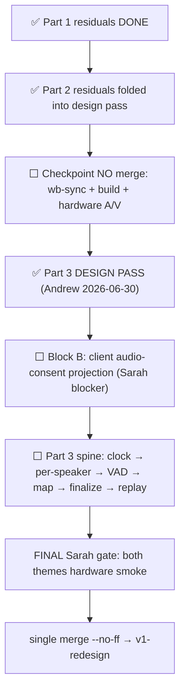

# ORCHESTRATOR STATE — canonical living bootstrap

> **READ THIS FIRST.** This file is the **single source of current orchestrator state** for tutoring-notes. We keep it current continuously (lightweight head every material turn; full restructure at milestones). A **brand-new orchestrator chat** must read it before dispatching work and must **NOT** ask Andrew for catch-up on what's done, where we are, what's next, or how we work — this doc, its reading list, and `git log` are authoritative.

> **Operating contract (`.cursor/rules/orchestrator-discipline.mdc`, explicit @ [`7341ff9`](https://github.com/Arangarx/tutoring-notes/commit/7341ff9)):** State durability is a **primary reliability obligation**, not a nicety. Andrew offloads project memory to the orchestrator on purpose — at any moment a session can be lost and a fresh orchestrator must resume with **minimal re-guidance** (ideally just "continue"). Keep this file continuously current; treat "I'll update state later" as a silent failure.

---

## ⏩ HEAD — 2026-06-30 Part 3 + consent design pass COMPLETE on `wb-wave5-polish`

> **Active branch:** [`wb-wave5-polish`](https://github.com/Arangarx/tutoring-notes/tree/wb-wave5-polish) — code @ [`691711f`](https://github.com/Arangarx/tutoring-notes/commit/691711f). **Worktree:** `tutoring-notes-polishwt` (default `tutoring-notes` checkout is on `v1-redesign` — NOT current). **All remaining Sarah-gate work lands here; single `merge --no-ff` to `v1-redesign` at final gate only (no interim merge, Andrew confirmed).** Integration base remains **`v1-redesign` @ [`7397abc`](https://github.com/Arangarx/tutoring-notes/commit/7397abc)**.

| Field | Value |
|---|---|
| **Last action completed** | **2026-06-30 Block B impl plan authored @ [`843ba19`](https://github.com/Arangarx/tutoring-notes/commit/843ba19)**; **7a RATIFIED fail-closed-universal** (no snapshot → no audio capture/upload/persist/transcribe; self-learners get all-true snapshot); **reachability finding** overturned consent-collection assumption (3 holes + ungated live join for missing snapshot). — — — **2026-06-30 Part 3 + consent DESIGN PASS COMPLETE — Andrew approved Block C (C1–C5) + disconnect/pause requirement; Block B (client audio-consent gate = Sarah-merge blocker, remote-surgical/in-person-all-or-nothing) ratified; design-pass gate PASSED, p3-* execution unblocked.** — — — **2026-06-30 DESIGN PASS (consent batch Block A) — Andrew ratified consent/privacy decisions @ `691711f`** (see Recent architectural decisions table). — — — **2026-06-30 p1c CSS co-location EXECUTED + pushed @ `045a7b4`** (Composer; 3 component-specific groups relocated into co-located sibling `.css`, shared primitives single-sourced, monolith −121L, jest 755/755 + tsc clean, appearance checkpoint-smoke-gated). **ALL Part 1/2 EXECUTION on `wb-wave5-polish` now complete** (coordinators A/V done + recording deferred; WbTopBar de-dup; CSS co-loc; reconnect + legacy-tests slivers). — — — **2026-06-30 p2a FOLD:** both p2a items folded into consent/recording design pass — `allowWhiteboardRecording` verdict **(d) NOT ENFORCED**; in-person consent projection **UNBUILT** → owned by Block B client consent projection. |
| **Next action(s)** | **(1) Block B execution** — 6-commit sequence per [`wb-block-b-consent-gate-plan.md`](wb-block-b-consent-gate-plan.md) **pending Andrew go** (`CLIENT-AUDIO-CONSENT-GATE` = Sarah-merge blocker; 7a fail-closed-universal; honest tutor "no consent on file" affordance). **(2) NEW open decisions pending Andrew:** consent-collection completeness (3 holes — Sarah-merge blocker vs fast-follow?); live session for unconsented minor (gate live join vs accept live-but-never-recorded). **(3) Part 1+2 checkpoint (NO merge):** `test:wb-sync` + surrogates + `npx next build` + hardware A/V smoke. **(4) Part 3 spine (unblocked):** `p3-clock` FIRST (incl. disconnect pause/freeze acceptance) → `p3-perspeaker-capture` → `p3-vad-chunking` + `p3-consent-recording` → `p3-incremental-map` → `p3-model-abstraction` → `p3-finalize` → `p3-replay-scrub` → `p3-video-seam` (design-only). **(5) FINAL Sarah gate:** full-experience hardware smoke both themes → single `merge --no-ff` to `v1-redesign`. |
| **Open Andrew-confirms** | **Go to execute Block B** (6-commit sequence per plan). **Consent-collection completeness** — close 3 holes (claim-without-consent; parent-create-no-consent; unclaimed tutor-created Student) as Sarah-merge **blocker** vs **fast-follow**? (7a fail-closed holds recording line interim.) **Live session for unconsented minor** — gate live join (require consent before minor goes live) vs accept live-but-never-recorded without consent? (Orchestrator lean: gating live for claimed minors worth considering for blocker.) **Debounced-disconnect pause trigger** — recommended default: stable disconnect ~6s (`PEER_EVICTION_TIMEOUT_MS`), not transient mobile blips; **final confirm at `p3-clock` execution**. **Standing:** **WB-LABEL-PARENT-SIGNIN** new term; **Sarah primary device** (assumed Windows desktop Chromium — verify on next call, [`SARAH-CALL-PREP.md`](../SARAH-CALL-PREP.md)); **Ship-to-Sarah gate** (notes path, end/continue save discipline, single-segment seek); **iOS student WB/A/V** zero real-device coverage ([`BACKLOG.md`](../BACKLOG.md) **WB-STUDENT-MOBILE-VALIDATION**). |
| **In-flight subagents** | **None.** Design-pass hook-point map complete; Block A (`691711f`), Block B, Block C ratified 2026-06-30. ⏸️ **Full `test:wb-sync` relay DEFERRED to final Sarah merge boundary** (per merge-cadence refinement). ⬜ **Hardware A/V smoke (both themes) still owed** before/at Sarah gate. p1c CSS co-location **COMPLETE @ `045a7b4`**. |
| **Uncommitted / unmerged** | **`wb-wave5-polish`** — Block B plan @ `843ba19`; 7a + reachability finding docs commit pending this turn. **Not merged** to `v1-redesign` (single `merge --no-ff` at final Sarah gate only). **`v1-redesign` @ `7397abc`** unchanged. |

**Strategic posture (unchanged):** Experience-driven wedge — WB + reliability = **ground floor (GATE)**; the win = accreting honest tutor-first continuity. [`experience-driven_wedge_ae2776e1.plan.md`](../../../../.cursor/plans/experience-driven_wedge_ae2776e1.plan.md). **Ship-to-Sarah gate** still governs cut to `v1-redesign → master` — see condensed block below.

**Process directives (standing):** preview links in **pairs** (Vercel MCP `branchAlias` + `https://preview.usemynk.com` when repointed); agent-runnable validation harnesses over manual smoke where possible; Opus-default for this reliability effort, Composer 2.5 only for zero-doubt mechanical tasks per active plan.

---

## Project arc + North Star

Pre-public pilot with one tutor (Sarah). North Star from [`AGENTS.md`](../../AGENTS.md): *"People need to use the app with confidence. Sarah is being patient, but that won't last forever."* Reliability bar: [`../../agenticPipeline/.cursor/rules/reliability-bar.mdc`](../../agenticPipeline/.cursor/rules/reliability-bar.mdc).

**Current program:** Complete the **live-session arc** (auth join → waiting room → live A/V whiteboard → end → per-speaker capture → transcription → review) as one reliable unit on `wb-wave5-polish`, then **single merge** to `v1-redesign` (the Sarah merge).

---

## Branch layering

```
master  ←  v1-redesign  (integration base @ 7397abc; Wave 4 merged; held for Sarah gate + master cut)
              ↑
              └── wb-wave5-polish @ 691711f  (ALL remaining work; worktree tutoring-notes-polishwt; NO interim merge)
```

| Branch | Role | Tip |
|---|---|---|
| **`v1-redesign`** | Integration base; Wave 4 student responsive parity merged @ [`a166f6c`](https://github.com/Arangarx/tutoring-notes/commit/a166f6c); subsequent doc commits through [`7397abc`](https://github.com/Arangarx/tutoring-notes/commit/7397abc) | Not yet merged to `master` — held for Gate A + Ship-to-Sarah + comprehensive re-smoke |
| **`wb-wave5-polish`** | **Active execution branch** — Wave 5 chrome/polish + reliability floor (Parts 1–3 of active plan); worktree `tutoring-notes-polishwt` | [`691711f`](https://github.com/Arangarx/tutoring-notes/commit/691711f) |

**Merge discipline (ratified):** All remaining work stays on `wb-wave5-polish`. **Single `merge --no-ff` to `v1-redesign`** at the final Sarah gate only. No interim merge.

Decisions ledger: [`docs/handoff/v1-redesign-STATUS.md`](v1-redesign-STATUS.md).

---

## Current Wave focus

**Active plan:** [`whiteboard_reliability_remaining_b082882.plan.md`](../../../../.cursor/plans/whiteboard_reliability_remaining_b082882.plan.md) — supersedes archived [`whiteboard_reliability_floor_9ba650d1.SUPERSEDED.plan.md`](../../../../.cursor/plans/archive/whiteboard_reliability_floor_9ba650d1.SUPERSEDED.plan.md).

**Done on branch (Parts 0, 1A mostly, 2A, 2B mostly):** guardrails, A/V bug fixes (enumerate-mutex, audio-reneg), waiting-room overlay, auth-join, lifecycle/consent unconditional enforcement, phantom-stroke fix, per-speaker investigation.

**Remaining (execution order):**



| Phase | Key todos | Notes |
|---|---|---|
| **Block B (first)** | `CLIENT-AUDIO-CONSENT-GATE` + **CONSENT-HONESTY-SARAH-MERGE-BLOCKER** | Sarah-merge blocker — client consent projection; gate capture/upload/IDB/transcription end-to-end |
| **Checkpoint** | `p1-checkpoint` | **NO merge** — quality gate before Part 3 execution |
| **Part 3 spine** | `p3-clock` → `p3-perspeaker-capture` → `p3-vad-chunking` → `p3-consent-recording` → `p3-incremental-map` → `p3-model-abstraction` → `p3-finalize` → `p3-replay-scrub` → `p3-video-seam` | **UNBLOCKED** (design pass approved 2026-06-30); tap-before-mix; disconnect pause/freeze in `p3-clock` |
| **Final gate** | `p-final-gate`, `p-test-account-reset` | Both themes; then merge; then test data reset at master cut |

---

## Latest committed state (`wb-wave5-polish` @ `8c9f68b`)

| Commit | Summary |
|---|---|
| [`8c9f68b`](https://github.com/Arangarx/tutoring-notes/commit/8c9f68b) | **Branch tip** — chore(repo): untrack accidentally-committed props-flyout debug screenshot |
| [`b082882`](https://github.com/Arangarx/tutoring-notes/commit/b082882) | fix(tests): upsert ConsentRecord in allowLiveSession denial test (relay harness fix) |
| [`c70e191`](https://github.com/Arangarx/tutoring-notes/commit/c70e191) | Quarantine 2nd-session AV-tile presence test as pre-existing flake |
| [`f0a2b72`](https://github.com/Arangarx/tutoring-notes/commit/f0a2b72) | Phantom-stroke: extend degenerate filter to live-sync broadcast path |
| [`29d9fe9`](https://github.com/Arangarx/tutoring-notes/commit/29d9fe9) | Merge phantom fix (adapter + action-sheet backdrop) |
| [`5acfb10`](https://github.com/Arangarx/tutoring-notes/commit/5acfb10) | Unconditional consent — remove `CONSENT_ENFORCEMENT` flag |
| [`2faecd8`](https://github.com/Arangarx/tutoring-notes/commit/2faecd8) | Remove per-session tutor attestation modal |
| [`63719b4`](https://github.com/Arangarx/tutoring-notes/commit/63719b4) | `allowNoteSending` gate on auto notes trigger |
| [`ab60bf5`](https://github.com/Arangarx/tutoring-notes/commit/ab60bf5) | `sessionPhase=ACTIVE` server guards |
| [`274f21a`](https://github.com/Arangarx/tutoring-notes/commit/274f21a) | `allowLiveSession=false` blocks learner join |
| [`c8265b1`](https://github.com/Arangarx/tutoring-notes/commit/c8265b1) | Phantom-stroke: drop degenerate line/arrow in `toCanonical` |
| [`3429b94`](https://github.com/Arangarx/tutoring-notes/commit/3429b94) | Merge liveboard-chrome student parity + tutor mic-meter fix |
| [`652ab46`](https://github.com/Arangarx/tutoring-notes/commit/652ab46) | Merge waiting-polish quick-wins + join-timer fixes |

Full history: `git log --oneline -25 wb-wave5-polish`.

**Smokebooks (recent):** [`wb-wave5-consent-perms-2026-06-30.md`](wb-wave5-consent-perms-2026-06-30.md), [`wb-wave5-liveboard-chrome-smokebook-2026-06-29.md`](wb-wave5-liveboard-chrome-smokebook-2026-06-29.md), [`wb-wave5-waiting-polish-quickwins-resmoke-2026-06-28.md`](wb-wave5-waiting-polish-quickwins-resmoke-2026-06-28.md).

---

## Queued dispatches (in order)

1. **Block B** — honesty-blocker + client audio-consent projection (`CLIENT-AUDIO-CONSENT-GATE` = Sarah-merge blocker).
2. **`p1-checkpoint`** — full `test:wb-sync` + regression + build + hardware A/V (NO merge).
3. **Part 3 spine** — `p3-clock` (incl. disconnect pause/freeze) → per-speaker capture through replay-scrub; video seam design-only.
4. **`p-final-gate`** — both themes hardware smoke → **`merge --no-ff` `wb-wave5-polish` → `v1-redesign`**.
5. **`p-test-account-reset`** — at master cut, preserve Andrew + Sarah admin accounts.

---

## Ship-to-Sarah gate (CONFIRMED by Andrew 2026-06-16 — still governing)

Andrew wants Sarah on the `v1-redesign` line once **waiting room → WB → end session is stable for tutor AND student — backend data pipeline INCLUDED**. Capture: [`sarah-pilot-feedback-2026-06-16-orchestrator-report.md`](sarah-pilot-feedback-2026-06-16-orchestrator-report.md).

**Confirmed gate items:** (1) notes — legacy monolithic generate path gone; per-chunk auto-notes only; (2) End/Continue on student-detail open-sessions never silently deletes recording; (3) single-segment seek works at every review entry point. Multi-segment seek → backlog SSG-3 only. **(4) Consent UI honesty — `CONSENT-HONESTY-SARAH-MERGE-BLOCKER` (NEW, Andrew 2026-06-30):** minimal honesty fix ships **with** the Sarah merge — hide dead `allowWhiteboardRecording` toggle; rewrite `allowLiveSession` copy to honestly cover live A/V **and** whiteboard capture (see **LIVE-SESSION-CONSENT-COPY**); sweep consent UI for any other shown-but-unenforced toggles. Fuller guided-setup / affordance pass (**CONSENT-UX-REDESIGN**) is fast-follow, **not** a blocker. Rationale: Sarah merge = first no-going-back moment with real families; we do not ship dishonest consent UI. Cross-ref: [`BACKLOG.md`](../BACKLOG.md) **CONSENT-HONESTY-SARAH-MERGE-BLOCKER**.

**Pre-master smoke deferral ledger:** [`pre-master-smoke-deferral-ledger-2026-06-16.md`](pre-master-smoke-deferral-ledger-2026-06-16.md).

---

## Open decisions — Andrew confirms

### Live gate (Part 3)

| # | Question | Status |
|---|---|---|
| **Part 3 design pass** | Overall Part 3 architecture/sequencing — review and approve in design session with Andrew before any p3-* execution | **OPEN — mandatory gate** |

Ratified **inputs** (not substitutes for the design pass): t=0 = FSM `recording` entry / `MediaRecorder.start()` + WB↔audio hardware sync oracle; 3+-peer per-speaker ≤3–4 cap NO mixdown fallback; minimal eval harness post-Sarah only; session-scoped consent override won't build for Sarah (`WB-SESSION-CONSENT-OVERRIDE`).

### Standing (from prior threads)

| Item | Notes |
|---|---|
| **WB-ADULT-JOIN-ENABLEMENT B1** | Thread B product confirm |
| **WB-LABEL-PARENT-SIGNIN** | New term confirm |
| **Sarah primary device** | Assumed Windows desktop Chromium |
| **iOS student WB/A/V** | Zero coverage — [`BACKLOG.md`](../BACKLOG.md) **WB-STUDENT-MOBILE-VALIDATION** |
| **B2 consent Step 6** | Parent per-tutor consent management UI — deferred past V1 |

---

## Recent architectural decisions (2026-06-30)

| Decision | Status |
|---|---|
| **Consent enforcement unconditional** | ✅ `CONSENT_ENFORCEMENT` deleted; always-on |
| **Per-speaker tap-before-mix** | ✅ Design-around ratified — transcription lanes only; mixdown = sole replay source; merge by `recordingTimeOffsetMs` never `createdAt` |
| **Reverses prior rollback [`89e0fe1`](https://github.com/Arangarx/tutoring-notes/commit/89e0fe1)** | ✅ With sync-metadata contract — document in LIVE-AV.md invariant #6 during `p3-perspeaker-capture` |
| **No interim merge** | ✅ All work on `wb-wave5-polish`; single merge at Sarah gate |
| **t=0 clock anchor** | ✅ **RATIFIED (2026-06-30)** — FSM `recording` / `MediaRecorder.start()`; WB↔audio hardware sync oracle in `p3-clock`; disconnect pause/freeze acceptance folded in. |
| **Part 3 design-pass gate** | ✅ **APPROVED (Andrew 2026-06-30)** — Block B + Block C (C1–C5) ratified; p3-* execution unblocked. |
| **CLIENT-AUDIO-CONSENT-GATE (Block B)** | ✅ **RATIFIED Sarah-merge BLOCKER (2026-06-30)** — client consent projection: load `SessionConsentSnapshot` into workspace; gate capture/upload/IDB/transcription end-to-end. In-person: student audio off = no session audio; remote: keep tutor, drop student from mixdown + transcription; live hearing never gated. Honest tutor indicator. Build once for `p3-consent-recording`. Cross-ref Block A: **LIVE-SESSION-CONSENT-COPY**, **CONSENT-HONESTY-SARAH-MERGE-BLOCKER**. Impl plan: [`wb-block-b-consent-gate-plan.md`](wb-block-b-consent-gate-plan.md) @ `843ba19`. |
| **7a fail-closed-universal (no snapshot)** | ✅ **RATIFIED (Andrew 2026-06-30)** — when no `SessionConsentSnapshot` / no `ConsentRecord` (any cause), audio is **not** captured/uploaded/persisted/transcribed ("no consent record = assume no consent"). No minor-vs-adult classification at capture time; self-learners get all-`true` snapshot via `isSelfLearner`. Whiteboard unconditional; live session **not** gated by 7a. Tutor gets unmistakable "no consent on file → recording & notes off" affordance (Block B blocker scope). |
| **Consent-collection reachability (3 holes + ungated live join)** | ⬜ **OPEN — pending Andrew (2026-06-30 investigation)** — overturned assumption that minors always have consent on file. Three paths to no-record session: (1) claim-complete without consent POST; (2) parent-create-learner writes no `ConsentRecord` (dashboard editor preview-only); (3) unclaimed tutor-created `Student` before claim (snapshot skipped; unclassifiable as minor). Join gate allows live join when snapshot **missing** (`join/[sessionId]/page.tsx:219-228`). 7a closes **audio-capture** exposure; remaining gaps = collection completeness + live-session gating. **Open forks:** collection fixes Sarah-merge blocker vs fast-follow; gate live for unconsented minor vs live-but-never-recorded. [`BACKLOG.md`](../BACKLOG.md) `CONSENT-COLLECTION-COMPLETENESS`. |
| **Part 3 C1–C5 (Block C)** | ✅ **APPROVED (Andrew 2026-06-30)** — C1: transcription-only per-speaker lanes, mixdown replay, merge by `recordingTimeOffsetMs`; C2: VAD live chunking replaces 50-min rollover; C3: ffmpeg single continuous replay at End; C4: build order locked; C5: video designed-for, not built for Sarah. |
| **Disconnect/pause requirement** | ✅ **RATIFIED (2026-06-30)** — on student disconnect: audio pauses + clock freezes; WB continues at frozen timestamp; reconnect resumes. Gap strokes collapse to pause instant (accepted). Trigger: debounced stable disconnect ~6s (`PEER_EVICTION_TIMEOUT_MS`) — **final confirm at p3-clock execution**. |
| **WB disconnect behavior FINAL** | ✅ Keep-as-is (WB usable during disconnect; strokes cluster at pause instant); disable-WB + gap-marker considered & deferred (`WB-DISCONNECT-GAMIFICATION-DEFERRED`) — revisit only if gaming becomes a problem |
| **WB-MENU-CLICK-THROUGH** | Deferred post-Sarah → [`BACKLOG.md`](../BACKLOG.md) |
| **Test data reset at master cut** | Preserve Andrew + Sarah admin; reset disposable learners (`p-test-account-reset`) |
| **WB-CONSENT-UNCONDITIONAL** | ✅ **RATIFIED (2026-06-30)** — whiteboard recording is **unconditional** for Sarah merge (not separately gated). `allowWhiteboardRecording` toggle **hidden** from consent UI (mirrors `WB-NOTES-EMAIL-SUBSCRIPTION-REFRAME`); Prisma + `SessionConsentSnapshot` fields **retained** (no migration). WB capture covered by `allowLiveSession` consent + privacy policy/ToS. Re-introducing real enforcement later is additive (D-1 access-gate, already mapped) pending legal consult. Resolves D-1 vs D-2 fork for Sarah: unconditional capture, honest copy = legal cover. |
| **LIVE-SESSION-CONSENT-COPY** | ✅ **RATIFIED (2026-06-30)** — `allowLiveSession` toggle copy MUST honestly state BOTH (a) student seen/heard live AND (b) whiteboard is recorded. Clear+honest copy = "fairly covered" pending counsel; anti-dark-pattern guarantee. Literal final copy string drafted for Andrew approval — never auto-shipped. |
| **CONSENT-DEFAULTS-OPT-IN** | ✅ **RATIFIED (2026-06-30)** — consent toggle defaults stay **OFF** / affirmative opt-in. Child-related consent must be affirmative (GDPR pre-ticked invalid; COPPA affirmative parental consent — confirm specifics with counsel). Opt-out defaults violate founding no-dark-patterns principle. Andrew "default-on?" question = **NO**. |
| **CONSENT-PRESENTATION-NO-TRICKS** | ✅ **RATIFIED direction (2026-06-30)** — fix low activation via **presentation**, not defaults: OFF-but-recommended toggles feel unfinished/attention state; value-first microcopy; guided-setup + completion indicator; distinguish required-for-feature (live session) from recommended (audio→notes). Must not go even one step toward anything construable as a "trick." Execution = fast-follow **CONSENT-UX-REDESIGN**, not Sarah blocker. |
| **CONSENT-HONESTY-SARAH-MERGE-BLOCKER** | ✅ **RATIFIED (2026-06-30)** — consent UI honesty is a **Sarah-merge blocker** (not fast-follow). **Minimal honesty fix** ships with merge: hide dead `allowWhiteboardRecording` toggle; rewrite `allowLiveSession` copy; sweep for other shown-but-unenforced toggles. **CONSENT-UX-REDESIGN** (full presentation pass) = fast-follow only. |
| **CONSENT-LEGAL-CONSULT** | Backlog — when affordable: validate with counsel (a) live-session consent + privacy policy sufficiency for minor WB capture, (b) whether minor WB needs own affirmative gate, (c) child-consent opt-in requirements, **(d) transcription of minor audio**. [`BACKLOG.md`](../BACKLOG.md). |
| **WB-SELECTIVE-REDACTION** | Backlog — **FUTURE, explicitly NOT pilot**: possible redaction of personal artifacts (homework PDFs/images) from WB capture while keeping strokes; content-classification + legal problem. Pilot = all-or-nothing unconditional WB. [`BACKLOG.md`](../BACKLOG.md). |

Full locked decisions: active plan § "Resolved (Andrew)".

---

## Hard-won lessons (durable)

### New (2026-06-30)

**lesson-codified-hack — tutor/student waiting-room mic delta mis-scoped twice:** First codified a chip-hack; then flattened tutor's full `MicControls` dropdown to match student's stripped control. **Tell:** student/tutor asymmetry. Echoes "branch decisions ≠ ratified intent" + "confirm material UX deltas explicitly."

**lesson-deferred-relay — relay specs authored with suite run DEFERRED had harness bugs jest couldn't catch:** Both phantom-stroke spec (wrong URL/auth + naive absence oracle) and consent-denial spec (`consentRecord.create()` unique-constraint) failed only at integration relay. **NEW RULE:** new wb-regression specs should get **≥1 targeted relay run** before declaring done, even when full suite run is deferred.

**data-reset-at-master-cut:** At `v1-redesign → master` cut, reset test data but **preserve Andrew + Sarah admin accounts**; re-confirm with Sarah then. Concrete todo: `p-test-account-reset`.

**no-interim-merge:** Ratified — single `merge --no-ff` at final Sarah gate only.

### Still load-bearing (do not forget)

**Plans ≠ ratified intent (2026-06-17):** Material product/UX decisions must be surfaced to Andrew explicitly — silence is not consent.

**Missed prompt ≠ consent (2026-06-17):** Re-surface material decisions; never infer from inaction.

**Subagent git safety (2026-06-10):** Never `git restore`/`reset --hard` to unblock checkout when uncommitted user work exists.

**Whiteboard chrome — extend don't rewrite (2026-06-09):** ADDITIVE ONLY on `WhiteboardWorkspaceClient.tsx` engine paths.

**Layout/coordinates — jsdom blind spot (2026-05-30):** Prove geometry on real browser; requirement-not-code tests.

**Flag-gated feature + test-injected flag = synthetic green (2026-06-17):** Green on flagged test path ≠ production default wired.

**Tombstone resurrection (2026-06-18):** Reconcile baseline must use `getSceneElementsIncludingDeleted()`.

**MediaStream id blocks video remount (2026-06-18):** Fresh `MediaStream` on reconnect.

**Mobile backgrounding ≠ full mesh rebuild (2026-06-18):** Deliberate leave vs transient suspend.

**Doc-heavy merges → add/add conflicts (2026-06-18):** Union-merge; preserve Andrew's smoke notes.

**RSC cookie-write no-op (2026-06-14):** Never write cookies from RSC render.

**CSS `@layer` cascade (2026-06-12):** Legacy unlayered base CSS beats Tailwind utilities.

**Secret egress (2026-05-31):** No plaintext secrets to third-party URLs (2FA QR lesson).

---

## Pilot context (Sarah)

Latest capture: [`sarah-pilot-feedback-2026-06-16-orchestrator-report.md`](sarah-pilot-feedback-2026-06-16-orchestrator-report.md). Call prep: [`SARAH-CALL-PREP.md`](../SARAH-CALL-PREP.md).

Sarah remains on production `master` ("old & busted") until Ship-to-Sarah gate passes on merged `v1-redesign` line.

---

## Parked threads (after Sarah merge)

| Thread | Notes |
|---|---|
| **Experience-driven wedge Phases 2–4** | Continuity engine, note quality, instrumentation — post this merge |
| **WB-COMPONENTS-PASS** | Full shadcn migration — incremental on touched surfaces only for now |
| **VIDEO recording capture** | Design seam in Part 3; build post-Sarah |
| **WB-MENU-CLICK-THROUGH** | Desktop popover click-through |
| **iOS per-speaker MediaRecorder** | Documented untested for Sarah merge |
| **`docs/phase3-consent-model` @ `4f9dbcd`** | Awaits union-merge to `v1-redesign` (conflict risk on handoff docs) |
| **A6-1 multi-segment replay** | Obviated by continuous-stream finalization in Part 3; legacy path neutralized not deleted |

---

## Housekeeping (pending — do not act until merge confirmed)

Worktree cleanup after integration merged: `tutoring-notes-polishwt`, `fixwt`, `liveboardwt` (+ consent/phantom satellite worktrees). See `git worktree list`.

---

## How we work (process — pointers only)

- **Orchestration model:** [`AGENTS.md`](../../AGENTS.md) § "Model usage protocol"
- **Dispatch boundary:** [`.cursor/rules/orchestrator-discipline.mdc`](../../.cursor/rules/orchestrator-discipline.mdc)
- **Merging (solo pilot):** smokeable branch → Andrew smoke → `merge --no-ff`; WB sync → `npm run test:wb-sync` at merge boundary; build-surface → `npx next build`
- **Smokebooks:** [`SMOKEBOOK-TEMPLATE.md`](SMOKEBOOK-TEMPLATE.md); preview URL via Vercel MCP (never guessed)
- **Commits on Windows/PowerShell:** `.git/COMMIT_MSG_DRAFT.txt` + `git commit -F`

---

## Reading list

Fresh orchestrator — read in order:

1. [`AGENTS.md`](../../AGENTS.md)
2. [`docs/handoff/ORCHESTRATOR-STATE.md`](ORCHESTRATOR-STATE.md) (this file) — **HEAD first**
3. **Active plan:** [`whiteboard_reliability_remaining_b082882.plan.md`](../../../../.cursor/plans/whiteboard_reliability_remaining_b082882.plan.md)
4. [`docs/LIVE-AV.md`](../LIVE-AV.md) — before any A/V or per-speaker work
5. [`docs/RECORDER-LIFECYCLE.md`](../RECORDER-LIFECYCLE.md) — before FSM/outbox/end-session
6. [`docs/WHITEBOARD-STATUS.md`](../WHITEBOARD-STATUS.md)
7. [`docs/handoff/v1-redesign-STATUS.md`](v1-redesign-STATUS.md)
8. [`docs/BACKLOG.md`](../BACKLOG.md)
9. [`docs/RELEASE-ROADMAP.md`](../RELEASE-ROADMAP.md)
10. [`docs/SARAH-CALL-PREP.md`](../SARAH-CALL-PREP.md)
11. [`docs/PLATFORM-ASSUMPTIONS.md`](../PLATFORM-ASSUMPTIONS.md)

Archived superseded plan (audit only): [`whiteboard_reliability_floor_9ba650d1.SUPERSEDED.plan.md`](../../../../.cursor/plans/archive/whiteboard_reliability_floor_9ba650d1.SUPERSEDED.plan.md).

---

## Open questions still in flight

| Question | Status |
|---|---|
| **Part 3 design pass** | **OPEN — mandatory gate before p3-* execution** |
| Map/reduce notes accuracy | Poor today — model abstraction + post-Sarah eval |
| Two-way calendar sync | Unresolved — [`scheduling-requirements-2026-06-11.md`](scheduling-requirements-2026-06-11.md) |

Resolved 2026-06-30 (ratified inputs, not design-pass substitute): t=0 anchor; 3+-peer cap ≤3–4 no mixdown fallback; session-scoped consent override won't build; minimal eval post-Sarah only.

---

## History / audit trail

Updated in place; `git log -p docs/handoff/ORCHESTRATOR-STATE.md`. Template: [`docs/handoff/orchestrator-state-template.md`](orchestrator-state-template.md).

Deep history: `git log --oneline wb-wave5-polish`, `git log --oneline v1-redesign`.

---

## Overall result

*(Orchestrator checkpoint — 2026-06-30 reconcile: Part 3 design-pass-gated; body↔HEAD consistent; tip 8c9f68b.)*
