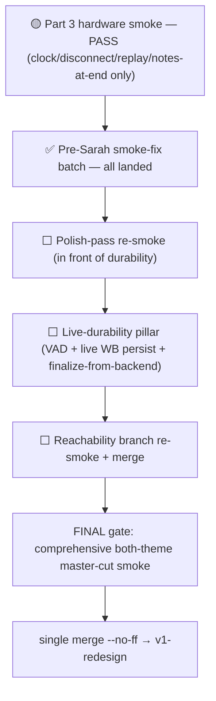

# ORCHESTRATOR STATE — canonical living bootstrap

> **READ THIS FIRST.** This file is the **single source of current orchestrator state** for tutoring-notes. We keep it current continuously (lightweight head every material turn; full restructure at milestones). A **brand-new orchestrator chat** must read it before dispatching work and must **NOT** ask Andrew for catch-up on what's done, where we are, what's next, or how we work — this doc, its reading list, and `git log` are authoritative.

> **Operating contract (`.cursor/rules/orchestrator-discipline.mdc`, explicit @ [`7341ff9`](https://github.com/Arangarx/tutoring-notes/commit/7341ff9)):** State durability is a **primary reliability obligation**, not a nicety. Andrew offloads project memory to the orchestrator on purpose — at any moment a session can be lost and a fresh orchestrator must resume with **minimal re-guidance** (ideally just "continue"). Keep this file continuously current; treat "I'll update state later" as a silent failure.

---

## ⏩ HEAD — 2026-07-04: **EXECUTING go-to-Sarah master-cut plan (overnight autonomous run)** @ [`go-to-sarah-master-cut-plan.md`](go-to-sarah-master-cut-plan.md)

> **FRESH EXECUTION CHAT — start here.** Work in worktree **`tutoring-notes-polishwt`** (a subagent got lost on this once — do NOT use the default `tutoring-notes` checkout, which is on `v1-redesign`), branch **`wb-wave5-polish`**. Reading list: THIS head → [`go-to-sarah-master-cut-plan.md`](go-to-sarah-master-cut-plan.md) (the executor spec) → [`go-to-sarah-plan-5axis-review.md`](go-to-sarah-plan-5axis-review.md) (BLOCKERs/SHOULD-FIXes, all folded into the plan) → `AGENTS.md` + [`.cursor/rules/orchestrator-discipline.mdc`](../../.cursor/rules/orchestrator-discipline.mdc). **Conductor tier:** Opus conducts durability pillars WS-A/B/C/D (fragile surfaces); Composer 2.5 subagents write code/tests; Sonnet 5-axis review of fragile diffs. Execution is **fragile-serial** in the one shared worktree (no parallel code-writers → clobber risk); WS-E disjoint bugs run serially too for overnight reliability.

### 🔴 LIVE EXECUTION LOG (overnight 2026-07-04) — resume from the first ⬜

Final 5-axis sanity pass: **no new fragile-surface BLOCKER**; plan execution-ready. Two refinements folded into dispatch prompts (WS-A pin `VAD_MIN_SEGMENT_SECONDS`; Wave 0 dup-orderIndex pre-check).

| Step | Status | Commit / note |
|---|---|---|
| Wave 0 — migration + OutboxRow TS fields | ✅ | [`34d2a34`](https://github.com/Arangarx/tutoring-notes/commit/34d2a34) — `WhiteboardEventBatch` + `SessionRecording` orderIndex `@@unique` + `lastPersistedBatchSeq/ToIndex` cols; OutboxRow `recordingTimeOffsetMs?`/`speakerId?` (no IDB bump). Additive-only (68 ins/0 del); local dup-check zero; validate + test:wb-jest 774 green. **NOTE for cut:** local test DB has no `_prisma_migrations` history (P3005) → migration applied via `db execute`; folder well-formed for Neon `migrate deploy` at cut, but re-run dup-orderIndex check on prod before applying. |
| WS-A — audio durability (VAD + register + per-speaker) | ✅ code+unit | P1 [`23c11a5`](https://github.com/Arangarx/tutoring-notes/commit/23c11a5) (VAD in meter RAF; timer surgery: hard-stop KEPT / chime re-anchored to session time / 50-min deleted; atomic-orderIndex register; onSegmentUploaded hook) + P2 [`05d2a65`](https://github.com/Arangarx/tutoring-notes/commit/05d2a65) (per-speaker lanes consent-gated on policy==full + claimed LearnerProfile; C-core folded; A4 merge). Mixdown/consent/gain UNTOUCHED. Replay-mix exclusion RED-BEFORE proven (unit). jest 777. |
| WS-B — WB ~1s persist sidecar | ✅ code+unit | [`578f350`](https://github.com/Arangarx/tutoring-notes/commit/578f350) — `runServerPersist` sidecar (mutex `persistInProgressRef`, 409-safe cursor, retry×3, boardDocumentJson every batch, ≥3-fail tutor warning); checkpoint route batch upsert (BLOCKER-2); erasure walk + db-state test route; no 1s Blob. Section A/`runCheckpoint`/apply paths UNTOUCHED. Policy unit 10/10 + route 5/5; jest 790. |
| Sonnet 5-axis review of WS-A+WS-B fragile diff | ✅ | No blocking BLOCKERs; 9 invariants hold, REPLAY-MIX clean. 4 SHOULD-FIX folded @ [`9ceeee7`](https://github.com/Arangarx/tutoring-notes/commit/9ceeee7): SF-1 `SessionRecording @@unique([wbsid,blobUrl])` + idempotent register P2002; SF-2 atomic checkpoint cursor `GREATEST`; SF-3 VAD delta clamp (iOS backgrounding); SF-4 relaxed CI asserts. jest 794. |
| GATE PREREQ FIX — Playwright webServer `prisma db push` | ✅ | [`b8b4bdd`](https://github.com/Arangarx/tutoring-notes/commit/b8b4bdd) — `playwright.config.ts` webServer: `--accept-data-loss` on db push + `PLAYWRIGHT_TEST=1` + `PLAYWRIGHT_TEST_SECRET`. Relay green again: baseline `wb-session-lifecycle` 44 pass/1 skip/1 pre-existing flake. **WS-B `wb-live-persist-tab-kill` PASS in real browser** ✅ (WS-B teeth now proven, not just unit). jest 794. |
| E2 dup-stroke PDF | ✅ code; ⚠️ real-browser BLOCKED | [`34f650a`](https://github.com/Arangarx/tutoring-notes/commit/34f650a) — bump `tutorSwitchTokenRef`+`pageSwitchProgrammaticRef` at `commitPdfBatch` entry, release in `.finally()`. jest 794. Teeth spec authored + harness now runs it, but **pdfjs-dist won't load in headless Playwright** (`Object.defineProperty called on non-object`) — SAME pre-existing gap as `inv-8` quarantine (`docs/BACKLOG.md`); dup-stroke oracle never executes. Attempting a headless-pdfjs fix (unlocks E2 teeth **and** inv-8); if genuinely hard → PARK real-browser proof as [human-only] PDF-render smoke w/ stated reason. |
| E3 reconnect pill (fold a962171 + BUG-8) | 🅿️ **PARKED for Andrew** | **Orchestrator decision (2026-07-04 overnight):** NOT executed. (1) Conflicts w/ Andrew's explicit 2026-07-03 park of `a962171` ("revisit only if base at risk"; base is safe) + BUG-8/BUG-9 "deferred hardening — plan + hardware/Sarah validation required". Plan inclusion ≠ ratified intent (`AGENTS.md` lesson). (2) BUG-8 is a **behavioral** change to `peer-mesh.ts`/`useLiveAV.ts` (most fragile surface; the exact surface the consolidated re-smoke FAILED on — already cost a recovery cycle). (3) Core acceptance = WebRTC media-transport recovery = genuinely **[human-only]** (real Safari/iOS); a jsdom/DOM "test" would be **theater** (blind to media transport) → would violate the zero-mechanical-bugs bar by faking coverage. Folding `a962171` alone just re-exposes the honest-but-failing pill (why Andrew parked it). **Needs Andrew + hardware in the loop.** Did NOT touch the A/V surface. Continuing with WS-C/D/E (additive + relay-testable). |
| WS-C finalize-from-backend + straight-to-overlay | ✅ code+teeth | [`dadc01e`](https://github.com/Arangarx/tutoring-notes/commit/dadc01e) — C1 `finalizeWhiteboardSessionFromBackend` (assembly-only → delegates to `endWhiteboardSession`, internals UNTOUCHED; new `assemble-persisted-state.ts`); C2/C3 wire roster/gate/in-live End to C1, `LEGACY_INTENT_ENDREVIEW_AUTO_END=false`. Real-browser teeth GREEN (`--workers=1`): roster + gate specs — no `intent=endreview`, no waiting-room flash, review<5s, endedAt+recordings+strokes preserved. **Items 5 (flash) + 7 (orphan) proven fixed.** jest 794. `[fzb]` registered. NOTE: WS-C spec uses `seed-recording` test helper for the finalize-preserves-recording assertion (A2's real-record path is proven separately in WS-A spec). |
| WS-D resume-from-backend | ✅ code+teeth | [`fc147ff`](https://github.com/Arangarx/tutoring-notes/commit/fc147ff) — server hydrate on ACTIVE open via `assembleInitialPersistedState` → `initialPersistedState` prop → `useWhiteboardRecorder.hydrateFromServer()` (seeds log/cursors, paints multi-page `boardDocument` via existing `applyBoardDocumentV1ToExcalidraw`); IDB banner suppressed when server batches exist (ACTIVE-w/o-batches + student join UNCHANGED); clock continuity via `createSessionMsClock(initialAccruedMs)`. New `[wbr]` prefix registered. Real-browser teeth `wb-resume-from-backend.spec.ts` GREEN (42s). jest 796. Section A diff/apply + student join NOT behaviorally changed. |
| Sonnet 5-axis review of WS-C+WS-D fragile diff | ✅ done — **1 BLOCKER + 2 SHOULD-FIX** | **BLOCKER (WS-D `fc147ff`):** Section F in `useWhiteboardRecorder.ts` unconditionally suppresses the IDB recovery prompt whenever server batches exist — **even if IDB has MORE events than the server batches cover** (strokes written to IDB while the DB batch write was in-flight at tab-kill are permanently lost). Direct reliability-bar regression. **Fix:** run `findCheckpoint` in parallel with the hydrate decision; only suppress IDB when `serverState.lastPersistedToIndex >= idbCheckpoint.events.length - 1`; else preserve prompt or merge server+IDB. **SHOULD-FIX 1:** no gap/overlap detection in `mergeEventBatchesFromDb`. **SHOULD-FIX 2:** live-sync-connect vs `hydrateFromServer` race has no ordering guarantee. **Clean:** ownership, consent, erasure, C1 delegation contract, test-route double-gating, clock seeding math, fragile-surface non-modification. **→ dispatching WS-D BLOCKER+SHOULD-FIX serially once E1 frees the relay (no concurrent code-writers — git-race lesson).** |
| WS-E E1 shimmer | ✅ code+teeth | [`e178fc4`](https://github.com/Arangarx/tutoring-notes/commit/e178fc4) — wrapper `::after` overlay (z-index 10) over VISIBLE fields, higher-contrast gradient, `prefers-reduced-motion` static, copy split ("Waiting for transcript…"/"Writing notes…"). Real-pipeline Playwright asserts `background-position` MOVES over ~800ms (not the forbidden `animationName` anti-pattern) — 2/2 PASS. jest 796. New `src/styles/tutor-notes-shimmer.css`. |
| WS-D BLOCKER + 2 SHOULD-FIX (from 5-axis) | ✅ done+teeth | [`f83267d`](https://github.com/Arangarx/tutoring-notes/commit/f83267d) — pure `shouldSuppressIdbPrompt` (suppress only when server coverage ≥ IDB); IDB-ahead → **auto-merge** server prefix + IDB tail (zero-loss, no double-apply); `mergeBatchRows` gap/overlap detect (`[wbr] merge_gap` → IDB fallback); `mountHydrateCompleteRef` defers remote ingest until hydrate done. Red-before/green-after predicate unit test; jest 808; resume spec green (40.6s). Apply-path + student join UNCHANGED (guard-only). |
| GATE BLOCKER — `npx next build` | ✅ FIXED | [`091bbfa`](https://github.com/Arangarx/tutoring-notes/commit/091bbfa) — removed 2 stale `eslint-disable @typescript-eslint/no-explicit-any` comments (WS-A `23c11a5`; code already used `Record<string,unknown>`; dir not registered for that rule → build error). Also fixed a **latent TS error in `pdf-render.ts`** (from E2 pdfjs fix `11429a0` — string-literal dynamic import unresolvable) via const-URL + cast. **`npx next build` exit 0** (route table printed); jest 808. eslint.config untouched. |
| WS-E E5 (roughness) | ✅ done+teeth | [`7511dd9`](https://github.com/Arangarx/tutoring-notes/commit/7511dd9) — `updateStrokeStyle` → `updateScene({ appState, captureUpdate: "IMMEDIATELY" })`. Real-browser teeth `wb-roughness-style.spec.ts`: draw freedraw w/ roughness=2, assert element.roughness===2 (red-before default 0). GREEN. |
| WS-E E4 (replay active board tab) | ✅ done+teeth | [`1e4703b`](https://github.com/Arangarx/tutoring-notes/commit/1e4703b) — additive `page-switch` WBEvent (no schema bump; `reconstructSceneAt` unchanged — hits default branch) + `recordPageSwitch` emit on selectTutorPage/addTutorPage + `deriveReplayPageListFromLog`/`findActiveReplayPageIdAt` + dynamic replay tab strip. Jest emission + Playwright 2-board scrub GREEN. jest 812. **⚠️ E4 touched `event-log.ts` → `test:wb-sync` REQUIRED at integrated gate.** |
| WS-E E6 (student mic persistence) | ✅ done+teeth | [`3a8572f`](https://github.com/Arangarx/tutoring-notes/commit/3a8572f) — learner-scoped mic keys `tn-mic-device-id:<learnerProfileId>` mirror video pattern (no dup); `useLiveAV` persist-on-pick + pre-select on mount/rejoin (`learnerAvGeneration` bump). Jest round-trip (21 tests) + Playwright rejoin GREEN. jest 812. peer-mesh/reconnect/onPeerLeave UNTOUCHED. Harness note: fake-media can't wrap patched tracks in `new MediaStream` so UI slot-swap not exercised in Playwright; persist path covered by jest; Playwright proves the user-visible rejoin pre-select (BUG-7 symptom). |
| Integrated gate — first run | ❌ RED (caught real regressions the `test:wb-jest` subset MISSED) | **`npx next build` FAIL:** TS error `WhiteboardWorkspaceClient.tsx:4713` — E5's `updateScene({ appState, captureUpdate })` violates Excalidraw mutually-exclusive overloads (ran in dev so Playwright passed; strict tsc rejects; Vercel red since E4/E5). **Full `npx jest` FAIL (25 tests/7 suites):** (1) `notes-worker.ts:304` `chunk.streamId.startsWith` undefined — WS-A/A4, REAL (breaks notes for tutor-default/legacy chunks) [18 tests: notes-worker+notes-session-bridge]; (2) `useLiveAV.dom` invariant-14 enumerateDevices-under-mutex — E6 mount pre-select; (3) `segment-policy` `clampVadSilenceAccumulationMs` expected false got true — SF-3; (4) `erasure-lifecycle` hits NEW Wave-0 `@@unique([wbsid,orderIndex])` — test needs distinct orderIndex; (5) `claim-setup-consent-decline` email-unique + (6) `EndedUnsavedSessionsList.dom` `document is not defined` — triage introduced-vs-preexisting. **Lesson reinforced:** `test:wb-jest` subset (812) ≠ full suite (2811) ≠ `next build`; gate on full jest + build for every wave. |
| Gate-greening fix batch | ✅ GREEN | [`912c886`](https://github.com/Arangarx/tutoring-notes/commit/912c886) — **full `npx jest` 2807 pass / 0 fail; `npx next build` exit 0.** Fixes: updateScene overload cast (runtime identical, E5 intact); notes-worker `chunk.streamId ?? 'tutor:mic'` guard; useLiveAV enumerate gated to picker-path only (siblings>0) — **no peer-mesh change**; SF-3 VAD clamp capped at hold-1; erasure test distinct orderIndex; +3 PRE-EXISTING fixed (claim-setup pollution, EndedUnsaved CRLF docblock, notes-session-bridge stale mock). |
| Integrated gate — relay `test:wb-sync` on tip 912c886 | ❌ RED | [relay run](1166f932-c93c-48ae-bcb3-5a20b2582d9a): `relay:build` ok; jest 812/812; Playwright **107 pass / 2 fail / 2 skip** (both fails also failed retry#1). **(A) BLOCKER — ROOT-CAUSED, NOT A WS-C REGRESSION:** [investigation](570167a1-12d5-4b0a-b040-796970b239a1) (95% conf): item 13 clicks `wb-end-session` ONCE but since `f412767` (Jul 3) that button only OPENS a confirm dialog — the test never clicks `wb-end-session-confirm-yes`, so `handleEndSession`→`onSessionEnded()`→`setMode("review")` never fires → review toolbar times out (deterministic, not flake). Production End→review path INTACT (WS-C still calls onSessionEnded on the in-live path). **Test-only additive fix** = add the confirm click (two-step pattern every other end spec uses). Same stale single-click pattern also in `recording-resilience.spec.ts` ~L113. **FIXED** [`ee2d455`](https://github.com/Arangarx/tutoring-notes/commit/ee2d455a144503bda86baf0bf0aba7e5e22995c5) — added confirm step to item13 + recording-resilience (inline, matching existing two-step specs); sweep found no other stale sites; **item13 targeted real-browser PASS 32.5s** (reached review toolbar, thumbnail asserts ok). Test-only, no production/config change. **Combined relay re-run on ee2d455 = NOT GREEN** ([re-run](608d8f22-3ba1-4004-ac6f-2933d44f7938)): jest 812/812; Playwright **107 pass / 12 fail / 7 flaky→pass / 4 skip** (13.2m, 130 tests × 14 workers). **Item13 fix CONFIRMED PASS (23.2s).** Newly-wired 9: 2 clean pass (roughness, live-persist-tab-kill main), 2 flaky→pass (resume-from-backend, replay-active-tab), **6 hard-fail across 4 files:** end-from-roster (End+review recording-count 30s timeout; Cancel+delete roster link count 2≠0), end-from-gate (same recording-count timeout; Cancel+delete waitForURL timeout), e2-pdf-stroke-leak (bridge 90s timeout run1; retry non-image els on PDF board), notes-shimmer main (review-mode 180s; retry pipeline jumped to done, no generating overlay), vad-per-speaker (A1+A2 recordings 0≠≥2; A3+A4 tutor:mic 0≠≥1; ffmpeg "corrupt audio" in logs). **+ NEW: `wb-session-lifecycle` 3 auth/join tests hard-failed BOTH runs** (unauth /join redirect timeout, tutor NextAuth /join no-redirect, #k= fragment) — **auth/join code UNCHANGED this wave + fine in lighter first run** → contention signature. **HYPOTHESIS: harness saturation** (14 workers × tutor+student browsers + relay + 1 dev server + 1 PG on one machine; 7 flakes are "E2E bridge timeout" = resource starvation; several teeth passed isolated but fail in full suite). **NOT fully confirmed** — e2-pdf stroke-leak + vad ffmpeg-corrupt could be real (WS-A recording/upload surface). **DIAGNOSTIC DISPATCHED:** low-concurrency `--workers=1` re-run of the 6 failing files + wb-session-lifecycle to separate real-bug vs load-artifact. **NOT attempting solo overnight fixes on fragile surfaces (end-session/VAD/PDF)** per tripwire discipline — classify, document, PARK for Andrew. **(B) SOFT:** `wb-session-lifecycle` "Session has ended" — known pre-existing flake (2/2), not blocking. **(C) COVERAGE GAP — FIXED:** [`2284dc4`](https://github.com/Arangarx/tutoring-notes/commit/2284dc49058f77ebe74e0885c14e22bb18b31a8d) wired all 9 wave teeth specs into `wb-regression` testMatch (tab-kill, resume-from-backend, end-from-roster, end-from-gate, vad-per-speaker, e2-pdf-stroke, notes-shimmer, roughness, replay-active-tab). `test:wb-sync`→`test:wb-playwright`→`--project=wb-regression` will now run them on the combined re-run. Per-WS "teeth green" was targeted dev runs, not the standing gate — now closed. **Re-run pending item13 fix.** |
| Relay `--workers=1` diagnostic | ✅ done → 3 REAL blockers isolated | [diagnostic](599da94b-33f4-4085-bd52-6add31661577): ~75% of relay fails were **CONTENTION** (14-worker-only; pass at w=1: gate End+review + Cancel, roster Cancel, lifecycle auth/join ×3) or **POLLUTION** (w=1-batch-only; pass ALONE: e2-pdf stroke-leak, roster End+review, notes-shimmer). **3 REAL (fail even fully isolated):** (1) **VAD A1+A2** solo mixdown `SessionRecording` count 0 (≥2 expected); (2) **VAD A3+A4** `tutor:mic` count 0 (≥1 expected) — both WS-A recording/upload path; ffmpeg "corrupt audio" on fake-mic blobs (but count-0 is UPSTREAM of transcription); (3) **`wb-session-lifecycle` "Session has ended"** — student never sees copy after tutor end → **ROOT-CAUSED = item-13-class STALE TEST, not WS-C** ([inv](4218680b-f8c7-45ec-82d2-46bcbee5245d), 90%): P2-G uses brittle role-regex confirm `/confirm|end session/i` that matches 2 buttons when dialog open → strict-mode throws → `.catch(()=>false)` skips the confirm-yes click → session never ends. Production tutor-end→`endedAt`-before-`leftAt`→`session_ended` poll path INTACT & untouched by WS-C. (item-13 fix's sweep mis-classified this as "valid" b/c role selector.) **Test-only fix dispatched** (switch to `wb-end-session-confirm-yes` + bump student timeout 30→45s + optional tutor review-toolbar oracle). **VAD ROOT-CAUSED** ([inv](b4ef3dc5-95db-4c30-a3f1-d87b46721f84), ~90-95%): clamp hypothesis **REFUTED** (clamp bounds per-tick RAF delta, NOT accumulated silence total; `912c886` is correct SF-3 hardening; unit test asserts the requirement — no change needed). Count-0 has TWO independent causes: **(1) REAL WS-A WIRING BUG** — `onSegmentUploaded`→`registerWhiteboardSessionAudioSegmentAction` fires ONLY in the worker `drainStreamOnce` path (rows *missing* blobRemoteUrl), but workspace `useAudioRecorder.onstop` uploads inline + enqueues rows WITH blobRemoteUrl set, and `enqueue` skips `kickWorker` when blobRemoteUrl set → **mid-session register NEVER runs → 0 `SessionRecording` rows even if VAD cuts fire** (segments still durable in Blob+IDB outbox + registered at End; but WS-A's incremental mid-session-register durability doesn't actually work). ZERO unit coverage of `onSegmentUploaded`. **(2) TEST LIMITATION** — Chromium fake mic = constant tone above RMS threshold; spec only `waitForTimeout`s (no speak→silence→speak driver) → VAD cuts likely never fire; needs test-only meter seam (mirror dom `mockMeterLevel`). **DESIGN DECISION (Opus):** fix by EXTENDING the worker drain to register uploaded-but-unregistered rows (`blobRemoteUrl && !registerOk`, skip re-upload) — reuse existing retry/idempotency(P2002)/onSegmentUploaded machinery — NOT a parallel fire-from-enqueue path. **PLAN:** red-before jest unit test → additive worker-drain fix → meter seam + rewrite VAD spec (speak→silence→speak) → full jest + targeted VAD green → **Sonnet 5-axis review (HARD GATE — outbox fragile)** → keep if clean, PARK w/ design if risky. **Serialized behind running session-ended fix** (shared Playwright services + git index). **ACTION:** investigating both REAL-blocker classes read-only before any fragile-surface fix (no guessing on recorder/upload + end-session). **Harness remedy for CONTENTION: lower workers 14→4-6 / shard heavy specs** (recommend to Andrew; safe config). Diagnostic left `phase*.log` in worktree (untracked — delete before final). |
| WS-A outbox mid-session register — FIX | ✅ landed [`234c6d7`](https://github.com/Arangarx/tutoring-notes/commit/234c6d7), 5-axis ✅ CLEAN | Extend worker-drain (Opus design): `enqueue` kicks when `blobRemoteUrl && !registerOk`; `drainStreamOnce` register-only branch (skips re-upload) → `invokeOnSegmentUploaded` sets `registerOk`; `[obx] action=register_mid_session*` logs; idempotency preserved (P2002 + End `createMany` no-op). **Red-before jest PROVED bug (0 calls); green-after 2/2; full jest 2809 pass / 0 fail.** Meter seam `__VAD_TEST_METER_LEVEL__` (prod NO-OP, gated `NODE_ENV!==production`) → VAD spec rewritten to drive real speak→silence→speak: **A1+A2 PASS, neg controls PASS.** **A3+A4 PARTIAL:** mid-session `tutor:mic`≥1 PASS (was 0), student `transcriptionOnly` rows PASS, End→review PASS — **fails ONLY at `perSpeakerStreamIds>=1`** (`speaker:` transcript chunks) b/c fake-mic WebM → Whisper 400 / ffmpeg corrupt = transcription of SYNTHETIC audio, DOWNSTREAM of the wiring fix. Per-speaker upload path proven; transcript E2E = proven harness limitation → **[human-only]** (real audio). Files: `upload-outbox.ts`, `upload-outbox.test.ts`, `mic-recorder-audio.ts`, `wb-vad-per-speaker-durability.spec.ts`. Scrutiny for review: register-failure has no attempt cap — re-invokes on each kick. **5-axis ✅ CLEAN ([review](92d78bf2-1dd2-4081-851c-c26d314ade7d)): NO BLOCKERs; register-only branch + P2002/@@unique idempotency + REPLAY-MIX + ownership + meter-seam prod-safety all hold; A3+A4 transcript quarantine endorsed as [human-only].** Findings: **SHOULD-FIX F-1** register failures don't increment `attempts` → `permanentFailAfter` cap never applies → O(N_kicks) unbounded retries on a *persistently-failing* register server (log-spam/wasted-calls, NOT data loss); **NICE F-2** in-flight `Set<string>` to prevent double-invoke of `handleSegmentUploaded` in fast-VAD windows (same ~10-line fix as F-1); **NICE F-3** dup `action=register_mid_session` log line. **ORCHESTRATOR DECISION — F-1/F-2/F-3 DEFERRED to documented pre-merge SHOULD-FIX** (NOT fixed overnight): review rated it SHOULD-FIX + "next wave acceptable"; impact bounded (server-failure-only, no data loss); making ANOTHER unattended change to the fragile outbox that then skips its own 5-axis would undercut the gate; wave parks for Andrew so pre-merge time exists. **→ Andrew (or a fresh dispatch w/ its own review) does the 10-line in-flight-Set fix — track attempts on register failure + reuse existing `permanentFailAfter` + dedupe log — before the v1-redesign merge.** **NEXT: quarantine A3+A4 transcript sub-assert [human-only] → relay re-run @ reduced concurrency (measure contention remedy; workers config = Andrew's tune) → smokebook CUT-3 → cleanup logs → PARK.** |
| Both-theme MASTER-CUT smokebook | ✅ authored | [`6f4d24c`](https://github.com/Arangarx/tutoring-notes/commit/6f4d24c) — `docs/handoff/go-to-sarah-master-cut-smokebook.md`, 39 items (37 pre-merge + 2 post-merge stubs). Preview alias VERIFIED via Vercel MCP = `tutoring-notes-git-wb-wave5-polish-arangarx-5209s-projects.vercel.app` (tip 912c886). CUT-1..6 both themes; [human-only] 21-23 = E3 reconnect + iOS VAD/AudioContext + per-speaker thermal. **CUT-3 relay Notes = orchestrator-fill after relay completes.** PARK at merge gate for Andrew's hardware smoke. |
| Quarantine A3+A4 transcript + final relay @ workers=4 | ✅ done — honest final state | Quarantine [`c2ca8f5`](https://github.com/Arangarx/tutoring-notes/commit/c2ca8f5): A3+A4 `speaker:` transcript sub-assert guarded behind `HUMAN_ONLY_AUDIO` env as **[human-only]** (fake-mic WebM → Whisper 400/ffmpeg corrupt; upload/enqueue path proven; retained sub-asserts stay green). Targeted VAD 5/5 PASS. **Final relay on `c2ca8f5` @ `--workers=4`: jest 812/812; Playwright wb-regression 122 pass / 2 fail / 2 flaky / 4 skip (8.5m).** **CONTENTION class RESOLVED at workers=4** (gate End+review/Cancel, roster Cancel, all 3 auth/join incl. `#k=` all PASS). **All 3 REAL diagnostic bugs GREEN** (VAD, session-ended, item-13). **Residual reds are NON-product** (test-isolation debt / harness): `wb-e2-pdf-stroke-leak` FAIL + `wb-end-from-roster` End+review FAIL = POLLUTION (both pass ALONE); `wb-notes-shimmer` FLAKY→pass = POLLUTION; `wb-resume-from-backend` FLAKY (5m timeout→retry pass) = load-flaky (WS-D already 5-axis + targeted-green). 4 intentional `test.fixme` skips. **Harness recommendation (NOT applied): lower Playwright workers 14→4 in `playwright.config.ts`.** phase*.log cleaned. **PARKED at merge gate — no product-bug reds remain.** |
| Integrated gate (test:wb-sync + next build) | ✅ captured | next build exit 0 (091bbfa); relay @ workers=4 on c2ca8f5 = honest state, no product-bug reds (residual = pollution/harness only). |
| Both-theme master-cut smokebook | 🅿️ PARKED at merge gate | CUT-3 filled with workers=4 relay result; preview alias verified; awaiting Andrew hardware smoke. |
| **⚠️ GATE PREREQ** — Playwright test webServer `prisma db push` wants `--accept-data-loss` → blocks ALL wb relay/teeth specs (WS-A/B/C/D + E2/E4 authored-not-run). Resolve before/at integrated gate. | ✅ resolved | fixed at b8b4bdd (--accept-data-loss + PLAYWRIGHT_TEST env). |
| **⚠️ git-safety note** — WS-B subagent `git restore`d an uncommitted STATE edit (clobbered, reconstructed). COMMIT state edits immediately, never leave uncommitted across a dispatch. | — | lesson |

**HARD STOPS (park for Andrew):** merge to v1-redesign/master; Neon/prod migrations; account reset; force-push. Build up to these, write smokebook, STOP.

**Rebuild after the fix-batch re-smoke FAIL (4 pass, 2 regressions, 2 mis-scopes).** New discipline (per Andrew + `AGENTS.md` lesson): smoke finding = note + the test it lived under; verify ambiguous notes; **Playwright-to-spec for every touched surface, real-browser-verified, tests written to SPEC not to code.** Progress:

| Step | Surface | Result | Commit |
|---|---|---|---|
| 1 STABILIZE | In-session top-bar **restored** to pre-`f412767` size; in-session End relabeled back to **"End session"** + honest confirm ("You'll go to review to save your notes."). Kept the 4 good items. Playwright 4/4 to spec. | ✅ landed | [`acb4f87`](https://github.com/Arangarx/tutoring-notes/commit/acb4f87) |
| 2 LEARNER TOP-BAR | Correct target: **learner/student logged-in** shell header (`StudentPageShell`) reduced ~68→57px (matches marketing chrome band); learner sign-out already present + verified. Playwright 2/2 to spec. | ✅ landed | [`620890e`](https://github.com/Arangarx/tutoring-notes/commit/620890e) |
| 3 NOTES SHIMMER | Correct behavior: **fields stay visible**; shimmer overlay @ 50% + dimmed placeholders for empty fields while generating; shimmer removed when done. (Reverts the `f412767` regression that hid the form.) Playwright 2/2 to spec via seeded note status. | ✅ landed | [`22ebf3e`](https://github.com/Arangarx/tutoring-notes/commit/22ebf3e) |
| 4 REPLAY AUTO-PLAY | **Real fix** for WebM duration-scan race — `audioDurationSettled` gates `seek(0,{play:true})` until duration resolved. **Real-WebM Playwright ran the actual regression path** (`durationSeconds=null`, ffmpeg unavailable) and asserted `currentTime`<2s, not-at-end, advancing on 1st + re-open. | ✅ landed | [`f311431`](https://github.com/Arangarx/tutoring-notes/commit/f311431) |
| 5a END-AND-REVIEW | **SSG-2 core** — roster rows get Resume / **End and review** (`/workspace?intent=endreview` → `autoConsent` bypasses gate → `initialIntent` fires existing `handleEndSession` once on mount → review, recording saved) / **Cancel and delete** (→ `deleteWhiteboardSessionAndDataAction`). **Real-recording anti-orphan Playwright 5/5.** Also fixed a latent bug: `deleteWhiteboardSessionAndDataAction` silently failed on sessions with a `SessionConsentSnapshot` (`onDelete: Restrict` FK) — now deletes that row first. Additive; no engine rewrite. | ✅ landed | [`ed5e05d`](https://github.com/Arangarx/tutoring-notes/commit/ed5e05d) |
| 5b GATE | `WorkspaceResumeGate` gets the same three actions; silent `endStaleWhiteboardSession` button removed (now called from **no production site**; dead-code removal deferred). End-and-review routes via `router.push(?intent=endreview)` → `useEffect([autoConsent])` mounts workspace → same `handleEndSession` once. | ✅ landed | [`57ebf46`](https://github.com/Arangarx/tutoring-notes/commit/57ebf46) |
| 5b test-harden | Gate anti-orphan test now proves **`recordings=1`** — a real Vercel-Blob-backed outbox row present at gate-entry is drained + registered by `handleEndSession`. The `recordings=0` was a **Playwright IDB-across-hard-nav artifact** (Chromium per-context IDB partitioning + 30s timeslice), NOT a product bug (production End-and-review is a soft nav; outbox never lost). No production code changed. | ✅ landed | [`37189fe`](https://github.com/Arangarx/tutoring-notes/commit/37189fe) |

**Part 3 spine (2026-07-02):** hardware smoke **PASS for exercised surfaces** — clock↔stroke alignment, disconnect→freeze→resume, no wall-clock inflation, end-finalize, tutor-mic regression. **Does NOT cover** VAD chunking, live WB event persistence, per-speaker C runtime, or finalize-from-persisted — those surfaces were not exercised (and are **UNBUILT**). **Full findings triage → [`BACKLOG.md`](../BACKLOG.md) § "Part 3 hardware-smoke findings".**

**Consolidated re-smoke (2026-07-03):** overall **FAIL** on live A/V — student reconnect did not recover media transport (tested on `wb-av-reachability-detection-fix` Preview 2). Andrew's results committed [`8e0df0d`](https://github.com/Arangarx/tutoring-notes/commit/8e0df0d) → [`presarah-batch-resmoke-smokebook-2026-07-03.md`](presarah-batch-resmoke-smokebook-2026-07-03.md). **Security PASS** — students/share read-only as intended. **Root cause (investigated):** **pre-existing latent media-transport-recovery gap on BOTH branches** — `onPeerLeave` does track-only cleanup; implicit-add race prevents full `rejoin-detected` peer-connection reset, so media transport isn't rebuilt on reconnect. Reachability branch did NOT introduce it — only exposed it by reporting connection state honestly. [`ed83d47`](https://github.com/Arangarx/tutoring-notes/commit/ed83d47) exonerated. **New deferred hardening:** **BUG-8** (reconnect media-transport recovery) + **BUG-9** (camera hotswap) — fragile surface (`peer-mesh.ts` / `useLiveAV.ts`); plan + hardware/Sarah validation required.

**Decisions locked:** (1) **Notes UI** — live session has NO notes UI; reduce at End only; Sarah ships notes-at-end + post-End skeleton (`SMOKE-NOTES-1`); `SMOKE-NOTES-2` DEFERRED post-Sarah. (2) **Start-on-A/V-reachability gate STAYS** — override = `SMOKE-POST-3` only. (3) **`wb-av-reachability-detection-fix` @ [`a962171`](https://github.com/Arangarx/tutoring-notes/commit/a962171) PARKED — unmerged** (Andrew 2026-07-03). Revisit only if base shown at risk. Base `wb-wave5-polish` is **SAFE** (regression visible on parked branch's honest detection; underlying gap predates both).

**Fix batch landed since last head update:**

| Id | Summary | Commit |
|---|---|---|
| SMOKE-UX-1 | Replay auto-play from position 0 (WebM `currentTime` duration-scan race fixed) | [`3bc7a8e`](https://github.com/Arangarx/tutoring-notes/commit/3bc7a8e) |
| SMOKE-NOTES-1 | Notes shimmer either/or (skeleton only while generating; form when done+content) | [`f412767`](https://github.com/Arangarx/tutoring-notes/commit/f412767) |
| A5 end-copy | **"Finish & save"** + confirm popover ("Finish this session?" / "Saves your recording and generates notes." / "Keep going"); copy/label only — no FSM change | [`f412767`](https://github.com/Arangarx/tutoring-notes/commit/f412767) |
| SMOKE-BUG-6-affordance | `EndedUnsavedSessionsList` accent **"Review"** button → in-shell `/workspace` | [`f412767`](https://github.com/Arangarx/tutoring-notes/commit/f412767) |
| top-bar-size | `.mynk-wb-topbar` capped 44px (CSS-only) | [`f412767`](https://github.com/Arangarx/tutoring-notes/commit/f412767) |
| tutor-post-end-nav | Legacy `router.replace` fallback → `/workspace` review URL | [`f412767`](https://github.com/Arangarx/tutoring-notes/commit/f412767) |
| SMOKE-UX-2 | Replay play/pause glyph centered (CSS-only) | [`f412767`](https://github.com/Arangarx/tutoring-notes/commit/f412767) |
| empty-notes-guard | Save disabled when all fields empty | [`f412767`](https://github.com/Arangarx/tutoring-notes/commit/f412767) |
| *(prior batch)* | BLOCK-2..4, BUG-1, PRESARAH-1/2, UX-4, BUG-6 group | through [`189fdb0`](https://github.com/Arangarx/tutoring-notes/commit/189fdb0) |
| SMOKE-BLOCK-1 | Reachability detection fix — **PARKED** on isolated branch | [`a962171`](https://github.com/Arangarx/tutoring-notes/commit/a962171) |

| Field | Value |
|---|---|
| **Last action completed** | WS-I landed + pushed [`f748ef7`](https://github.com/Arangarx/tutoring-notes/commit/f748ef7) — tutor mute now silences the tutor in the RECORDING (new recording-branch-only mute gain node in `mic-recorder-audio.ts`; applied at graph-build time so mute-BEFORE-start is honored — Andrew's exact repro; REPLAY-MIX invariant preserved, remote/learner audio untouched + test-guarded). Teeth spec `tests/integration/wb-tutor-recording-mute.spec.ts` enrolled in the `wb-regression` gate allowlist + `@wb-recording`/`@wb-av` tags. Durable-state setup commit [`43d38f4`](https://github.com/Arangarx/tutoring-notes/commit/43d38f4) before it. |
| **Next action(s)** | WS-N (P1 data-loss, fragile) in design-first investigation now; then WS-L/WS-G (replay durations+concat), WS-K (live reduce + shimmer/copy), WS-S (review-overlay verify), the P2 UI set (WS-M/F/H/J/O/Q/R), infra WS-P, then site-wide coverage audit (WS-V) + Part-2 test buildout + defect hunt (WS-T) + UX heuristic review (WS-U) + Part-3 slim smokebook. Merge to master = Andrew hard stop. |
| **Open Andrew-confirms** | (1) learner sign-out session leak backlog-vs-this-wave (currently backlog, [`BACKLOG.md`](../BACKLOG.md) **SMOKE-PRIV-2**); (2) dup-account block owed as verify+answer (**VERIFY-ACCT-1**); (3) batched defect-hunt/UX ambiguous findings pending as they arise. |
| **In-flight subagents** | WS-N read-only investigation (design input). |
| **Uncommitted / unmerged** | Branch `wb-wave5-polish` at [`f748ef7`](https://github.com/Arangarx/tutoring-notes/commit/f748ef7) (this docs commit adds on top), unmerged (merge = Andrew hard stop). No other uncommitted work at time of this write. |

**Strategic posture (unchanged):** Experience-driven wedge — WB + reliability = **ground floor (GATE)**; the win = accreting honest tutor-first continuity. [`experience-driven_wedge_ae2776e1.plan.md`](../../../../.cursor/plans/experience-driven_wedge_ae2776e1.plan.md). **Ship-to-Sarah gate** governs cut to `v1-redesign → master` — see § Ship-to-Sarah gate below.

**Process directives (standing):** preview links in **pairs** (Vercel MCP `branchAlias` + `https://preview.usemynk.com` when repointed); agent-runnable validation harnesses over manual smoke where possible; Opus-default for reliability effort, Composer 2.5 only for zero-doubt mechanical tasks.

---

## Project arc + North Star

Pre-public pilot with one tutor (Sarah). North Star from [`AGENTS.md`](../../AGENTS.md): *"People need to use the app with confidence. Sarah is being patient, but that won't last forever."* Reliability bar: [`../../agenticPipeline/.cursor/rules/reliability-bar.mdc`](../../agenticPipeline/.cursor/rules/reliability-bar.mdc).

**Target program (not yet shipped end-to-end):** Complete the **live-session arc** (auth join → waiting room → live A/V whiteboard → end → per-speaker capture → transcription → review) as one reliable unit. **Shipped today on `wb-wave5-polish`:** p3-clock, per-speaker A+B **schema**, model abstraction, 50-min time-based segments with transcribe-on-arrival + map per completed segment + reduce at End, End-and-review three-action UX ([`ed5e05d`](https://github.com/Arangarx/tutoring-notes/commit/ed5e05d)/[`57ebf46`](https://github.com/Arangarx/tutoring-notes/commit/57ebf46)), pre-Sarah polish batch. **Unbuilt (pre-merge blockers):** VAD chunking, per-speaker C runtime, live WB event persistence, finalize-from-persisted, gapless continuous replay. **Single merge** to `v1-redesign` only after durability pillar + comprehensive both-theme master-cut smoke.

---

## Branch layering

```
master  ←  v1-redesign  (integration base @ bf1a2c3; Wave 4 merged; held for Sarah gate + master cut)
              ↑
              └── wb-wave5-polish @ 189fdb0  (ALL remaining work; worktree tutoring-notes-polishwt; NO interim merge)
                    ├── wb-av-reachability-detection-fix @ a962171  (isolated; merges after re-smoke)
                    └── wb-wave5-perspeaker-c-core @ b6b7181  (isolated C-core; merges when C wired)
```

| Branch | Role | Tip |
|---|---|---|
| **`v1-redesign`** | Integration base; Wave 4 student responsive parity merged @ [`a166f6c`](https://github.com/Arangarx/tutoring-notes/commit/a166f6c); doc commits through [`bf1a2c3`](https://github.com/Arangarx/tutoring-notes/commit/bf1a2c3) | Not yet merged to `master` — held for Gate A + Ship-to-Sarah + comprehensive re-smoke |
| **`wb-wave5-polish`** | **Active execution branch** — Wave 5 + Part 3 spine (**partial**) + pre-Sarah smoke fixes; worktree `tutoring-notes-polishwt` | [`37189fe`](https://github.com/Arangarx/tutoring-notes/commit/37189fe) |
| **`wb-av-reachability-detection-fix`** | SMOKE-BLOCK-1 reachability detection (Fix A + B1); off wb-wave5-polish | [`a962171`](https://github.com/Arangarx/tutoring-notes/commit/a962171) |
| **`wb-wave5-perspeaker-c-core`** | Pure `perspeaker-identity.ts` C-core; NOT wired to runtime | [`b6b7181`](https://github.com/Arangarx/tutoring-notes/commit/b6b7181) |

**Merge discipline (Andrew reaffirmed 2026-07-01; re-baselined 2026-07-03):** All remaining work stays on `wb-wave5-polish`. **Single `merge --no-ff` to `v1-redesign`** only after **live-durability pillar** landed + **comprehensive both-theme master-cut smoke**. No interim merge.

Decisions ledger: [`docs/handoff/v1-redesign-STATUS.md`](v1-redesign-STATUS.md).

---

## Current Wave focus

**Active plan:** [`whiteboard_reliability_remaining_b082882.plan.md`](../../../../.cursor/plans/whiteboard_reliability_remaining_b082882.plan.md) — supersedes archived [`whiteboard_reliability_floor_9ba650d1.SUPERSEDED.plan.md`](../../../../.cursor/plans/archive/whiteboard_reliability_floor_9ba650d1.SUPERSEDED.plan.md).

**State-of-play (2026-07-02 evening):**



| Phase | Status | Notes |
|---|---|---|
| **Consent/erasure** | ✅ Done | 9 BLOCKERs + CF-1..CF-4 + Workstreams B/C/D; identity-e2e 16/16 |
| **Part 3 spine** | 🟡 **PARTIAL** — subset landed + hardware-smoked | **Landed:** `p3-clock`, per-speaker A+B **schema**, model abstraction, video-seam docs. **UNBUILT (pre-merge blockers):** VAD chunking, per-speaker C runtime, live WB persistence, finalize-from-persisted, gapless continuous replay |
| **Pre-Sarah smoke fixes** | ✅ Landed on branch | Full queue cleared — awaiting consolidated re-smoke |
| **Reachability fix** | ✅ Built, ⬜ re-smoke | Isolated branch; merge after clean mobile pass |
| **perspeaker C runtime** | ⬜ **UNBUILT** (pre-merge blocker) | `useRemoteMicRecorders` exists but **NOT mounted**; C-core @ `b6b7181` unwired |
| **Final gate** | ⬜ Pending | Live-durability pillar + comprehensive both-theme master-cut smoke → single merge |

---

## Classified smoke-finding queue (2026-07-03)

Full triage: [`BACKLOG.md`](../BACKLOG.md) § "Part 3 hardware-smoke findings".

| Class | Items | Action |
|---|---|---|
| **✅ CLEARED (landed)** | SMOKE-BLOCK-2..4, SMOKE-BUG-1, PRESARAH-1/2, SMOKE-UX-4, SMOKE-BUG-6 (group @ [`189fdb0`](https://github.com/Arangarx/tutoring-notes/commit/189fdb0) + Review affordance @ [`f412767`](https://github.com/Arangarx/tutoring-notes/commit/f412767)); SMOKE-UX-1 @ [`3bc7a8e`](https://github.com/Arangarx/tutoring-notes/commit/3bc7a8e); SMOKE-NOTES-1, A5 end-copy, top-bar-size, tutor-post-end-nav, SMOKE-UX-2, empty-notes-guard @ [`f412767`](https://github.com/Arangarx/tutoring-notes/commit/f412767) | On `wb-wave5-polish` @ [`f412767`](https://github.com/Arangarx/tutoring-notes/commit/f412767); awaiting Andrew re-smoke of fix batch |
| **PARKED** | SMOKE-BLOCK-1 reachability detection | `wb-av-reachability-detection-fix` @ [`a962171`](https://github.com/Arangarx/tutoring-notes/commit/a962171) — unmerged; revisit only if base at risk |
| **NEEDS DECISION (Andrew)** | map/reduce prompt WORDING | Sign-off before tuning |
| **FRAGILE (plan + hardware; do NOT auto-fix)** | `SMOKE-BUG-2` stale "Call reconnecting…" pill; `SMOKE-BUG-3` student text across tutor page-switch (WB sync, L); `SMOKE-BUG-4` pencil stuck roughness (S–M); `SMOKE-BUG-5` replay missing active board (M–L); `SMOKE-BUG-7` student re-picks mic each session (S–M); **`BUG-8`** reconnect media-transport recovery (`onPeerLeave` track-only cleanup + implicit-add race blocks `rejoin-detected` reset); **`BUG-9`** camera hotswap mid-session | `peer-mesh.ts` / `useLiveAV.ts` — needs plan + hardware/Sarah validation |
| **DEFERRED post-Sarah** | `SMOKE-UX-3` replay ±10s scrub; `SMOKE-NOTES-2` live/progressive notes (= `p3-incremental-map`); `SMOKE-POST-1..3` (incl. text chat); perspeaker-C runtime build | Design-unblocked; C-core ready |

---

## Session-experience build status

| Layer | Status |
|---|---|
| **Schema (BUILT)** | `TranscriptChunk`, `TranscriptChunkExtraction`, `SessionRecording.streamId` — chunked audio + per-chunk transcription + map-extraction + video-ready `streamId` |
| **Part 3 spine (PARTIAL)** | **Landed:** `p3-clock` [`1572983`](https://github.com/Arangarx/tutoring-notes/commit/1572983); per-speaker A+B **schema** [`e92c9ac`](https://github.com/Arangarx/tutoring-notes/commit/e92c9ac)/[`8638c86`](https://github.com/Arangarx/tutoring-notes/commit/8638c86)/[`1df3258`](https://github.com/Arangarx/tutoring-notes/commit/1df3258); model abstraction [`f4cd9cb`](https://github.com/Arangarx/tutoring-notes/commit/f4cd9cb)/[`cefc5cd`](https://github.com/Arangarx/tutoring-notes/commit/cefc5cd); video-seam docs [`d299a6c`](https://github.com/Arangarx/tutoring-notes/commit/d299a6c). Hardware smoke PASS for clock/disconnect/replay-alignment/notes-at-end only — **does NOT cover** VAD/live-persistence (UNBUILT). |
| **Partial pipeline (SHIPPED)** | 50-min time-based segments (`SEGMENT_MAX_SECONDS`); per-segment transcribe-on-arrival + incremental map; reduce at End; `SkeletonNotes` shimmer wired (`SMOKE-NOTES-1`); finalize is **client-only** (IndexedDB outbox + in-memory log; `endStaleWhiteboardSession` stamps `endedAt` only) |
| **perspeaker C runtime (UNBUILT)** | `useRemoteMicRecorders` exists but **NOT mounted** in workspace; C-core deterministic module @ `b6b7181` unwired; only **tutor:mic mixdown** transcribed today |
| **Live-durability pillar (UNBUILT — pre-merge blocker)** | VAD chunking; live WB event persistence (in-memory `logRef` + 30s IDB checkpoint; server checkpoint API unwired; canonical `events.json` at End only); finalize-from-persisted (no server-side assemble) |
| **Deferred post-master** | consent-recording gates, incremental-map **live notes display** (`SMOKE-NOTES-2` / `p3-incremental-map`), eval harness + flywheel |
| **Spike (unmerged, flag OFF)** | [`spike/live-transcription` @ `7671a25`](https://github.com/Arangarx/tutoring-notes/tree/spike/live-transcription) — not Sarah-path |

**Standing erasure coverage gaps** ([`BACKLOG.md`](../BACKLOG.md)): (a) **ERASURE-ORPHAN-AUDIO-BLOBS**; (b) **ERASURE-CLIENT-STORE-UNREACHABLE** (IDB/sessionStorage drafts).

---

## Recently completed (landed)

- **SMOKE-BUG-6 @ [`189fdb0`](https://github.com/Arangarx/tutoring-notes/commit/189fdb0)** — ended-but-unsaved sessions (`endedAt != null`, `noteId` null) surface as **"Ended — needs review"** on student-detail (last 30 days, cap 20); row → in-shell `/workspace` review; `EndedUnsavedSessionsList.dom.test.tsx` (3 tests). Andrew: treat as bug.
- **SMOKE-UX-4 @ [`37cff6b`](https://github.com/Arangarx/tutoring-notes/commit/37cff6b)** — wordmark nav standardized: non-live shells → canonical `/` role-redirect; WB review + read-only replay → `/`; live-session WB wordmark stays inert (`BL-WB-WORDMARK-NAV` guarded-leave still deferred).
- **Part 3 overnight run @ [`d299a6c`](https://github.com/Arangarx/tutoring-notes/commit/d299a6c)** — **subset** landed: p3-clock, per-speaker A+B schema, p3-model-abstraction, p3-video-seam (docs only); jest 2742, build exit 0, `test:wb-sync` 107 pass/2 skip/1 known flake. **NOT landed:** p3-vad-chunking, per-speaker C runtime, live WB persistence, finalize-from-persisted. Smokebook [`part3-notes-reliability-spine-smokebook.md`](part3-notes-reliability-spine-smokebook.md) + report [`part3-overnight-2026-07-02-orchestrator-report.md`](part3-overnight-2026-07-02-orchestrator-report.md). Hardware smoke PASS covered clock/disconnect/replay-alignment/notes-at-end only.
- **Checkpoint fully green @ [`5dd1793`](https://github.com/Arangarx/tutoring-notes/commit/5dd1793)** — wb-sync seed-gap fix (consent harness); identity-e2e 16/16.
- **Consent/erasure arc** — CF-1 [`183f09b`](https://github.com/Arangarx/tutoring-notes/commit/183f09b), CF-3 [`7a9514f`](https://github.com/Arangarx/tutoring-notes/commit/7a9514f), CF-2.1 [`b7c88ac`](https://github.com/Arangarx/tutoring-notes/commit/b7c88ac), erasure Steps 1–6, Workstream C e2e (consent `faebbfc` + erasure `cf20015` + routing `5402e04`).
- **Pre-merge smoke (2026-07-01)** — NOT PASS @ `8e38935`; six merge-blockers MB-1..MB-6 triaged [`consent-honesty-smoke-findings-2026-07-01.md`](consent-honesty-smoke-findings-2026-07-01.md); safe-then-merge + reversible tombstone (Option A) ratified.
- **PERSPEAKER-C-TRANSCRIPTION-TRIGGER** resolved 2026-07-02 — worker-driven option (a); identity keyed on `identityKey` not `peerId`; **schema** supports both-streams co-equal (no prefer-one hierarchy); **runtime + VAD UNBUILT** — only tutor:mic mixdown transcribed today.

---

## Latest committed state (`wb-wave5-polish` @ `189fdb0`)

| Commit | Summary |
|---|---|
| [`189fdb0`](https://github.com/Arangarx/tutoring-notes/commit/189fdb0) | **Branch tip** — SMOKE-BUG-6 "Ended — needs review" group |
| [`37cff6b`](https://github.com/Arangarx/tutoring-notes/commit/37cff6b) | SMOKE-UX-4 wordmark nav standardized |
| [`09fd07b`](https://github.com/Arangarx/tutoring-notes/commit/09fd07b) | ORCHESTRATOR-STATE heavy restructure |
| [`db63552`](https://github.com/Arangarx/tutoring-notes/commit/db63552) | Pre-Sarah smoke-fix batch complete (prior tip) |
| [`f0a14d8`](https://github.com/Arangarx/tutoring-notes/commit/f0a14d8) | SMOKE-UX-2 replay Play/Pause footer stack |
| [`6a8b6dc`](https://github.com/Arangarx/tutoring-notes/commit/6a8b6dc) | PRESARAH-1 always-on recording |
| [`d299a6c`](https://github.com/Arangarx/tutoring-notes/commit/d299a6c) | p3-video-seam docs-only |
| [`1572983`](https://github.com/Arangarx/tutoring-notes/commit/1572983) | p3-clock monotonic pause-aware session clock |

`test:wb-jest` **772** green; full `npx jest` **2741** pass (238 suites; known pre-existing shared-DB FK-race / upload-outbox noise only); `next build` exit 0. Full history: `git log --oneline -25 wb-wave5-polish`.

**Smokebooks (recent):** [`part3-notes-reliability-spine-smokebook.md`](part3-notes-reliability-spine-smokebook.md), [`wb-wave5-consent-perms-2026-06-30.md`](wb-wave5-consent-perms-2026-06-30.md), [`wb-wave5-liveboard-chrome-smokebook-2026-06-29.md`](wb-wave5-liveboard-chrome-smokebook-2026-06-29.md).

---

## Queued dispatches (in order)

> **⚠️ Doc-internal sequencing contradiction (flagged 2026-07-04):** this queue historically listed `p3-vad-chunking` **after** the v1-redesign merge (old item 8), while [`part3-execution-bootstrapper.md`](part3-execution-bootstrapper.md) + [`RELEASE-ROADMAP.md`](../RELEASE-ROADMAP.md) require durable live persistence **before** Sarah/master. **Andrew re-baselined (2026-07-03):** VAD + live WB persist + finalize-from-backend **IS** a pre-Sarah/pre-master blocker; live-notes **display** stays deferred. Queue below reflects re-baseline.

1. **5-axis adversarial pass** on [`go-to-sarah-master-cut-plan.md`](go-to-sarah-master-cut-plan.md).
2. **Live-durability pillar** — VAD chunking + live WB event persistence + finalize-from-persisted (+ wire per-speaker C runtime).
3. **Resolve-all A/V bugs** — BUG-8/BUG-9 et al. (fragile surfaces; plan + hardware validation).
4. **Polish-pass re-smoke** (if still pending) — pre-Sarah fix batch on `wb-wave5-polish` preview; **in front of** durability, not the final gate.
5. **Reachability branch** — mobile re-smoke Fix A (+ B1 when Safari available) → `merge --no-ff wb-av-reachability-detection-fix → wb-wave5-polish` (if still warranted).
6. **Map/reduce wording** — Andrew sign-off on [`cefc5cd`](https://github.com/Arangarx/tutoring-notes/commit/cefc5cd).
7. **`test:wb-sync`** — once on final integrated tip (~38 min, Docker) before merge.
8. **`p-final-gate`** — **comprehensive both-theme master-cut smoke** (FINAL gate).
9. **`merge --no-ff` `wb-wave5-polish` → `v1-redesign`** — after step 8 PASS only.
10. **`p-test-account-reset`** — at master cut, preserve Andrew + Sarah admin accounts.
11. **Post-master deferred** — `p3-consent-recording` → `p3-incremental-map` (live display) → `p3-replay-scrub`; eval harness + flywheel.

---

## Ship-to-Sarah gate (CONFIRMED by Andrew 2026-06-16 — still governing)

Andrew wants Sarah on the `v1-redesign` line once **waiting room → WB → end session is stable for tutor AND student — backend data pipeline INCLUDED**. Capture: [`sarah-pilot-feedback-2026-06-16-orchestrator-report.md`](sarah-pilot-feedback-2026-06-16-orchestrator-report.md).

**Confirmed gate items:** (1) notes — legacy monolithic generate path gone; per-chunk auto-notes only; (2) End/Continue on student-detail open-sessions never silently deletes recording; (3) single-segment seek works at every review entry point. Multi-segment seek → backlog SSG-3 only. **(4) Consent UI honesty — `CONSENT-HONESTY-SARAH-MERGE-BLOCKER` (Andrew 2026-06-30):** hide dead `allowWhiteboardRecording` toggle; rewrite `allowLiveSession` copy to honestly cover live A/V **and** whiteboard capture (see **LIVE-SESSION-CONSENT-COPY**); sweep consent UI for shown-but-unenforced toggles. Fuller guided-setup (**CONSENT-UX-REDESIGN**) = fast-follow, **not** a blocker.

**Pre-master smoke deferral ledger:** [`pre-master-smoke-deferral-ledger-2026-06-16.md`](pre-master-smoke-deferral-ledger-2026-06-16.md).

---

## Open decisions — Andrew confirms

### Live gate (Part 3)

| # | Question | Status |
|---|---|---|
| **Part 3 design pass** | Overall Part 3 architecture/sequencing | **✅ APPROVED (2026-06-30)** |
| **Notes quality vs merge scope** | First-pass map/reduce quality pre-merge? | **✅ RESOLVED (2026-07-01)** — quality is pre-merge bar; eval harness + flywheel post-master |
| **PERSPEAKER-C trigger** | Worker-driven vs client-driven transcription enqueue | **✅ RESOLVED (2026-07-02)** — option (a) worker-driven |
| **SMOKE-BUG-6** | Ended-without-Save excluded from open-list | **✅ RESOLVED (2026-07-02)** — bug; "Ended — needs review" group @ [`189fdb0`](https://github.com/Arangarx/tutoring-notes/commit/189fdb0) |
| **SMOKE-UX-3** | Replay ±10s scrub buttons | **DEFERRED post-Sarah** (Andrew 2026-07-02) |
| **SMOKE-UX-4** | Wordmark navigation per-role | **✅ SHIPPED @ [`37cff6b`](https://github.com/Arangarx/tutoring-notes/commit/37cff6b)** — non-live → `/`; review/replay → `/`; live WB inert |
| **Map/reduce wording** | Prompt text in [`cefc5cd`](https://github.com/Arangarx/tutoring-notes/commit/cefc5cd) | **⬜ PROPOSED** — Andrew sign-off |

Ratified **inputs**: t=0 = FSM `recording` entry / `MediaRecorder.start()` + WB↔audio hardware sync oracle; 3+-peer per-speaker ≤3–4 cap NO mixdown fallback; first-pass notes quality pre-merge; eval harness + flywheel post-master only; session-scoped consent override won't build for Sarah (`WB-SESSION-CONSENT-OVERRIDE`).

### Standing (from prior threads)

| Item | Notes |
|---|---|
| **WB-ADULT-JOIN-ENABLEMENT B1** | Thread B product confirm |
| **WB-LABEL-PARENT-SIGNIN** | New term confirm |
| **Sarah primary device** | Assumed Windows desktop Chromium |
| **iOS student WB/A/V** | Zero coverage — [`BACKLOG.md`](../BACKLOG.md) **WB-STUDENT-MOBILE-VALIDATION** |
| **B2 consent Step 6** | Parent per-tutor consent management UI — deferred past V1 |

---

## Recent architectural decisions (2026-06-30 – 2026-07-02)

| Decision | Status |
|---|---|
| **CC-1 + CC-2 API** | ✅ [`35147ef`](https://github.com/Arangarx/tutoring-notes/commit/35147ef)→[`5d6d196`](https://github.com/Arangarx/tutoring-notes/commit/5d6d196). B2 create-time live-reject removed. |
| **Block B EXECUTED** | ✅ 7 commits `d180ef1`→`bded52e`, 13 suites/146 tests |
| **5-axis adversarial review (consent-honesty)** | ✅ 8 BLOCKER / 6 HIGH / 6 MEDIUM / 5 LOW — [`consent-blocker-5axis-review-2026-06-30.md`](consent-blocker-5axis-review-2026-06-30.md) |
| **Consent enforcement unconditional** | ✅ `CONSENT_ENFORCEMENT` deleted; always-on |
| **Per-speaker tap-before-mix** | 🟡 **Design ratified** — transcription lanes only; mixdown = sole replay source; merge by `recordingTimeOffsetMs`; **runtime UNBUILT** (only tutor:mic mixdown today) |
| **Reverses prior rollback [`89e0fe1`](https://github.com/Arangarx/tutoring-notes/commit/89e0fe1)** | ✅ With sync-metadata contract — LIVE-AV.md invariant #6 |
| **No interim merge** | ✅ Single merge at Sarah gate |
| **t=0 clock anchor** | ✅ FSM `recording` / `MediaRecorder.start()`; disconnect pause/freeze in `p3-clock` |
| **CLIENT-AUDIO-CONSENT-GATE (Block B)** | ✅ Client consent projection gates capture/upload/IDB/transcription — [`wb-block-b-consent-gate-plan.md`](wb-block-b-consent-gate-plan.md) |
| **7a fail-closed-universal** | ✅ No snapshot/record → no audio capture/upload/transcribe |
| **CC-1 ConsentRecord-exists gate** | ✅ Session gate = ConsentRecord exists for (learner,tutor) |
| **CC-2 mandatory consent choice** | ✅ Save OR explicit decline on claim setup |
| **Self-learner parental-consent exemption** | ✅ All-true snapshot via `isSelfLearner` |
| **Data erasure path** | ✅ Option A + headless-preserve — [`learner-erasure-plan.md`](learner-erasure-plan.md) |
| **Part 3 C1–C5** | 🟡 PARTIAL — transcription-only replay guard + per-speaker **schema** landed; **VAD chunking, per-speaker C runtime, ffmpeg gapless continuous replay UNBUILT**; video designed-for (docs) |
| **Disconnect/pause** | ✅ Audio pauses + clock freezes on disconnect; WB continues at frozen timestamp; ~8s debounce trigger |
| **WB-CONSENT-UNCONDITIONAL** | ✅ WB recording unconditional for Sarah; `allowWhiteboardRecording` hidden; fields retained |
| **LIVE-SESSION-CONSENT-COPY** | ✅ Copy must state live A/V + WB recording; literal string Andrew-gated |
| **CONSENT-DEFAULTS-OPT-IN** | ✅ Defaults OFF / affirmative opt-in |
| **CONSENT-HONESTY-SARAH-MERGE-BLOCKER** | ✅ Minimal honesty fix ships with merge |
| **Start-on-A/V-reachability gate** | ✅ **STAYS** (Andrew 2026-07-02) — override only `SMOKE-POST-3` |
| **Notes-at-end only for Sarah** | ✅ Live notes deferred (`SMOKE-NOTES-2`); SkeletonNotes wired post-End |
| **PERSPEAKER identity on identityKey** | ✅ NOT peerId — device-switch continuity; cap on identityKeys ≤3 |
| **Both-streams co-equal** | 🟡 **SCHEMA ONLY** — `TranscriptChunk`/`SessionRecording` `streamId`+`speakerId` support per-speaker lanes; **runtime + VAD UNBUILT**; only tutor:mic mixdown transcribed today |

Full locked decisions: active plan § "Resolved (Andrew)".

---

## Hard-won lessons (durable)

### New (2026-06-30)

**lesson-codified-hack — tutor/student waiting-room mic delta mis-scoped twice:** First codified a chip-hack; then flattened tutor's full `MicControls` dropdown to match student's stripped control. **Tell:** student/tutor asymmetry. Echoes "branch decisions ≠ ratified intent" + "confirm material UX deltas explicitly."

**lesson-deferred-relay — relay specs authored with suite run DEFERRED had harness bugs jest couldn't catch:** Both phantom-stroke spec (wrong URL/auth + naive absence oracle) and consent-denial spec (`consentRecord.create()` unique-constraint) failed only at integration relay. **NEW RULE:** new wb-regression specs should get **≥1 targeted relay run** before declaring done, even when full suite run is deferred.

**data-reset-at-master-cut:** At `v1-redesign → master` cut, reset test data but **preserve Andrew + Sarah admin accounts**; re-confirm with Sarah then. Concrete todo: `p-test-account-reset`.

**no-interim-merge:** Ratified — single `merge --no-ff` at final Sarah gate only.

### Still load-bearing (do not forget)

**Plans ≠ ratified intent (2026-06-17):** Material product/UX decisions must be surfaced to Andrew explicitly — silence is not consent. (Also in [`AGENTS.md`](../../AGENTS.md).)

**Missed prompt ≠ consent (2026-06-17):** Re-surface material decisions; never infer from inaction.

**Subagent git safety (2026-06-10):** Never `git restore`/`reset --hard` to unblock checkout when uncommitted user work exists.

**Whiteboard chrome — extend don't rewrite (2026-06-09):** ADDITIVE ONLY on `WhiteboardWorkspaceClient.tsx` engine paths.

**Layout/coordinates — jsdom blind spot (2026-05-30):** Prove geometry on real browser; requirement-not-code tests.

**Flag-gated feature + test-injected flag = synthetic green (2026-06-17):** Green on flagged test path ≠ production default wired.

**Tombstone resurrection (2026-06-18):** Reconcile baseline must use `getSceneElementsIncludingDeleted()`.

**MediaStream id blocks video remount (2026-06-18):** Fresh `MediaStream` on reconnect.

**Mobile backgrounding ≠ full mesh rebuild (2026-06-18):** Deliberate leave vs transient suspend.

**Doc-heavy merges → add/add conflicts (2026-06-18):** Union-merge; preserve Andrew's smoke notes.

**RSC cookie-write no-op (2026-06-14):** Never write cookies from RSC render.

**CSS `@layer` cascade (2026-06-12):** Legacy unlayered base CSS beats Tailwind utilities.

**Secret egress (2026-05-31):** No plaintext secrets to third-party URLs (2FA QR lesson).

---

## Pilot context (Sarah)

Latest capture: [`sarah-pilot-feedback-2026-06-16-orchestrator-report.md`](sarah-pilot-feedback-2026-06-16-orchestrator-report.md). Call prep: [`SARAH-CALL-PREP.md`](../SARAH-CALL-PREP.md).

Sarah remains on production `master` ("old & busted") until Ship-to-Sarah gate passes on merged `v1-redesign` line.

---

## Parked threads (after Sarah merge)

| Thread | Notes |
|---|---|
| **Experience-driven wedge Phases 2–4** | Continuity engine, note quality, instrumentation |
| **WB-COMPONENTS-PASS** | Full shadcn migration — incremental on touched surfaces only |
| **VIDEO recording capture** | Design seam in Part 3; build post-Sarah |
| **WB-MENU-CLICK-THROUGH** | Desktop popover click-through |
| **iOS per-speaker MediaRecorder** | Documented untested for Sarah merge |
| **`docs/phase3-consent-model` @ `4f9dbcd`** | Awaits union-merge to `v1-redesign` |
| **A6-1 multi-segment replay** | Deferred until gapless continuous replay lands (UNBUILT) |

---

## Housekeeping (pending — do not act until merge confirmed)

- **Throwaway untracked copies** in main `tutoring-notes` (v1-redesign) working tree: `docs/handoff/{consent-honesty-premerge-smoke-index, wb-block-b-consent-gate-smokebook-2026-06-30, cc1-cc2-consent-gate-smokebook, erasure-smokebook}.md` — delete before merge. Tracked authoritative copies on `wb-wave5-polish`.
- **Worktree cleanup** after integration merged: `tutoring-notes-polishwt`, `fixwt`, `liveboardwt` (+ consent/phantom satellite worktrees). See `git worktree list`.
- **Pre-existing tsc errors** in `src/__tests__/dom/WhiteboardWorkspaceEnd.dom.test.tsx` — small cleanup sometime.

---

## How we work (process — pointers only)

- **Orchestration model:** [`AGENTS.md`](../../AGENTS.md) § "Model usage protocol"
- **Dispatch boundary:** [`.cursor/rules/orchestrator-discipline.mdc`](../../.cursor/rules/orchestrator-discipline.mdc)
- **Merging (solo pilot):** smokeable branch → Andrew smoke → `merge --no-ff`; WB sync → `npm run test:wb-sync` at merge boundary; build-surface → `npx next build`
- **Smokebooks:** [`SMOKEBOOK-TEMPLATE.md`](SMOKEBOOK-TEMPLATE.md); preview URL via Vercel MCP (never guessed)
- **Commits on Windows/PowerShell:** `.git/COMMIT_MSG_DRAFT.txt` + `git commit -F`

---

## Reading list

Fresh orchestrator — read in order:

1. [`AGENTS.md`](../../AGENTS.md)
2. [`docs/handoff/ORCHESTRATOR-STATE.md`](ORCHESTRATOR-STATE.md) (this file) — **HEAD first**
3. **Active plan:** [`whiteboard_reliability_remaining_b082882.plan.md`](../../../../.cursor/plans/whiteboard_reliability_remaining_b082882.plan.md)
4. [`docs/LIVE-AV.md`](../LIVE-AV.md) — before any A/V or per-speaker work
5. [`docs/RECORDER-LIFECYCLE.md`](../RECORDER-LIFECYCLE.md) — before FSM/outbox/end-session
6. [`docs/WHITEBOARD-STATUS.md`](../WHITEBOARD-STATUS.md)
7. [`docs/handoff/v1-redesign-STATUS.md`](v1-redesign-STATUS.md)
8. [`docs/BACKLOG.md`](../BACKLOG.md)
9. [`docs/RELEASE-ROADMAP.md`](../RELEASE-ROADMAP.md)
10. [`docs/SARAH-CALL-PREP.md`](../SARAH-CALL-PREP.md)
11. [`docs/PLATFORM-ASSUMPTIONS.md`](../PLATFORM-ASSUMPTIONS.md)

Archived superseded plan (audit only): [`whiteboard_reliability_floor_9ba650d1.SUPERSEDED.plan.md`](../../../../.cursor/plans/archive/whiteboard_reliability_floor_9ba650d1.SUPERSEDED.plan.md).

---

## Open questions still in flight

| Question | Status |
|---|---|
| Map/reduce notes accuracy | **✅ RESOLVED (2026-07-01)** — first-pass quality is Part 3 pre-merge bar; eval harness + flywheel deferred post-master |
| Two-way calendar sync | Unresolved — [`scheduling-requirements-2026-06-11.md`](scheduling-requirements-2026-06-11.md) |
| SMOKE-BUG-6 / UX-4 | **✅ RESOLVED** — shipped @ [`189fdb0`](https://github.com/Arangarx/tutoring-notes/commit/189fdb0) / [`37cff6b`](https://github.com/Arangarx/tutoring-notes/commit/37cff6b) |
| SMOKE-UX-3 | **DEFERRED post-Sarah** (Andrew 2026-07-02) |

---

## History / audit trail

Updated in place; `git log -p docs/handoff/ORCHESTRATOR-STATE.md`. Template: [`docs/handoff/orchestrator-state-template.md`](orchestrator-state-template.md).

Deep history: `git log --oneline wb-wave5-polish`, `git log --oneline v1-redesign`.
