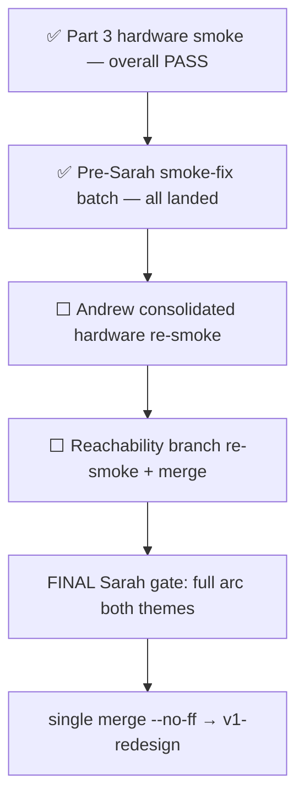

# ORCHESTRATOR STATE — canonical living bootstrap

> **READ THIS FIRST.** This file is the **single source of current orchestrator state** for tutoring-notes. We keep it current continuously (lightweight head every material turn; full restructure at milestones). A **brand-new orchestrator chat** must read it before dispatching work and must **NOT** ask Andrew for catch-up on what's done, where we are, what's next, or how we work — this doc, its reading list, and `git log` are authoritative.

> **Operating contract (`.cursor/rules/orchestrator-discipline.mdc`, explicit @ [`7341ff9`](https://github.com/Arangarx/tutoring-notes/commit/7341ff9)):** State durability is a **primary reliability obligation**, not a nicety. Andrew offloads project memory to the orchestrator on purpose — at any moment a session can be lost and a fresh orchestrator must resume with **minimal re-guidance** (ideally just "continue"). Keep this file continuously current; treat "I'll update state later" as a silent failure.

---

## ⏩ HEAD — 2026-07-02 (evening): PART 3 HARDWARE SMOKE **DONE — overall PASS** + reachability-detection fix built

**Smoke result:** Part 3 spine PASSED on hardware (clock↔stroke alignment, disconnect→freeze→resume with first-8s strokes at proper time, no wall-clock inflation, end-finalize, tutor-mic regression). **Full findings triage → [`BACKLOG.md`](../BACKLOG.md) § "Part 3 hardware-smoke findings (Andrew, 2026-07-02)"** (SMOKE-BLOCK/NOTES/BUG/UX/POST ids). Andrew's filled-in smokebook committed on both branches ([`bf1a2c3`](https://github.com/Arangarx/tutoring-notes/commit/bf1a2c3) v1-redesign, [`b468502`](https://github.com/Arangarx/tutoring-notes/commit/b468502) wb-wave5-polish).

**Decisions locked this session:** (1) **Notes UI** — during a live session there is NO notes UI; reduce runs only at End; the `SkeletonNotes` shimmer is DEAD CODE (never rendered — corrected the stale "SHIPPED" claim). Sarah ships **notes-at-end + wire the existing `SkeletonNotes` into the post-End generation window** (`SMOKE-NOTES-1`, small, pre-Sarah). **Live/progressive notes during the session (`SMOKE-NOTES-2` = `p3-incremental-map`) DEFERRED post-Sarah/possibly post-release** (Andrew: needs view-only-vs-edit + replace/append resolution + slide-out-not-form; reduce isn't live yet). (2) **Start-on-A/V-reachability gate is CORRECT and STAYS** — Andrew explicitly rejected decoupling Start from A/V (a session must NOT start without stable student A/V; tutor "start anyway" override is `SMOKE-POST-3`, only if the student can at least see the whiteboard).

**Top reliability finding + fix (SMOKE-BLOCK-1):** dead-Start-button + student-stuck-"Connecting…" was **reachability DETECTION under-reporting a genuinely-connected peer** (NOT the gate). Two mechanisms: (A) stale-`"new"` snapshot from early PC/ICE events dropped before the useLiveAV entry exists; (B) predicate hard-required the Safari-flaky aggregate `connectionState==="connected"`. **Fix built + Sonnet-reviewed (no blockers) on isolated branch [`wb-av-reachability-detection-fix`](https://github.com/Arangarx/tutoring-notes/tree/wb-av-reachability-detection-fix) @ [`a962171`](https://github.com/Arangarx/tutoring-notes/commit/a962171)** (off `wb-wave5-polish`): (A) `peer-mesh.getPeerConnectionSnapshot` re-read on entry-ensure; (B1) pure `isPeerReachable` (ICE connected/completed && pc ∉ {failed,closed}). Full `npx jest` green (2751). Fix-A has red/green dom coverage in `useLiveAV.dom.test.tsx`. **Reframe (Andrew 2026-07-02): smoke repro was on Andrew's ANDROID phone, not Safari** — culprit was almost certainly browser-agnostic Fix A (stale-snapshot race), NOT Safari aggregate B. ⇒ **Fix A re-smokeable on Andrew's Android/desktop now**; B1 waits for Safari device (Sarah — Andrew has no Apple device). Race is intermittent — dom test is the deterministic guard. Preview: [wb-av-reachability-detection-fix](https://tutoring-notes-git-wb-av-reachab-bde990-arangarx-5209s-projects.vercel.app). Merges into `wb-wave5-polish` after clean re-smoke.

**Pre-Sarah smoke-fix queue — ✅ ENTIRE QUEUE CLEARED on `wb-wave5-polish` @ [`189fdb0`](https://github.com/Arangarx/tutoring-notes/commit/189fdb0)** (all pushed, NOT merged, awaiting Andrew's **one consolidated hardware re-smoke** — he wanted more landed before smoking):

| Id | Summary | Commit |
|---|---|---|
| SMOKE-BLOCK-1 | Reachability-detection fix (isolated branch; mobile re-smoke pending) | [`a962171`](https://github.com/Arangarx/tutoring-notes/commit/a962171) |
| SMOKE-BUG-1 | 405 active-ping role-guard | [`36d4bf3`](https://github.com/Arangarx/tutoring-notes/commit/36d4bf3) |
| SMOKE-NOTES-1 | SkeletonNotes shimmer wired | [`1480592`](https://github.com/Arangarx/tutoring-notes/commit/1480592) |
| SMOKE-BLOCK-2 | Tutor note→replay href → in-shell `/workspace` | [`c24c1a1`](https://github.com/Arangarx/tutoring-notes/commit/c24c1a1) |
| SMOKE-BLOCK-3 | Back-to-student + all-notes nav on review top bar | [`22e20e0`](https://github.com/Arangarx/tutoring-notes/commit/22e20e0) |
| PRESARAH-2 | Open-sessions copy | [`682dd67`](https://github.com/Arangarx/tutoring-notes/commit/682dd67) |
| SMOKE-BLOCK-4 | Learner sign-out affordance | [`194bb40`](https://github.com/Arangarx/tutoring-notes/commit/194bb40) |
| PRESARAH-1 | Always-on recording (5-axis PASS) | [`6a8b6dc`](https://github.com/Arangarx/tutoring-notes/commit/6a8b6dc) + [`4c75aab`](https://github.com/Arangarx/tutoring-notes/commit/4c75aab) |
| SMOKE-UX-1 | Replay auto-plays on open | [`a6fa9b5`](https://github.com/Arangarx/tutoring-notes/commit/a6fa9b5)/[`254f2bf`](https://github.com/Arangarx/tutoring-notes/commit/254f2bf) |
| SMOKE-UX-2 | Replay Play/Pause no longer overlaps Board tab | [`f0a14d8`](https://github.com/Arangarx/tutoring-notes/commit/f0a14d8) |
| SMOKE-UX-4 | Wordmark nav standardized (non-live → `/`; WB review/replay → `/`; live WB inert) | [`37cff6b`](https://github.com/Arangarx/tutoring-notes/commit/37cff6b) |
| SMOKE-BUG-6 | "Ended — needs review" group on student-detail (`endedAt` set, no `noteId`) | [`189fdb0`](https://github.com/Arangarx/tutoring-notes/commit/189fdb0) |

| Field | Value |
|---|---|
| **Last action completed** | **SMOKE-UX-4** @ [`37cff6b`](https://github.com/Arangarx/tutoring-notes/commit/37cff6b) (wordmark nav) + **SMOKE-BUG-6** @ [`189fdb0`](https://github.com/Arangarx/tutoring-notes/commit/189fdb0) ("Ended — needs review" group). Branch tip advanced `db63552` → [`189fdb0`](https://github.com/Arangarx/tutoring-notes/commit/189fdb0). Gates: `test:wb-jest` 772 green, full `npx jest` 2741 pass (238 suites), `next build` exit 0. Prior: Part 3 hardware smoke **overall PASS** (2026-07-02 evening); entire pre-Sarah batch on `wb-wave5-polish`; reachability fix on isolated branch [`a962171`](https://github.com/Arangarx/tutoring-notes/commit/a962171). |
| **Next action(s)** | **Andrew (priority order):** (1) **Consolidated hardware re-smoke** of the full pre-Sarah fix batch on `wb-wave5-polish` @ [`189fdb0`](https://github.com/Arangarx/tutoring-notes/commit/189fdb0) preview (both themes at final gate) — UX-4 + BUG-6 now included. (2) **Reachability branch re-smoke** — Fix A on Android/desktop now; B1 when Safari device available; then `merge --no-ff wb-av-reachability-detection-fix → wb-wave5-polish`. (3) Sign off or edit **map/reduce prompt wording** ([`cefc5cd`](https://github.com/Arangarx/tutoring-notes/commit/cefc5cd)). **Orchestrator:** after Andrew re-smoke PASS → run `test:wb-sync` once on final integrated tip → single `merge --no-ff wb-wave5-polish → v1-redesign` only at **full-arc both-themes hardware smoke** (FINAL Sarah gate). **Do NOT** interim-merge. |
| **Open Andrew-confirms** | **Needs decision:** map/reduce prompt **WORDING** ([`cefc5cd`](https://github.com/Arangarx/tutoring-notes/commit/cefc5cd)). **Resolved:** `SMOKE-BUG-6` → treat as bug, surface "Ended — needs review" @ [`189fdb0`](https://github.com/Arangarx/tutoring-notes/commit/189fdb0); `SMOKE-UX-4` → shipped @ [`37cff6b`](https://github.com/Arangarx/tutoring-notes/commit/37cff6b); `SMOKE-UX-3` → **DEFERRED post-Sarah** (Andrew 2026-07-02); `PERSPEAKER-C-TRANSCRIPTION-TRIGGER` → option (a) worker-driven. **Standing:** erasure UX defaults (cancel operator-only, no parent self-delete, "Deleted" badge); **WB-LABEL-PARENT-SIGNIN**; **Sarah primary device** ([`SARAH-CALL-PREP.md`](../SARAH-CALL-PREP.md)); **Ship-to-Sarah gate**; **iOS student WB/A/V** ([`BACKLOG.md`](../BACKLOG.md) **WB-STUDENT-MOBILE-VALIDATION**). |
| **In-flight subagents** | **None.** Bootstrappers: [`part3-execution-bootstrapper.md`](part3-execution-bootstrapper.md), [`session-experience-arc-continuation-bootstrapper.md`](session-experience-arc-continuation-bootstrapper.md). Latest handoff: [`part3-overnight-2026-07-02-orchestrator-report.md`](part3-overnight-2026-07-02-orchestrator-report.md). |
| **Uncommitted / unmerged** | **`wb-wave5-polish` @ [`189fdb0`](https://github.com/Arangarx/tutoring-notes/commit/189fdb0)** — worktree `tutoring-notes-polishwt`; entire pre-Sarah batch pushed (incl. UX-4 + BUG-6), NOT merged. **`v1-redesign` @ [`bf1a2c3`](https://github.com/Arangarx/tutoring-notes/commit/bf1a2c3)** — integration base; NOT merged to master. **`wb-av-reachability-detection-fix` @ [`a962171`](https://github.com/Arangarx/tutoring-notes/commit/a962171)** — pushed, awaits mobile re-smoke, then merge into wb-wave5-polish. **`wb-wave5-perspeaker-c-core` @ [`b6b7181`](https://github.com/Arangarx/tutoring-notes/commit/b6b7181)** — pure C-core + 16 tests, NOT wired, NOT merged (off smoke tree). Migration `20260702120000_transcript_chunk_speaker_labels` auto-applies preview-dev; production Andrew-gated. **Merge-boundary:** batch touched `src/components/whiteboard/` → run full `test:wb-sync` (~38 min, Docker) once on final tip before v1-redesign merge. **Housekeeping:** 4 throwaway untracked smokebook copies in main `tutoring-notes` (v1-redesign) working tree — delete before merge (tracked copies on wb-wave5-polish). Pre-existing tsc errors in `WhiteboardWorkspaceEnd.dom.test.tsx` (unrelated cleanup). |

**Strategic posture (unchanged):** Experience-driven wedge — WB + reliability = **ground floor (GATE)**; the win = accreting honest tutor-first continuity. [`experience-driven_wedge_ae2776e1.plan.md`](../../../../.cursor/plans/experience-driven_wedge_ae2776e1.plan.md). **Ship-to-Sarah gate** governs cut to `v1-redesign → master` — see § Ship-to-Sarah gate below.

**Process directives (standing):** preview links in **pairs** (Vercel MCP `branchAlias` + `https://preview.usemynk.com` when repointed); agent-runnable validation harnesses over manual smoke where possible; Opus-default for reliability effort, Composer 2.5 only for zero-doubt mechanical tasks.

---

## Project arc + North Star

Pre-public pilot with one tutor (Sarah). North Star from [`AGENTS.md`](../../AGENTS.md): *"People need to use the app with confidence. Sarah is being patient, but that won't last forever."* Reliability bar: [`../../agenticPipeline/.cursor/rules/reliability-bar.mdc`](../../agenticPipeline/.cursor/rules/reliability-bar.mdc).

**Current program:** Complete the **live-session arc** (auth join → waiting room → live A/V whiteboard → end → per-speaker capture → transcription → review) as one reliable unit on `wb-wave5-polish`, then **single merge** to `v1-redesign` (the Sarah merge).

---

## Branch layering

```
master  ←  v1-redesign  (integration base @ bf1a2c3; Wave 4 merged; held for Sarah gate + master cut)
              ↑
              └── wb-wave5-polish @ 189fdb0  (ALL remaining work; worktree tutoring-notes-polishwt; NO interim merge)
                    ├── wb-av-reachability-detection-fix @ a962171  (isolated; merges after re-smoke)
                    └── wb-wave5-perspeaker-c-core @ b6b7181  (isolated C-core; merges when C wired)
```

| Branch | Role | Tip |
|---|---|---|
| **`v1-redesign`** | Integration base; Wave 4 student responsive parity merged @ [`a166f6c`](https://github.com/Arangarx/tutoring-notes/commit/a166f6c); doc commits through [`bf1a2c3`](https://github.com/Arangarx/tutoring-notes/commit/bf1a2c3) | Not yet merged to `master` — held for Gate A + Ship-to-Sarah + comprehensive re-smoke |
| **`wb-wave5-polish`** | **Active execution branch** — Wave 5 + Part 3 spine + pre-Sarah smoke fixes; worktree `tutoring-notes-polishwt` | [`189fdb0`](https://github.com/Arangarx/tutoring-notes/commit/189fdb0) |
| **`wb-av-reachability-detection-fix`** | SMOKE-BLOCK-1 reachability detection (Fix A + B1); off wb-wave5-polish | [`a962171`](https://github.com/Arangarx/tutoring-notes/commit/a962171) |
| **`wb-wave5-perspeaker-c-core`** | Pure `perspeaker-identity.ts` C-core; NOT wired to runtime | [`b6b7181`](https://github.com/Arangarx/tutoring-notes/commit/b6b7181) |

**Merge discipline (Andrew reaffirmed 2026-07-01):** All remaining work stays on `wb-wave5-polish`. **Single `merge --no-ff` to `v1-redesign`** at the **final full-arc both-themes hardware smoke** only. No interim merge.

Decisions ledger: [`docs/handoff/v1-redesign-STATUS.md`](v1-redesign-STATUS.md).

---

## Current Wave focus

**Active plan:** [`whiteboard_reliability_remaining_b082882.plan.md`](../../../../.cursor/plans/whiteboard_reliability_remaining_b082882.plan.md) — supersedes archived [`whiteboard_reliability_floor_9ba650d1.SUPERSEDED.plan.md`](../../../../.cursor/plans/archive/whiteboard_reliability_floor_9ba650d1.SUPERSEDED.plan.md).

**State-of-play (2026-07-02 evening):**



| Phase | Status | Notes |
|---|---|---|
| **Consent/erasure** | ✅ Done | 9 BLOCKERs + CF-1..CF-4 + Workstreams B/C/D; identity-e2e 16/16 |
| **Part 3 spine** | ✅ Landed + hardware-smoked | `p3-clock`, perspeaker A+B foundation, model abstraction, video-seam docs; gates green |
| **Pre-Sarah smoke fixes** | ✅ Landed on branch | Full queue cleared — awaiting consolidated re-smoke |
| **Reachability fix** | ✅ Built, ⬜ re-smoke | Isolated branch; merge after clean mobile pass |
| **perspeaker C runtime** | ⬜ Deferred | C-core built @ `b6b7181`; wiring needs own hardware pass |
| **Final gate** | ⬜ Pending | Full live-session arc both themes → single merge |

---

## Classified smoke-finding queue (2026-07-02 evening)

Full triage: [`BACKLOG.md`](../BACKLOG.md) § "Part 3 hardware-smoke findings (Andrew, 2026-07-02)".

| Class | Items | Action |
|---|---|---|
| **✅ CLEARED (landed)** | SMOKE-BLOCK-1..4, SMOKE-BUG-1/6, SMOKE-NOTES-1, PRESARAH-1/2, SMOKE-UX-1/2/4 | On `wb-wave5-polish` @ [`189fdb0`](https://github.com/Arangarx/tutoring-notes/commit/189fdb0); awaiting consolidated re-smoke |
| **NEEDS DECISION (Andrew)** | map/reduce prompt WORDING | Sign-off before tuning |
| **FRAGILE (plan + hardware; do NOT auto-fix)** | `SMOKE-BUG-2` stale "Call reconnecting…" pill; `SMOKE-BUG-3` student text across tutor page-switch (WB sync, L); `SMOKE-BUG-4` pencil stuck roughness (S–M); `SMOKE-BUG-5` replay missing active board (M–L); `SMOKE-BUG-7` student re-picks mic each session (S–M) | Andrew lacks Safari hardware until Sarah |
| **DEFERRED post-Sarah** | `SMOKE-UX-3` replay ±10s scrub (Andrew 2026-07-02); `SMOKE-NOTES-2` live/progressive notes (= `p3-incremental-map`); `SMOKE-POST-1..3` (incl. text chat); perspeaker-C runtime build | Design-unblocked; C-core ready |

---

## Session-experience build status

| Layer | Status |
|---|---|
| **Schema (BUILT)** | `TranscriptChunk`, `TranscriptChunkExtraction`, `SessionRecording.streamId` — chunked audio + per-chunk transcription + map-extraction + video-ready `streamId` |
| **Part 3 spine (LANDED)** | `p3-clock` [`1572983`](https://github.com/Arangarx/tutoring-notes/commit/1572983); perspeaker A+B [`e92c9ac`](https://github.com/Arangarx/tutoring-notes/commit/e92c9ac)/[`8638c86`](https://github.com/Arangarx/tutoring-notes/commit/8638c86)/[`1df3258`](https://github.com/Arangarx/tutoring-notes/commit/1df3258); model abstraction [`f4cd9cb`](https://github.com/Arangarx/tutoring-notes/commit/f4cd9cb)/[`cefc5cd`](https://github.com/Arangarx/tutoring-notes/commit/cefc5cd); video-seam docs [`d299a6c`](https://github.com/Arangarx/tutoring-notes/commit/d299a6c). Hardware-smoked overall PASS. |
| **Partial pipeline (SHIPPED)** | 50-min time-based segments; per-segment transcribe + incremental map; `SkeletonNotes` shimmer wired (`SMOKE-NOTES-1`) |
| **perspeaker C runtime (UNBUILT)** | C-core deterministic module @ `b6b7181`; wiring = outbox fields → `useRemoteMicRecorders` → worker-driven transcription; needs Sonnet 5-axis on fragile diff + hardware pass |
| **Deferred post-master** | VAD chunking, consent-recording gates, incremental-map live notes, eval harness + flywheel |
| **Spike (unmerged, flag OFF)** | [`spike/live-transcription` @ `7671a25`](https://github.com/Arangarx/tutoring-notes/tree/spike/live-transcription) — not Sarah-path |

**Standing erasure coverage gaps** ([`BACKLOG.md`](../BACKLOG.md)): (a) **ERASURE-ORPHAN-AUDIO-BLOBS**; (b) **ERASURE-CLIENT-STORE-UNREACHABLE** (IDB/sessionStorage drafts).

---

## Recently completed (landed)

- **SMOKE-BUG-6 @ [`189fdb0`](https://github.com/Arangarx/tutoring-notes/commit/189fdb0)** — ended-but-unsaved sessions (`endedAt != null`, `noteId` null) surface as **"Ended — needs review"** on student-detail (last 30 days, cap 20); row → in-shell `/workspace` review; `EndedUnsavedSessionsList.dom.test.tsx` (3 tests). Andrew: treat as bug.
- **SMOKE-UX-4 @ [`37cff6b`](https://github.com/Arangarx/tutoring-notes/commit/37cff6b)** — wordmark nav standardized: non-live shells → canonical `/` role-redirect; WB review + read-only replay → `/`; live-session WB wordmark stays inert (`BL-WB-WORDMARK-NAV` guarded-leave still deferred).
- **Part 3 overnight run @ [`d299a6c`](https://github.com/Arangarx/tutoring-notes/commit/d299a6c)** — all p3-* waves landed; jest 2742, build exit 0, `test:wb-sync` 107 pass/2 skip/1 known flake. Smokebook [`part3-notes-reliability-spine-smokebook.md`](part3-notes-reliability-spine-smokebook.md) + report [`part3-overnight-2026-07-02-orchestrator-report.md`](part3-overnight-2026-07-02-orchestrator-report.md).
- **Checkpoint fully green @ [`5dd1793`](https://github.com/Arangarx/tutoring-notes/commit/5dd1793)** — wb-sync seed-gap fix (consent harness); identity-e2e 16/16.
- **Consent/erasure arc** — CF-1 [`183f09b`](https://github.com/Arangarx/tutoring-notes/commit/183f09b), CF-3 [`7a9514f`](https://github.com/Arangarx/tutoring-notes/commit/7a9514f), CF-2.1 [`b7c88ac`](https://github.com/Arangarx/tutoring-notes/commit/b7c88ac), erasure Steps 1–6, Workstream C e2e (consent `faebbfc` + erasure `cf20015` + routing `5402e04`).
- **Pre-merge smoke (2026-07-01)** — NOT PASS @ `8e38935`; six merge-blockers MB-1..MB-6 triaged [`consent-honesty-smoke-findings-2026-07-01.md`](consent-honesty-smoke-findings-2026-07-01.md); safe-then-merge + reversible tombstone (Option A) ratified.
- **PERSPEAKER-C-TRANSCRIPTION-TRIGGER** resolved 2026-07-02 — worker-driven option (a); identity keyed on `identityKey` not `peerId`; both-streams co-equal (no prefer-one hierarchy); VAD at chunking layer.

---

## Latest committed state (`wb-wave5-polish` @ `189fdb0`)

| Commit | Summary |
|---|---|
| [`189fdb0`](https://github.com/Arangarx/tutoring-notes/commit/189fdb0) | **Branch tip** — SMOKE-BUG-6 "Ended — needs review" group |
| [`37cff6b`](https://github.com/Arangarx/tutoring-notes/commit/37cff6b) | SMOKE-UX-4 wordmark nav standardized |
| [`09fd07b`](https://github.com/Arangarx/tutoring-notes/commit/09fd07b) | ORCHESTRATOR-STATE heavy restructure |
| [`db63552`](https://github.com/Arangarx/tutoring-notes/commit/db63552) | Pre-Sarah smoke-fix batch complete (prior tip) |
| [`f0a14d8`](https://github.com/Arangarx/tutoring-notes/commit/f0a14d8) | SMOKE-UX-2 replay Play/Pause footer stack |
| [`6a8b6dc`](https://github.com/Arangarx/tutoring-notes/commit/6a8b6dc) | PRESARAH-1 always-on recording |
| [`d299a6c`](https://github.com/Arangarx/tutoring-notes/commit/d299a6c) | p3-video-seam docs-only |
| [`1572983`](https://github.com/Arangarx/tutoring-notes/commit/1572983) | p3-clock monotonic pause-aware session clock |

`test:wb-jest` **772** green; full `npx jest` **2741** pass (238 suites; known pre-existing shared-DB FK-race / upload-outbox noise only); `next build` exit 0. Full history: `git log --oneline -25 wb-wave5-polish`.

**Smokebooks (recent):** [`part3-notes-reliability-spine-smokebook.md`](part3-notes-reliability-spine-smokebook.md), [`wb-wave5-consent-perms-2026-06-30.md`](wb-wave5-consent-perms-2026-06-30.md), [`wb-wave5-liveboard-chrome-smokebook-2026-06-29.md`](wb-wave5-liveboard-chrome-smokebook-2026-06-29.md).

---

## Queued dispatches (in order)

1. **Andrew consolidated hardware re-smoke** — full pre-Sarah fix batch on `wb-wave5-polish` preview (both themes at final gate).
2. **Reachability branch** — mobile re-smoke Fix A (+ B1 when Safari available) → `merge --no-ff wb-av-reachability-detection-fix → wb-wave5-polish`.
3. **Map/reduce wording** — Andrew sign-off on [`cefc5cd`](https://github.com/Arangarx/tutoring-notes/commit/cefc5cd).
4. **`test:wb-sync`** — once on final integrated tip (~38 min, Docker) before merge.
5. **`p-final-gate`** — **full live-session arc** both themes hardware smoke (FINAL Sarah gate).
6. **`merge --no-ff` `wb-wave5-polish` → `v1-redesign`** — after step 5 PASS only.
7. **`p-test-account-reset`** — at master cut, preserve Andrew + Sarah admin accounts.
8. **perspeaker-C runtime** (when ready) — wire C-core, Sonnet 5-axis, own hardware pass; then `p3-vad-chunking` → `p3-consent-recording` → `p3-incremental-map` → `p3-finalize` → `p3-replay-scrub`.

---

## Ship-to-Sarah gate (CONFIRMED by Andrew 2026-06-16 — still governing)

Andrew wants Sarah on the `v1-redesign` line once **waiting room → WB → end session is stable for tutor AND student — backend data pipeline INCLUDED**. Capture: [`sarah-pilot-feedback-2026-06-16-orchestrator-report.md`](sarah-pilot-feedback-2026-06-16-orchestrator-report.md).

**Confirmed gate items:** (1) notes — legacy monolithic generate path gone; per-chunk auto-notes only; (2) End/Continue on student-detail open-sessions never silently deletes recording; (3) single-segment seek works at every review entry point. Multi-segment seek → backlog SSG-3 only. **(4) Consent UI honesty — `CONSENT-HONESTY-SARAH-MERGE-BLOCKER` (Andrew 2026-06-30):** hide dead `allowWhiteboardRecording` toggle; rewrite `allowLiveSession` copy to honestly cover live A/V **and** whiteboard capture (see **LIVE-SESSION-CONSENT-COPY**); sweep consent UI for shown-but-unenforced toggles. Fuller guided-setup (**CONSENT-UX-REDESIGN**) = fast-follow, **not** a blocker.

**Pre-master smoke deferral ledger:** [`pre-master-smoke-deferral-ledger-2026-06-16.md`](pre-master-smoke-deferral-ledger-2026-06-16.md).

---

## Open decisions — Andrew confirms

### Live gate (Part 3)

| # | Question | Status |
|---|---|---|
| **Part 3 design pass** | Overall Part 3 architecture/sequencing | **✅ APPROVED (2026-06-30)** |
| **Notes quality vs merge scope** | First-pass map/reduce quality pre-merge? | **✅ RESOLVED (2026-07-01)** — quality is pre-merge bar; eval harness + flywheel post-master |
| **PERSPEAKER-C trigger** | Worker-driven vs client-driven transcription enqueue | **✅ RESOLVED (2026-07-02)** — option (a) worker-driven |
| **SMOKE-BUG-6** | Ended-without-Save excluded from open-list | **✅ RESOLVED (2026-07-02)** — bug; "Ended — needs review" group @ [`189fdb0`](https://github.com/Arangarx/tutoring-notes/commit/189fdb0) |
| **SMOKE-UX-3** | Replay ±10s scrub buttons | **DEFERRED post-Sarah** (Andrew 2026-07-02) |
| **SMOKE-UX-4** | Wordmark navigation per-role | **✅ SHIPPED @ [`37cff6b`](https://github.com/Arangarx/tutoring-notes/commit/37cff6b)** — non-live → `/`; review/replay → `/`; live WB inert |
| **Map/reduce wording** | Prompt text in [`cefc5cd`](https://github.com/Arangarx/tutoring-notes/commit/cefc5cd) | **⬜ PROPOSED** — Andrew sign-off |

Ratified **inputs**: t=0 = FSM `recording` entry / `MediaRecorder.start()` + WB↔audio hardware sync oracle; 3+-peer per-speaker ≤3–4 cap NO mixdown fallback; first-pass notes quality pre-merge; eval harness + flywheel post-master only; session-scoped consent override won't build for Sarah (`WB-SESSION-CONSENT-OVERRIDE`).

### Standing (from prior threads)

| Item | Notes |
|---|---|
| **WB-ADULT-JOIN-ENABLEMENT B1** | Thread B product confirm |
| **WB-LABEL-PARENT-SIGNIN** | New term confirm |
| **Sarah primary device** | Assumed Windows desktop Chromium |
| **iOS student WB/A/V** | Zero coverage — [`BACKLOG.md`](../BACKLOG.md) **WB-STUDENT-MOBILE-VALIDATION** |
| **B2 consent Step 6** | Parent per-tutor consent management UI — deferred past V1 |

---

## Recent architectural decisions (2026-06-30 – 2026-07-02)

| Decision | Status |
|---|---|
| **CC-1 + CC-2 API** | ✅ [`35147ef`](https://github.com/Arangarx/tutoring-notes/commit/35147ef)→[`5d6d196`](https://github.com/Arangarx/tutoring-notes/commit/5d6d196). B2 create-time live-reject removed. |
| **Block B EXECUTED** | ✅ 7 commits `d180ef1`→`bded52e`, 13 suites/146 tests |
| **5-axis adversarial review (consent-honesty)** | ✅ 8 BLOCKER / 6 HIGH / 6 MEDIUM / 5 LOW — [`consent-blocker-5axis-review-2026-06-30.md`](consent-blocker-5axis-review-2026-06-30.md) |
| **Consent enforcement unconditional** | ✅ `CONSENT_ENFORCEMENT` deleted; always-on |
| **Per-speaker tap-before-mix** | ✅ Transcription lanes only; mixdown = sole replay source; merge by `recordingTimeOffsetMs` |
| **Reverses prior rollback [`89e0fe1`](https://github.com/Arangarx/tutoring-notes/commit/89e0fe1)** | ✅ With sync-metadata contract — LIVE-AV.md invariant #6 |
| **No interim merge** | ✅ Single merge at Sarah gate |
| **t=0 clock anchor** | ✅ FSM `recording` / `MediaRecorder.start()`; disconnect pause/freeze in `p3-clock` |
| **CLIENT-AUDIO-CONSENT-GATE (Block B)** | ✅ Client consent projection gates capture/upload/IDB/transcription — [`wb-block-b-consent-gate-plan.md`](wb-block-b-consent-gate-plan.md) |
| **7a fail-closed-universal** | ✅ No snapshot/record → no audio capture/upload/transcribe |
| **CC-1 ConsentRecord-exists gate** | ✅ Session gate = ConsentRecord exists for (learner,tutor) |
| **CC-2 mandatory consent choice** | ✅ Save OR explicit decline on claim setup |
| **Self-learner parental-consent exemption** | ✅ All-true snapshot via `isSelfLearner` |
| **Data erasure path** | ✅ Option A + headless-preserve — [`learner-erasure-plan.md`](learner-erasure-plan.md) |
| **Part 3 C1–C5** | ✅ Transcription-only lanes, VAD chunking, ffmpeg continuous replay, video designed-for |
| **Disconnect/pause** | ✅ Audio pauses + clock freezes on disconnect; WB continues at frozen timestamp; ~8s debounce trigger |
| **WB-CONSENT-UNCONDITIONAL** | ✅ WB recording unconditional for Sarah; `allowWhiteboardRecording` hidden; fields retained |
| **LIVE-SESSION-CONSENT-COPY** | ✅ Copy must state live A/V + WB recording; literal string Andrew-gated |
| **CONSENT-DEFAULTS-OPT-IN** | ✅ Defaults OFF / affirmative opt-in |
| **CONSENT-HONESTY-SARAH-MERGE-BLOCKER** | ✅ Minimal honesty fix ships with merge |
| **Start-on-A/V-reachability gate** | ✅ **STAYS** (Andrew 2026-07-02) — override only `SMOKE-POST-3` |
| **Notes-at-end only for Sarah** | ✅ Live notes deferred (`SMOKE-NOTES-2`); SkeletonNotes wired post-End |
| **PERSPEAKER identity on identityKey** | ✅ NOT peerId — device-switch continuity; cap on identityKeys ≤3 |
| **Both-streams co-equal** | ✅ Tutor + student audio both feed map/reduce; VAD gates chunk quality |

Full locked decisions: active plan § "Resolved (Andrew)".

---

## Hard-won lessons (durable)

### New (2026-06-30)

**lesson-codified-hack — tutor/student waiting-room mic delta mis-scoped twice:** First codified a chip-hack; then flattened tutor's full `MicControls` dropdown to match student's stripped control. **Tell:** student/tutor asymmetry. Echoes "branch decisions ≠ ratified intent" + "confirm material UX deltas explicitly."

**lesson-deferred-relay — relay specs authored with suite run DEFERRED had harness bugs jest couldn't catch:** Both phantom-stroke spec (wrong URL/auth + naive absence oracle) and consent-denial spec (`consentRecord.create()` unique-constraint) failed only at integration relay. **NEW RULE:** new wb-regression specs should get **≥1 targeted relay run** before declaring done, even when full suite run is deferred.

**data-reset-at-master-cut:** At `v1-redesign → master` cut, reset test data but **preserve Andrew + Sarah admin accounts**; re-confirm with Sarah then. Concrete todo: `p-test-account-reset`.

**no-interim-merge:** Ratified — single `merge --no-ff` at final Sarah gate only.

### Still load-bearing (do not forget)

**Plans ≠ ratified intent (2026-06-17):** Material product/UX decisions must be surfaced to Andrew explicitly — silence is not consent. (Also in [`AGENTS.md`](../../AGENTS.md).)

**Missed prompt ≠ consent (2026-06-17):** Re-surface material decisions; never infer from inaction.

**Subagent git safety (2026-06-10):** Never `git restore`/`reset --hard` to unblock checkout when uncommitted user work exists.

**Whiteboard chrome — extend don't rewrite (2026-06-09):** ADDITIVE ONLY on `WhiteboardWorkspaceClient.tsx` engine paths.

**Layout/coordinates — jsdom blind spot (2026-05-30):** Prove geometry on real browser; requirement-not-code tests.

**Flag-gated feature + test-injected flag = synthetic green (2026-06-17):** Green on flagged test path ≠ production default wired.

**Tombstone resurrection (2026-06-18):** Reconcile baseline must use `getSceneElementsIncludingDeleted()`.

**MediaStream id blocks video remount (2026-06-18):** Fresh `MediaStream` on reconnect.

**Mobile backgrounding ≠ full mesh rebuild (2026-06-18):** Deliberate leave vs transient suspend.

**Doc-heavy merges → add/add conflicts (2026-06-18):** Union-merge; preserve Andrew's smoke notes.

**RSC cookie-write no-op (2026-06-14):** Never write cookies from RSC render.

**CSS `@layer` cascade (2026-06-12):** Legacy unlayered base CSS beats Tailwind utilities.

**Secret egress (2026-05-31):** No plaintext secrets to third-party URLs (2FA QR lesson).

---

## Pilot context (Sarah)

Latest capture: [`sarah-pilot-feedback-2026-06-16-orchestrator-report.md`](sarah-pilot-feedback-2026-06-16-orchestrator-report.md). Call prep: [`SARAH-CALL-PREP.md`](../SARAH-CALL-PREP.md).

Sarah remains on production `master` ("old & busted") until Ship-to-Sarah gate passes on merged `v1-redesign` line.

---

## Parked threads (after Sarah merge)

| Thread | Notes |
|---|---|
| **Experience-driven wedge Phases 2–4** | Continuity engine, note quality, instrumentation |
| **WB-COMPONENTS-PASS** | Full shadcn migration — incremental on touched surfaces only |
| **VIDEO recording capture** | Design seam in Part 3; build post-Sarah |
| **WB-MENU-CLICK-THROUGH** | Desktop popover click-through |
| **iOS per-speaker MediaRecorder** | Documented untested for Sarah merge |
| **`docs/phase3-consent-model` @ `4f9dbcd`** | Awaits union-merge to `v1-redesign` |
| **A6-1 multi-segment replay** | Obviated by continuous-stream finalization in Part 3 |

---

## Housekeeping (pending — do not act until merge confirmed)

- **Throwaway untracked copies** in main `tutoring-notes` (v1-redesign) working tree: `docs/handoff/{consent-honesty-premerge-smoke-index, wb-block-b-consent-gate-smokebook-2026-06-30, cc1-cc2-consent-gate-smokebook, erasure-smokebook}.md` — delete before merge. Tracked authoritative copies on `wb-wave5-polish`.
- **Worktree cleanup** after integration merged: `tutoring-notes-polishwt`, `fixwt`, `liveboardwt` (+ consent/phantom satellite worktrees). See `git worktree list`.
- **Pre-existing tsc errors** in `src/__tests__/dom/WhiteboardWorkspaceEnd.dom.test.tsx` — small cleanup sometime.

---

## How we work (process — pointers only)

- **Orchestration model:** [`AGENTS.md`](../../AGENTS.md) § "Model usage protocol"
- **Dispatch boundary:** [`.cursor/rules/orchestrator-discipline.mdc`](../../.cursor/rules/orchestrator-discipline.mdc)
- **Merging (solo pilot):** smokeable branch → Andrew smoke → `merge --no-ff`; WB sync → `npm run test:wb-sync` at merge boundary; build-surface → `npx next build`
- **Smokebooks:** [`SMOKEBOOK-TEMPLATE.md`](SMOKEBOOK-TEMPLATE.md); preview URL via Vercel MCP (never guessed)
- **Commits on Windows/PowerShell:** `.git/COMMIT_MSG_DRAFT.txt` + `git commit -F`

---

## Reading list

Fresh orchestrator — read in order:

1. [`AGENTS.md`](../../AGENTS.md)
2. [`docs/handoff/ORCHESTRATOR-STATE.md`](ORCHESTRATOR-STATE.md) (this file) — **HEAD first**
3. **Active plan:** [`whiteboard_reliability_remaining_b082882.plan.md`](../../../../.cursor/plans/whiteboard_reliability_remaining_b082882.plan.md)
4. [`docs/LIVE-AV.md`](../LIVE-AV.md) — before any A/V or per-speaker work
5. [`docs/RECORDER-LIFECYCLE.md`](../RECORDER-LIFECYCLE.md) — before FSM/outbox/end-session
6. [`docs/WHITEBOARD-STATUS.md`](../WHITEBOARD-STATUS.md)
7. [`docs/handoff/v1-redesign-STATUS.md`](v1-redesign-STATUS.md)
8. [`docs/BACKLOG.md`](../BACKLOG.md)
9. [`docs/RELEASE-ROADMAP.md`](../RELEASE-ROADMAP.md)
10. [`docs/SARAH-CALL-PREP.md`](../SARAH-CALL-PREP.md)
11. [`docs/PLATFORM-ASSUMPTIONS.md`](../PLATFORM-ASSUMPTIONS.md)

Archived superseded plan (audit only): [`whiteboard_reliability_floor_9ba650d1.SUPERSEDED.plan.md`](../../../../.cursor/plans/archive/whiteboard_reliability_floor_9ba650d1.SUPERSEDED.plan.md).

---

## Open questions still in flight

| Question | Status |
|---|---|
| Map/reduce notes accuracy | **✅ RESOLVED (2026-07-01)** — first-pass quality is Part 3 pre-merge bar; eval harness + flywheel deferred post-master |
| Two-way calendar sync | Unresolved — [`scheduling-requirements-2026-06-11.md`](scheduling-requirements-2026-06-11.md) |
| SMOKE-BUG-6 / UX-4 | **✅ RESOLVED** — shipped @ [`189fdb0`](https://github.com/Arangarx/tutoring-notes/commit/189fdb0) / [`37cff6b`](https://github.com/Arangarx/tutoring-notes/commit/37cff6b) |
| SMOKE-UX-3 | **DEFERRED post-Sarah** (Andrew 2026-07-02) |

---

## History / audit trail

Updated in place; `git log -p docs/handoff/ORCHESTRATOR-STATE.md`. Template: [`docs/handoff/orchestrator-state-template.md`](orchestrator-state-template.md).

Deep history: `git log --oneline wb-wave5-polish`, `git log --oneline v1-redesign`.
