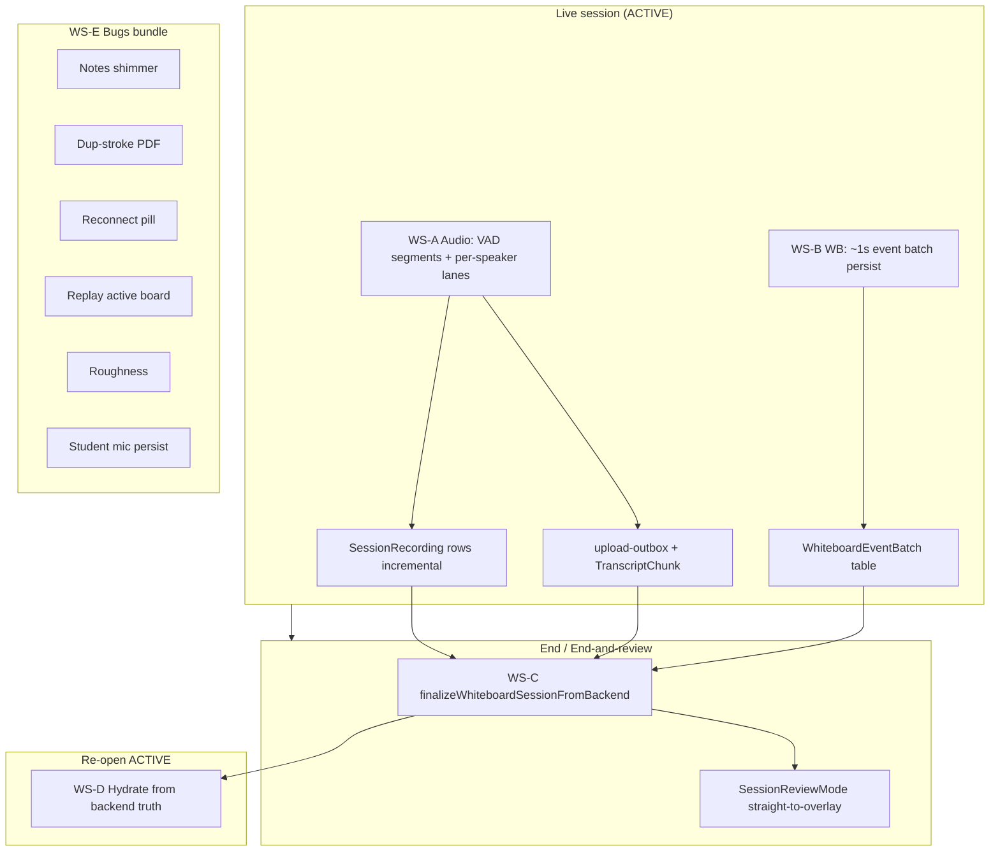
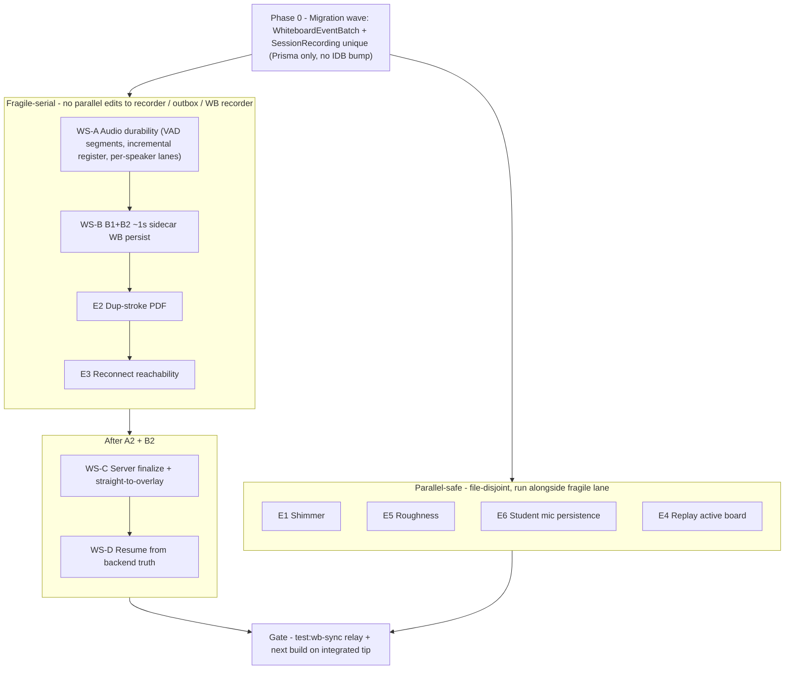

# Go-to-Sarah master-cut plan — `wb-wave5-polish` → `v1-redesign` → `master`

**Purpose:** Single consolidated executor plan to take the tutoring-notes app from branch `wb-wave5-polish` to Sarah on **live production (`master`)**, via the two-step merge `wb-wave5-polish → v1-redesign → master`.

**Branch / tip (authoring time):** `wb-wave5-polish` @ [`affc1e1`](https://github.com/Arangarx/tutoring-notes/commit/affc1e194a0beff33641692580bbbc55db2c8214)  
**Worktree:** `tutoring-notes-polishwt` (see [`docs/handoff/part3-execution-bootstrapper.md`](part3-execution-bootstrapper.md))  
**Integration line:** `v1-redesign` (+793 commits vs `master` @ [`3ba2c48`](https://github.com/Arangarx/tutoring-notes/commit/3ba2c485ee9837f26ccdc8e64e93636fe28cb3cf))  
**Polish delta:** `wb-wave5-polish` (+376 vs `v1-redesign` tip at authoring time)

**5-axis pass 1 folded (2026-07-04):** Sonnet adversarial review ([`go-to-sarah-plan-5axis-review.md`](go-to-sarah-plan-5axis-review.md)) — **BLOCKER-1** through **BLOCKER-5** and **SF-1** through **SF-9** integrated below (orderIndex transaction + unique constraint; WS-B upsert/retry/cursor policy; `OutboxConfig.onSegmentUploaded`; precise timer surgery labels; C1 assembly-only → `endWhiteboardSession`; persist mutex; per-batch `boardDocumentJson`; no 1s Blob put; VAD RAF + `VAD_MAX_SEGMENT_SECONDS`; no IDB version bump; Playwright tab-kill + test helper routes; persist-failure tutor warning).

---

## Honest re-baseline (read first)

**Live per-session durability is NOT built.** VAD chunking, per-speaker transcribe-on-arrival, live whiteboard persistence (~1s server batches), and finalize-from-persisted backend state were scoped as pre-`v1-redesign` **Part 3 CORE** requirements ([`part3-execution-bootstrapper.md`](part3-execution-bootstrapper.md), [`docs/RELEASE-ROADMAP.md`](../RELEASE-ROADMAP.md) SSG/durability rows). Prior [`ORCHESTRATOR-STATE.md`](ORCHESTRATOR-STATE.md) and the Part 3 smokebook prose implied more had shipped than actually runs in production:

| Claimed / implied | Actual on tip `affc1e1` |
|---|---|
| Per-speaker capture wired | Schema + `transcriptionOnly` replay isolation only; **`useRemoteMicRecorders` is NOT mounted** in `WhiteboardWorkspaceClient.tsx` |
| Incremental `SessionRecording` rows mid-session | **`registerWhiteboardSessionAudioSegmentAction` exists but is NOT called from the live workspace** — rows are created only inside `endWhiteboardSession` batch insert |
| Live WB server persist | Checkpoint API writes Blob **with no DB pointer** ([`checkpoint/route.ts`](../../src/app/api/whiteboard/[sessionId]/checkpoint/route.ts) L139–144); recorder only IDB-checkpoints every 30s |
| Tab-kill / roster End-and-review safe finalize | **Client-only** finalize; closed-tab → End-and-review can produce **empty** replay/notes ([`wave5-rebuild-resmoke-smokebook-2026-07-03.md`](wave5-rebuild-resmoke-smokebook-2026-07-03.md) item 7 **FAIL**) |

**This plan is the real durability pillar + remaining pre-Sarah bug bundle**, gated behind comprehensive both-theme MASTER-CUT smoke.

**Display vs pipeline (do not conflate):**

- **DEFERRED for Sarah:** live-notes **DISPLAY** during an active session (skeleton/blur updating while still on the live board).
- **REQUIRED for Sarah:** incremental **VAD → transcribe → map** as chunks arrive, so notes are **ready seconds after End** (reduce runs on accumulated chunks; no monolithic post-end wait).

---

## Architecture overview

Four durability pillars + a bugs bundle, converging on one master-cut gate:



**Reference-only (do NOT ship):** spike branch `design/live-incremental-transcription-2026-06-02` / `ltx-outbox` / `IncrementalTranscriptSegment` — port **patterns only**; build on landed `upload-outbox` + `TranscriptChunk`.

**C-core identity (merge in, do not reimplement):** branch `wb-wave5-perspeaker-c-core` @ [`b6b7181`](https://github.com/Arangarx/tutoring-notes/commit/b6b7181) — `perspeaker-identity.ts`, `speakerTranscriptStreamId()`, `reconcileSpeakers()`.

---

## Global rules (enforce in every workstream)

### 1. Testing with teeth (Andrew hard rule)

Every touched surface gets a **Playwright** test written **to the user-observable requirement**, never to the implementation just written.

| Forbidden as sole coverage | Required instead |
|---|---|
| DOM structure-only asserts | Drive the **real pipeline** (start session → record → end via UI) |
| Seed DB `status: generating` + assert `animationName !== none` | Poll real `pending → generating → done`; assert overlay **visible and animating** (e.g. `background-position` at t=0 vs t=800ms, or screenshot diff) |
| jsdom geometry/stroke assertions | **Real browser** (`test:wb-sync` relay, Playwright/WebKit, or hardware HUD); red-before / green-after |

`npm run test:wb-jest` (~5s) is **inner-loop only** — not merge proof for sync/geometry/audio cadence.

### 2. Merge-boundary gates

| Gate | When |
|---|---|
| `npm run test:wb-sync` (Docker relay, ~38 min) | **Once** on final integrated `wb-wave5-polish` tip before `merge --no-ff → v1-redesign`, if **any** change touches `src/lib/whiteboard/`, `src/components/whiteboard/`, or WB apply paths |
| `npx next build` (exit 0) | Any build-surface change (fonts, CSS, `next.config.*`, Tailwind, `package.json` scripts) |

### 3. No duplication

- Build live audio durability on **landed** `upload-outbox` + `TranscriptChunk` — **not** spike `ltx-outbox`.
- Extend **`WorkspaceResumeGate`** three-action model and **`SessionReviewMode`** overlay — no parallel end/review components.
- Reuse stored-device helpers in [`src/lib/recording/storage.ts`](../../src/lib/recording/storage.ts).
- Unavoidable duplication → justify inline + log to [`docs/BACKLOG.md`](../BACKLOG.md).

### 4. Fragile surfaces — extend, don't rewrite; STOP on behavioral change

Escalate to orchestrator (plan mode → Sonnet/Opus) before changing **existing behavior** of:

- [`src/lib/recording/lifecycle-machine.ts`](../../src/lib/recording/lifecycle-machine.ts)
- [`src/lib/recording/upload-outbox.ts`](../../src/lib/recording/upload-outbox.ts)
- [`endWhiteboardSession`](../../src/app/admin/students/[id]/whiteboard/actions.ts) (~L668–911)
- [`src/hooks/useAudioRecorder.ts`](../../src/hooks/useAudioRecorder.ts) gapless rollover (~L683–846)
- [`src/lib/mic-recorder-audio.ts`](../../src/lib/mic-recorder-audio.ts) mixdown
- [`src/lib/av/peer-mesh.ts`](../../src/lib/av/peer-mesh.ts), [`src/hooks/useLiveAV.ts`](../../src/hooks/useLiveAV.ts)
- WB apply-path/sync: [`src/lib/whiteboard/`](../../src/lib/whiteboard/), [`useStudentWhiteboardCanvas.ts`](../../src/hooks/useStudentWhiteboardCanvas.ts)
- [`src/lib/recording/session-clock.ts`](../../src/lib/recording/session-clock.ts)

Adding state/handlers/callbacks/new tables is fine.

### 5. Per-session logging

Add and document new prefixes in [`docs/RECORDER-LIFECYCLE.md`](../RECORDER-LIFECYCLE.md) registry; log **every** state transition:

| Prefix | Feature |
|---|---|
| `vad` | VAD segment cut lifecycle |
| `psc` | Per-speaker capture lane |
| `wbp` | WB live-persist batch |
| `fzb` | Finalize-from-backend |

### 6. Consent

All new capture/transcription lanes must respect Block B projection (`allowLiveSession` vs `allowAudioRecording` vs `allowWhiteboardRecording`) and frozen `SessionConsentSnapshot`. No un-consented capture. **Attribution = LearnerProfile only** — login required to join; do not build anonymous-speaker paths.

---

## Current-state facts (verified on `affc1e1`)

### Audio

- Single mixdown `MediaRecorder` (tutor + remotes summed via [`mic-recorder-audio.addRemoteAudio`](../../src/lib/mic-recorder-audio.ts)).
- Segments cut **only** at 50-min rollover ([`segment-policy.ts`](../../src/lib/recording/segment-policy.ts) L19 `SEGMENT_MAX_SECONDS`) or End ([`useAudioRecorder.ts`](../../src/hooks/useAudioRecorder.ts) L609–646 timer, L683–846 `rolloverSegmentGapless`).
- Transcription + map **already run live** per completed mixdown segment ([`WhiteboardWorkspaceClient.tsx`](../../src/app/admin/students/[id]/whiteboard/[whiteboardSessionId]/workspace/WhiteboardWorkspaceClient.tsx) L1809–1831 `enqueueChunkTranscriptionAction`; [`transcription-worker.ts`](../../src/lib/recording/transcription-worker.ts) L229–237 `extractChunkMap`).
- `SessionRecording` rows + reduce are **End-only** ([`endWhiteboardSession`](../../src/app/admin/students/[id]/whiteboard/actions.ts) L668–911; assembled from IDB outbox via [`assembleEndSessionSegments`](../../src/lib/recording/upload-outbox-instance.ts) L194–220).
- [`useRemoteMicRecorders`](../../src/hooks/useRemoteMicRecorders.ts) exists; **not mounted** in workspace.
- Two timelines: `recordingTimeOffsetMs` (p3-clock, pause-aware) vs `audioStartedAtMs` (wall clock, [`OutboxRow`](../../src/lib/recording/upload-outbox.ts) L100–106).

### Whiteboard events

- In-memory `logRef` ([`useWhiteboardRecorder.ts`](../../src/hooks/useWhiteboardRecorder.ts) L467) + 30s IDB checkpoint (Section E L929–978).
- Server checkpoint API exists but **unwired** to DB ([`checkpoint/route.ts`](../../src/app/api/whiteboard/[sessionId]/checkpoint/route.ts) L139–144).
- Canonical `events.json` only at End (`buildFinalEventsJson` L1094–1101 → `uploadWhiteboardEvents` → `endWhiteboardSession` swaps `eventsBlobUrl`).
- Flat event timeline — **no `pageId` on events** ([`event-log.ts`](../../src/lib/whiteboard/event-log.ts) L161–165); per-page state in `pageDataRef` / `WhiteboardBoardDocumentV1`.

### Finalize

- **Client-only.** `endWhiteboardSession` persists what the client sends (IDB outbox + in-memory log). Does **not** reconstruct from backend.
- `endStaleWhiteboardSession` stamps `endedAt` only — **unreferenced in production UI** on this branch (dead code; do not resurrect).

### End-and-review UX (keep contract, replace mechanism)

- Three actions on roster ([`ActiveWhiteboardSessionsList.tsx`](../../src/app/admin/students/[id]/whiteboard/ActiveWhiteboardSessionsList.tsx) L98–106) and gate ([`WorkspaceResumeGate.tsx`](../../src/app/admin/students/[id]/whiteboard/[whiteboardSessionId]/workspace/WorkspaceResumeGate.tsx)).
- `?intent=endreview` → `autoConsent` → `initialIntent` → one-shot `useEffect` ([`WhiteboardWorkspaceClient.tsx`](../../src/app/admin/students/[id]/whiteboard/[whiteboardSessionId]/workspace/WhiteboardWorkspaceClient.tsx) L4007–4021) → `handleEndSession` → [`SessionReviewMode`](../../src/app/admin/students/[id]/whiteboard/[whiteboardSessionId]/workspace/SessionReviewMode.tsx).
- **Problem:** mounts **full live workspace** (waiting-room/live-board flash); re-runs **client** finalize — not tab-kill safe.
- Andrew smoke: [`wave5-rebuild-resmoke-smokebook-2026-07-03.md`](wave5-rebuild-resmoke-smokebook-2026-07-03.md) item 5 **PARTIAL** (“went through waiting room”), item 7 **FAIL** (“live board… not directly to notes”; no recording).

### Attribution

- Schema-ready: `TranscriptChunk.streamId` (default `tutor:mic`), `speakerId`; `SessionRecording.streamId`.
- Chain: `peerId` → `identityKey` = sha256(learnerProfileId:sessionId)[:12] → `SessionParticipant.learnerProfileId`.
- C-core on `wb-wave5-perspeaker-c-core` @ `b6b7181` — **not wired** on polish tip.
- LIVE-AV invariant #6a: tap-before-mix per-speaker lanes; mixdown = sole replay source.

---

## WS-A — Live audio durability + VAD + per-speaker

### Goal

Replace 50-min rollover with **VAD silence-boundary** segments; register each segment server-side on upload; mount per-speaker transcription lanes; merge transcripts on stable speaker identity.

### Design

#### A1 — VAD segmentation

- Reuse analyser RMS: [`readAnalyserRmsLevel`](../../src/lib/mic-recorder-audio.ts) / `getLevel()` on the mixdown graph.
- **VAD state machine runs inside the existing meter RAF callback** (`startMeter` in [`useAudioRecorder.ts`](../../src/hooks/useAudioRecorder.ts)) — sub-100ms silence detection, reuses the already-running graph. Guard `rolloverSegmentGapless()` calls with `rolloverInProgressRef.current === false` before firing.
- Port VAD segment-close **pattern** from spike `useLiveTranscription.ts` (~L248–296) (reference worktree `live-transcription-design-a3f7b2c1` / branch `design/live-incremental-transcription-2026-06-02`) — anchor cut boundaries to **pause-aware p3-clock** (`getAudioMs()` / `audioSegmentStartOffsetMsRef` in workspace), **not** wall clock.
- On silence threshold + min segment duration → call existing **`rolloverSegmentGapless()`** ([`useAudioRecorder.ts`](../../src/hooks/useAudioRecorder.ts) L683–846) — do not invent a parallel stop/upload path.
- **Safety cap (concrete):** `VAD_MAX_SEGMENT_SECONDS = 150` (2.5 min) in [`segment-policy.ts`](../../src/lib/recording/segment-policy.ts). If VAD is not operational (e.g. `getLevel()` returns 0 for >`VAD_MAX_SEGMENT_SECONDS`), the cap triggers `rolloverSegmentGapless()` directly — **iOS/Safari fallback** when `AudioContext.state === 'suspended'` while tab is backgrounded (VAD stops cutting; cap fires on next resumed tick, up to cap seconds late). Document in smokebook as best-effort; iOS hardware validation pending.
- **Timer surgery in `startTimer()`** ([`useAudioRecorder.ts`](../../src/hooks/useAudioRecorder.ts) L609–646 on tip `affc1e1`) — precise keep/delete labels:
  - **KEEP** `shouldHardStopSession` block (**L628–635**) **unchanged** — mandatory 8-hour runaway guard (`SESSION_SAFETY_MAX_SECONDS`); only server-side protection against runaway sessions if VAD malfunctions.
  - **KEEP + RE-ANCHOR** `shouldFireApproachingChime` block (**L616–626**). This chime is **NOT** a Whisper/segment-size mechanism (Andrew, 2026-07-04) — it is the **tutor billing/time-awareness warning** that they're approaching the ~1-hour session mark, so they notice the timer and don't roll into more billed time/tokens than intended. It only happened to be co-located with the 50-min segment rollover. Decouple its input from segment-elapsed and re-anchor to **session elapsed time** (pause-aware `totalSessionElapsedRef` / `activeMs` / p3-clock) with a session-time threshold instead of `WARN_SEGMENT_SECONDS`. Default: warn ~5 min before the 60-min mark (recurring hourly is acceptable); exact threshold/recurrence tracks the final billing model — billing-dependent detail, **not** a blocker. The chime must survive this workstream.
  - **DELETE** `shouldRolloverSegment` block (**L637–645**) — 50-min rollover; replaced by VAD.
  - Verify `shouldHardStopSession(totalSessionElapsedRef.current)` remains in the resulting timer callback. Red-before test drives `SESSION_SAFETY_MAX_SECONDS` to confirm guard still fires.
- [`segment-policy.ts`](../../src/lib/recording/segment-policy.ts): remove `SEGMENT_MAX_SECONDS`, `shouldRolloverSegment`, and the test override hooks tied to the 50-min **segment** rollover; **keep** `shouldHardStopSession` + `SESSION_SAFETY_MAX_SECONDS`; add `VAD_MAX_SEGMENT_SECONDS` + VAD threshold helpers (pure, testable). **Repurpose** `WARN_SEGMENT_SECONDS` + `shouldFireApproachingChime` into session-time-milestone helpers (rename to e.g. `SESSION_TIME_WARN_SECONDS` / `shouldFireSessionTimeChime`) that fire on **session elapsed time**, not segment elapsed — this is the tutor billing-awareness chime and must be preserved.
- **Keep + repurpose** `isWarning` / `formatSegmentTimeLeft` (rename to session-time equivalents, e.g. `formatSessionTimeLeft`) to drive the tutor's approaching-billing-milestone countdown/chime UI off session elapsed time. Remove only the **segment-rollover** framing, not the countdown itself.
- Log every VAD transition: `[vad] vad=<segmentId> action=<open|silence_tick|cut|cap_force> wbsid=… offsetMs=…`

#### A2 — Incremental `SessionRecording` register

- On outbox upload-success for **non-`transcriptionOnly`** rows, call extended [`registerWhiteboardSessionAudioSegmentAction`](../../src/app/admin/students/[id]/whiteboard/actions.ts) L1412–1508 (or thin wrapper).
- **Today:** action accepts only `{ blobUrl, mimeType, sizeBytes }` and does **not** set `streamId` — extend signature: `streamId`, optional `speakerId`, `audioStartedAtMs` (wall sort key), idempotent on `blobUrl` (same dedupe as `endWhiteboardSession` L813–820).
- **Atomic `orderIndex` (BLOCKER-1):** replace the `findFirst → create` pair with a single `db.$transaction`:
  ```typescript
  const row = await db.$transaction(async (tx) => {
    const last = await tx.sessionRecording.findFirst({
      where: { whiteboardSessionId },
      orderBy: { orderIndex: "desc" },
      select: { orderIndex: true },
    });
    const orderIndex = (last?.orderIndex ?? -1) + 1;
    return tx.sessionRecording.create({
      data: { …, orderIndex },
      select: { id: true, orderIndex: true },
    });
  });
  ```
  Add **`@@unique([whiteboardSessionId, orderIndex])`** on `SessionRecording` in migration wave 0 so concurrent VAD-drain races surface as DB errors, not silent duplicate `orderIndex` corruption.
- **Wiring (BLOCKER-3):** add `onSegmentUploaded?: (row: OutboxRow) => Promise<void>` to `OutboxConfig` ([`upload-outbox.ts`](../../src/lib/recording/upload-outbox.ts) ~L216–260); call from `drainStreamOnce` after successful `writeRow` (fire-and-forget with error isolation — callback throw must **not** crash the drain loop). Route in [`upload-outbox-instance.ts`](../../src/lib/recording/upload-outbox-instance.ts) `getOrCreateUploadOutbox()` → `registerWhiteboardSessionAudioSegmentAction` for non-`transcriptionOnly` rows. **Do not** rewrite drain loop semantics.
- Set `registerOk: true` on row after server ack; `endWhiteboardSession` `createMany` must remain idempotent (skip existing `blobUrl`).
- **Race guard:** if `finalizeOutboxAfterEnd` / end-session in flight, registration for ended session returns 409 — worker treats as success (row already durable).
- Log: `[obx] … action=register_mid_session …` (existing prefix).

#### A3 — Per-speaker transcription lanes

- **Mount** [`useRemoteMicRecorders`](../../src/hooks/useRemoteMicRecorders.ts) in [`WhiteboardWorkspaceClient.tsx`](../../src/app/admin/students/[id]/whiteboard/[whiteboardSessionId]/workspace/WhiteboardWorkspaceClient.tsx) when `audioCapturePolicy === "full"` (tutor path).
- Fold in C-core: cherry-pick / merge `perspeaker-identity.ts` from `wb-wave5-perspeaker-c-core` @ `b6b7181`.
- Each reconciled peer: RAW `p.audioStream` → [`createRemoteStreamRecorder`](../../src/lib/recording/remote-stream-recorder.ts) → `outbox.enqueue` with:
  - `streamId: studentMicStreamId(peerId)` (transport)
  - `transcriptionOnly: true`
  - `recordingTimeOffsetMs` (p3-clock at segment start — **optional field on `OutboxRow`; no IDB version bump** — see migration wave 0)
  - `speakerId: learnerProfileId` (from `SessionParticipant` map)
- Extend [`createRemoteStreamRecorder`](../../src/lib/recording/remote-stream-recorder.ts) L203–211 enqueue to pass new fields.
- Cap lanes via `reconcileSpeakers()` — distinct `identityKey`, newest device wins.
- **INVARIANT — replay mix is UNCHANGED (Andrew, 2026-07-04).** The audio that lands in the replay MUST NOT change from what ships today. Replay audio remains the **`tutor:mic` Web Audio mixdown** built in [`mic-recorder-audio.ts`](../../src/lib/mic-recorder-audio.ts) (`remoteSource → remoteGain → recordingDest`): tutor mic **+ the learner's remote audio summed in when consent policy is `full`**, gated by the existing `shouldAttachRemoteStreamToRecordingMixdown` (Gate E) / `resolveRemoteRecordingGainLinear` (Gate F) in [`audio-capture-policy.ts`](../../src/lib/recording/audio-capture-policy.ts). **Do NOT modify the mixdown graph, the consent gates, or the gain wiring.** If the learner consents to audio, their voice continues to reach replay via this mixdown exactly as before. The **only** audio change in this workstream is VAD deciding *when* to cut a segment (silence boundary vs. 50-min) — never *what audio* is inside a segment.
- **Mixdown `tutor:mic` stays sole replay source** ([`assembleEndSessionSegments`](../../src/lib/recording/upload-outbox-instance.ts) L190–207 skips `transcriptionOnly`). The new per-speaker lanes (A3) are **additive and transcription-only** (`transcriptionOnly: true`) and MUST be excluded from replay assembly — they exist solely to feed per-speaker transcription/attribution and MUST NOT be summed into or concatenated onto the replay.
- After upload of `transcriptionOnly` row, `onSegmentUploaded` callback (same `OutboxConfig` hook as A2) invokes `enqueueChunkTranscriptionAction` with `streamId`, `speakerId`, `recordingTimeOffsetMs` — routed in `upload-outbox-instance.ts` based on row type.
- **`assembleEndSessionSegments` mapper:** use explicit field list when copying `OutboxRow` → `EndSessionSegment` (not object spread) so new optional fields do not silently leak into end-session payload.
- Consent: gate lane creation on `allowAudioRecording` + mode-aware policy (mirror [`registerWhiteboardSessionAudioSegmentAction`](../../src/app/admin/students/[id]/whiteboard/actions.ts) L1461–1474).
- Log: `[psc] psc=<streamId> action=<start|stop|segment|enqueue> wbsid=… peer=… speakerId=…`

#### A4 — Stable-speaker merge

- Transcription enqueue uses `speakerTranscriptStreamId(identityKey)` for map/reduce lane grouping (device switch = new transport stream, same speaker).
- [`notes-worker.ts`](../../src/lib/recording/notes-worker.ts) L285–302: order by `recordingTimeOffsetMs`; group extractions by `speakerId` / learner profile when reducing.
- Billing: session length no longer capped by 50-min rollover — `activeMs` on `WhiteboardSession` remains billing truth.

### File touch-points

| File | Change |
|---|---|
| `src/lib/recording/segment-policy.ts` | Remove 50-min policy; **keep** `shouldHardStopSession` + `SESSION_SAFETY_MAX_SECONDS`; add `VAD_MAX_SEGMENT_SECONDS` + VAD threshold helpers |
| `src/hooks/useAudioRecorder.ts` | VAD in meter RAF; **delete** L637–645 (50-min rollover) only; **keep** L628–635 hard stop; **keep + re-anchor** L616–626 chime to session elapsed time (tutor billing-awareness warning); keep gapless cut |
| `src/lib/mic-recorder-audio.ts` | Expose RMS reader for VAD (read-only) |
| `src/lib/recording/upload-outbox.ts` | `OutboxRow.recordingTimeOffsetMs?`, `speakerId?` (optional fields; **`DB_VERSION` stays 1**); `onSegmentUploaded` on `OutboxConfig`; call from `drainStreamOnce` |
| `src/lib/recording/upload-outbox-instance.ts` | Pass `onSegmentUploaded`; route to register vs enqueue by row type; explicit `assembleEndSessionSegments` field list |
| `prisma/schema.prisma` | `@@unique([whiteboardSessionId, orderIndex])` on `SessionRecording` |
| `src/lib/recording/remote-stream-recorder.ts` | Pass transcription metadata on enqueue |
| `src/hooks/useRemoteMicRecorders.ts` | Pass offset + speakerId; use `reconcileSpeakers` |
| `src/lib/recording/perspeaker-identity.ts` | **New** (from c-core branch) |
| `src/app/admin/students/[id]/whiteboard/actions.ts` | Extend `registerWhiteboardSessionAudioSegmentAction` (transactional orderIndex); extend `enqueueChunkTranscriptionAction` if needed |
| `WhiteboardWorkspaceClient.tsx` | Mount `useRemoteMicRecorders`; consent gates |
| `src/app/api/test/whiteboard/[sessionId]/recording-count/route.ts` | **New** test-env-only helper for Playwright DB assertions (SF-7) |
| `docs/RECORDER-LIFECYCLE.md` | Registry: `vad`, `psc` |

### Guardrails

- **Fragile-serial** with WS-A as a whole — one executor at a time on recorder/outbox.
- VAD cut must call **`rolloverSegmentGapless`** — no alternate MediaRecorder stop semantics.
- Do **not** add per-speaker rows to replay `SessionRecording`.
- Second failed VAD+iOS attempt → STOP escalate.

### Playwright-with-teeth spec

**`tests/integration/wb-vad-per-speaker-durability.spec.ts`** (new):

1. **Hermetic relay** — tutor + student join ACTIVE session; override VAD thresholds via `page.addInitScript` (non-prod test hook mirroring existing `__SEGMENT_MAX_SECONDS_OVERRIDE` pattern in `segment-policy.ts` L24–39).
2. Tutor speaks 3–5s → pause 2s (silence) → speak again; assert **≥2** mixdown outbox uploads before End.
3. Student speaks while unmuted; assert **≥1** `transcriptionOnly` upload with `streamId` matching `student:peer-*:mic`.
4. **Before End click:** call test helper route `GET /api/test/whiteboard/[sessionId]/recording-count` (Bearer `$PLAYWRIGHT_TEST_SECRET`; compiled only when `NODE_ENV === 'test'` or `PLAYWRIGHT_TEST=1`) — assert `count ≥ 2` for `wbsid`. **No direct Prisma in test setup.**
5. End via UI; assert `TranscriptChunk` rows for both `tutor:mic` and per-speaker stream; `TutorNote` reaches `done` within timeout.
6. **Red-before:** temporarily disable VAD cut → test fails on segment count.
7. **Red-before (hard stop):** drive `SESSION_SAFETY_MAX_SECONDS` override → assert hard stop still fires after timer surgery.

### Acceptance criteria

- [ ] No 50-min rollover UI or timer behavior in production build.
- [ ] `SESSION_SAFETY_MAX_SECONDS` hard stop still fires (timer surgery preserved L628–635).
- [ ] VAD cuts anchored to p3-clock via meter RAF; pause freezes clock (no inflation).
- [ ] `SessionRecording` rows exist mid-session for mixdown segments.
- [ ] Per-speaker lanes produce `TranscriptChunk` + map rows; replay audio is mixdown-only.
- [ ] `vad` / `psc` logs grep-clean on happy path.
- [ ] Consent denied → no per-speaker lanes; mixdown policy per Block B mode rules.

### Merge gates

- **`npm run test:wb-sync`** required (outbox + workspace wiring).
- `npx jest` green including new unit tests for VAD policy + `perspeaker-identity`.

---

## WS-B — Live whiteboard durability

### Goal

~1s server-side append of WB event slices + **`boardDocumentJson` on every batch** so tab-kill does not lose strokes (including multi-page state).

### Design

#### B1 — `runServerPersist` sidecar

- Add **`runServerPersist`** in [`useWhiteboardRecorder.ts`](../../src/hooks/useWhiteboardRecorder.ts) Section E (parallel to `runCheckpoint` L929–978).
- Interval ~**1000ms** + invoke from existing **`visibilitychange` → hidden** handler (Section C L858–867) alongside `runCheckpoint`.
- **Additive ONLY** — must **not** modify `flushPendingDiff`, `onCanvasChange`, `ingestRemote`, or apply paths.
- Shared monotonic **`lastPersistedIndex`** cursor on hook instance; each tick sends `events[lastIndex..len)` slice + **`boardDocumentJson` on every batch** (required — sole multi-page recovery mechanism; ~2–5 KB per batch at 1s is acceptable).
- **Client retry policy (BLOCKER-2):** on persist failure, retry up to **3 times** with exponential backoff on **non-409** errors; on **409**, log warning and **do not advance `lastPersistedIndex`** (next tick retries). Never advance cursor on error — a single dropped request must not silently end server-side persist for the rest of the session.
- **Mutex (SF-1):** guard with `persistInProgressRef = useRef(false)` (not `useState`). If a tick fires while persist is in progress, skip the tick. End-side flush calls `runServerPersist()` directly (not via interval) and **awaits** it; if `persistInProgressRef` is true, End waits for completion rather than skipping.
- **Tutor visibility (SF-8):** track `serverPersistConsecutiveFailures`; after **≥3** consecutive failures, surface non-blocking warning via existing `checkpointStatus` UI channel (reuse IDB error pattern; message e.g. "Backup save paused — strokes protected by local draft"). Reset counter on success.
- Do **not** call `buildFinalEventsJson` on interval (End-only finalization).
- Log: `[wbp] wbp=<batchSeq> action=<append|skip_empty|error> wbsid=… from=… to=…`

#### B2 — DB shape + route

**Prisma (additive migration):**

```prisma
model WhiteboardEventBatch {
  id                 String   @id @default(cuid())
  whiteboardSessionId String
  whiteboardSession   WhiteboardSession @relation(fields: [whiteboardSessionId], references: [id], onDelete: Cascade)
  batchSeq           Int
  fromEventIndex     Int
  toEventIndex       Int
  eventsJson         Json
  boardDocumentJson  Json     // required on every batch (SF-2)
  schemaVersion      Int
  createdAt          DateTime @default(now())

  @@unique([whiteboardSessionId, batchSeq])
  @@index([whiteboardSessionId, createdAt])
  @@index([whiteboardSessionId, toEventIndex])
}

// On WhiteboardSession:
lastPersistedBatchSeq Int @default(0)
lastPersistedToIndex  Int @default(-1)  // canonical cursor for gap detection
```

- Extend **`POST /api/whiteboard/[sessionId]/checkpoint`** ([`checkpoint/route.ts`](../../src/app/api/whiteboard/[sessionId]/checkpoint/route.ts)):
  - Accept `{ batchSeq, fromEventIndex, toEventIndex, eventsJson, boardDocumentJson, schemaVersion }` — **`boardDocumentJson` required on every batch**.
  - Gate: `sessionPhase === ACTIVE` (existing L99–117), `!endedAt`, ownership, tutor approval.
  - **Persist semantics (BLOCKER-2):** use **`upsert`** on `(whiteboardSessionId, batchSeq)` — retries of the same batch are idempotent (not raw `insert`). Canonical ordering is **`(fromEventIndex, toEventIndex)`**, not strict `batchSeq` monotonicity: accept any batch with `batchSeq > 0` and valid `fromEventIndex ≥ lastPersistedToIndex`. Duplicate `batchSeq` already persisted → **200/no-op**. Do **not** reject "out-of-order" `batchSeq` with 409 in a way that causes cascading batch loss.
  - Bump `lastPersistedBatchSeq` / track `lastPersistedToIndex` from accepted batches; **DB row is source of truth** for WS-C/D. **No Blob `put` on the 1s persist path** (SF-3) — redundant/expensive; existing 30s `runCheckpoint` Blob provides cross-device redundancy.
- **Erasure:** extend [`src/lib/erasure/blob-inventory.ts`](../../src/lib/erasure/blob-inventory.ts) + learner erasure walk to delete `WhiteboardEventBatch` rows; existing `whiteboard-checkpoints/{sessionId}/` Blobs remain covered by current cleanup (no new Blob path).

### File touch-points

| File | Change |
|---|---|
| `prisma/schema.prisma` | `WhiteboardEventBatch`, `lastPersistedBatchSeq` |
| `prisma/migrations/*` | Additive migration wave |
| `src/hooks/useWhiteboardRecorder.ts` | `runServerPersist`, cursor, interval, `persistInProgressRef`, failure counter + `checkpointStatus` warning, visibility hook |
| `src/app/api/whiteboard/[sessionId]/checkpoint/route.ts` | Batch upsert + DB pointer; required `boardDocumentJson`; no 1s Blob put |
| `src/app/api/test/whiteboard/[sessionId]/db-state/route.ts` | **New** test-env-only helper for Playwright batch assertions (SF-6) |
| `src/lib/erasure/*` | Inventory new table |
| `docs/PLATFORM-ASSUMPTIONS.md` | If new body-size / rate limits |

### Guardrails

- **Migration = fragile-surface tripwire** — additive only; no column renames.
- No changes to Section A hot path (diff/apply).
- 1s persist must not force extra `captureUpdate` on canvas.
- `persistInProgressRef` mutex: End flush awaits in-flight persist; ticks skip when mutex held (SF-1).

### Playwright-with-teeth spec

**`tests/integration/wb-live-persist-tab-kill.spec.ts`** (new):

1. Start ACTIVE session; draw 5 strokes over 3s.
2. **`await context.close()`** — closes the page without firing End session (simulates tab kill; **not** `window.stop()`, which does not terminate the JS context or fire `visibilitychange`/`pagehide`). Create a new context and navigate to the roster.
3. Re-open workspace via roster **Resume** (after WS-D) OR call server assemble API in test.
4. Assert recovered scene contains **≥5** stroke elements matching pre-kill IDs (or element count + hash oracle).
5. Assert `WhiteboardEventBatch` count ≥ 1 via test helper `GET /api/test/whiteboard/[sessionId]/db-state` (test-env-only; Bearer `$PLAYWRIGHT_TEST_SECRET`).

Until WS-D lands, sub-test may use the **test-only** `db-state` reader (tutor-gated) to assert batches without full resume UI.

### Acceptance criteria

- [ ] Batches append ~1s during ACTIVE recording.
- [ ] Every batch includes `boardDocumentJson` (multi-page recovery).
- [ ] Server upsert idempotent on batch retry; client does not advance `lastPersistedIndex` on 409.
- [ ] Hidden-tab flush persists within 2s.
- [ ] ≥3 consecutive persist failures surface tutor warning via `checkpointStatus`.
- [ ] Erasure inventory includes new table.
- [ ] `wbp` logs present on happy path.
- [ ] No Blob `put` on 1s persist path.

### Merge gates

- **`npm run test:wb-sync`** required.
- `npx next build` if route body limits touched.

---

## WS-C — Server-side finalize + straight-to-overlay

### Goal

Tab-kill-safe finalize from backend-persisted state; End-and-review goes **straight to `SessionReviewMode`** without mounting full live workspace.

### Design

#### C1 — `finalizeWhiteboardSessionFromBackend(wbsid)` — assembly layer only (BLOCKER-5)

New server action in [`actions.ts`](../../src/app/admin/students/[id]/whiteboard/actions.ts) (near `endWhiteboardSession`). **C1 assembles inputs; `endWhiteboardSession` is the sole commit layer — no transaction logic duplicated.**

1. `assertOwnsWhiteboardSession`; if `endedAt` already set, return existing review payload (idempotency — do not throw).
2. **Assemble events:** merge `WhiteboardEventBatch` rows ordered by `(fromEventIndex, toEventIndex)` OR fall back to latest checkpoint Blob if batches empty; pick **best** `events.json` (max `toEventIndex` / latest batch); upload final canonical blob if needed → `finalEventsBlobUrl`.
3. **Assemble audio:** map all `SessionRecording` rows for `wbsid` (incremental rows from A2) to `EndSessionSegment[]`; validate blob hosts.
4. **Snapshot:** best-effort from client optional param OR last `boardDocumentJson` thumbnail path — non-blocking → `snapshotBlobUrl`.
5. **Commit:** call **`endWhiteboardSession(wbsid, finalEventsBlobUrl, { snapshotBlobUrl, segments })`** directly. This reuses the tested transaction, consent gates (`resolveModeAwareAudioRecordingConsent` before notes generation), erasure short-circuit, token revocation, participant `leftAt`, `skipDuplicates` on segments, and deliberate `revalidatePath` exclusions (L892–904). **Do not** mirror L759–861 in C1.
6. Log: `[fzb] fzb=<wbsid> action=<assemble|end|idempotent_skip> batches=N segments=M`

**Thin client path:** in-live End may flush last WB delta + outbox drain then call C1 with optional `finalEventsBlobUrl` override only if server batches lag (server prefers backend truth).

#### C2 — Wire three-action UX to C1

**Keep:** roster + gate labels; `?intent=endreview` URL shape; `SessionReviewMode` overlay; three-action copy.

**Replace:** `WhiteboardWorkspaceClient` auto-end `useEffect` (L4007–4021) as the **primary** finalize mechanism.

**New flow:**

| Entry | Behavior |
|---|---|
| Roster **End and review** | Call `finalizeWhiteboardSessionFromBackend` (server action or route handler) **then** navigate to `/workspace` with `initialMode=review` (session now `endedAt` set) — **no** `intent=endreview` mount of live client |
| Gate **End and review** | Same: C1 server-side → `router.push` to review mode |
| Ended session **Review** | Direct `SessionReviewMode` (page.tsx already sets `initialMode={endedAt ? "review" : "live"}` L130) |
| In-live **End session** | Flush last delta → drain outbox timeout → C1 → `onSessionEnded()` → shell `review` |

Implement via:

- [`WorkspaceResumeGate.tsx`](../../src/app/admin/students/[id]/whiteboard/[whiteboardSessionId]/workspace/WorkspaceResumeGate.tsx) — replace `router.push(?intent=endreview)` with `finalizeAndReviewAction` + push to clean workspace URL.
- [`ActiveWhiteboardSessionsList.tsx`](../../src/app/admin/students/[id]/whiteboard/ActiveWhiteboardSessionsList.tsx) — form/post or link with server action instead of bare `href=…intent=endreview`.
- [`WhiteboardSessionShell.tsx`](../../src/app/admin/students/[id]/whiteboard/[whiteboardSessionId]/workspace/WhiteboardSessionShell.tsx) — handle loading state while finalize runs.
- Retain `initialIntent` path **only** as fallback for deep links until migrated; feature-flag off once Playwright green.

**Andrew smoke targets:** [`wave5-rebuild-resmoke-smokebook-2026-07-03.md`](wave5-rebuild-resmoke-smokebook-2026-07-03.md) items 5 + 7 — no waiting room flash; recording + strokes preserved.

#### C3 — In-live End honesty

- Keep **"End session"** label + confirm dialog (restored @ [`acb4f87`](https://github.com/Arangarx/tutoring-notes/commit/acb4f87) — verify on tip).
- Wire confirm → thin flush → **C1** (not client-only `endWhiteboardSession` with empty client payload).

### File touch-points

| File | Change |
|---|---|
| `src/app/admin/students/[id]/whiteboard/actions.ts` | `finalizeWhiteboardSessionFromBackend` (assembly → `endWhiteboardSession`) |
| `WorkspaceResumeGate.tsx` | Server finalize + navigation |
| `ActiveWhiteboardSessionsList.tsx` | Server finalize trigger |
| `WhiteboardSessionShell.tsx` | Review-first routing states |
| `WhiteboardWorkspaceClient.tsx` | In-live End → C1; deprecate auto-end effect |
| `notes-actions.ts` | Ensure `loadSessionReviewPayload` works post-C1 |
| `docs/RECORDER-LIFECYCLE.md` | `fzb` registry; two-path finalize diagram |

### Guardrails

- **Idempotent** finalize — double-click End-and-review safe.
- Do **not** `revalidatePath(/workspace)` in a way that unmounts review (inherited from `endWhiteboardSession` — do not duplicate or bypass).
- Client `endWhiteboardSession` call sites thin-wrap to **C1** once proven; C1 always delegates commit to `endWhiteboardSession`.

### Playwright-with-teeth spec

**Extend** [`tests/integration/wb-end-from-roster.spec.ts`](../../tests/integration/wb-end-from-roster.spec.ts) and [`wb-end-from-gate.spec.ts`](../../tests/integration/wb-end-from-gate.spec.ts):

1. Record audio + strokes; navigate away **without** End.
2. Roster **End and review** → assert URL **lacks** live waiting-room testid; **`SessionReviewMode`** testid visible within 5s.
3. Assert `endedAt` set; `SessionRecording.count ≥ 1`; `eventsBlobUrl` updated; replay testid shows strokes.
4. Assert **no** `wjg action=auto_end_fired` without live board mount (or assert zero Excalidraw canvas in DOM before review).
5. Gate path: same assertions.

### Acceptance criteria

- [ ] Item 7 SSG-2 scenario passes (orphan recording preserved).
- [ ] Item 5 PARTIAL resolved (no waiting-room detour).
- [ ] Tab-kill → End-and-review → non-empty replay + notes pipeline started.
- [ ] `fzb` logs on finalize.

### Merge gates

- `npm run test:wb-sync` if workspace end path touched.
- Depends on **A2 + B2** landed.

---

## WS-D — Resume from backend (no IndexedDB prompt)

### Goal

ACTIVE session re-open hydrates scene + timeline from **backend** persisted state; IDB demoted to optional last-mile cache.

### Design

#### D1 — Server hydrate on workspace open

- New server loader (in [`page.tsx`](../../src/app/admin/students/[id]/whiteboard/[whiteboardSessionId]/workspace/page.tsx) or `actions.ts`): for `sessionPhase === ACTIVE` && `!endedAt`, fetch:
  - Latest `boardDocumentJson` from max `WhiteboardEventBatch`
  - Merged event slice / replay cursor start index
  - `SessionRecording` segment list (for audio resume offsets)
- Pass as `initialPersistedState` prop to workspace.
- Client on mount:
  - Set `logRef`, `prevElementsRef`, `pageDataRef` from server truth (**multi-page requires `boardDocument`**, not flat `reconstructSceneAt` alone).
  - Resume p3-clock / `audioSegmentStartOffsetMsRef` from server `activeMs` + last segment offset.
- **Remove** tutor IndexedDB prompt UI ([`WhiteboardWorkspaceClient.tsx`](../../src/app/admin/students/[id]/whiteboard/[whiteboardSessionId]/workspace/WhiteboardWorkspaceClient.tsx) L6493–6517) and gate auto-load from IDB ([`useWhiteboardRecorder.ts`](../../src/hooks/useWhiteboardRecorder.ts) Section F L984–1064) for ACTIVE sessions with server batches.
- `WorkspaceResumeGate` **Resume** = navigate with `autoConsent` + server hydrate (same `wbsid`).
- IDB `runCheckpoint` remains as local cache; server wins on conflict.

### File touch-points

| File | Change |
|---|---|
| `page.tsx` | Load persisted state |
| `WhiteboardWorkspaceClient.tsx` | Apply hydrate; remove IDB banner |
| `useWhiteboardRecorder.ts` | `hydrateFromServer()`; demote Section F prompt |
| `WhiteboardSessionShell.tsx` | Pass hydrate props |
| New: `src/lib/whiteboard/assemble-persisted-state.ts` | Pure merge of batches → `WBEventLog` + `WhiteboardBoardDocumentV1` |

### Guardrails

- Multi-page resume **requires** `boardDocumentJson` on every persist batch (WS-B SF-2) — flag if batches lack it until backfill.
- Do not break student join path.

### Playwright-with-teeth spec

**`tests/integration/wb-resume-from-backend.spec.ts`**:

1. ACTIVE session; draw on pages p1 + p2; wait ≥2s for persist.
2. Navigate away; re-open via **Resume** on gate.
3. Assert **no** “Browser recovery (IndexedDB)” banner.
4. Assert p2 elements visible after tab switch without IDB accept click.
5. Continue drawing; End; assert all strokes in replay.

### Acceptance criteria

- [ ] No IDB prompt for ACTIVE sessions with server batches.
- [ ] Page isolation holds after resume.
- [ ] `boardDocumentJson` present in most-recent batch for ACTIVE sessions with pages > 1.
- [ ] Clock continuity across resume.

### Merge gates

- **`npm run test:wb-sync`** required.
- Depends on **B2**.

---

## WS-E — Bugs bundle (resolve all)

### E1 — Notes shimmer (SMOKE-NOTES-1)

**Problem:** [`TutorNotesSection.tsx`](../../src/components/whiteboard/TutorNotesSection.tsx) L184–186, L410–434 — shimmer behind opaque textareas (opacity 0.5, z-index 1) → imperceptible; footer + shimmer both keyed on `isActive`.

**Fix:**

- Move `@keyframes shimmer` to global CSS ([`src/styles/`](../../src/styles/) or `whiteboard-chrome.css`).
- Wrap fields in shimmer **`::after` on wrapper** around fields (not behind textareas); raise z-index; increase gradient contrast.
- `prefers-reduced-motion`: static high-contrast “loading” state.
- Copy: `pending` → “Waiting for transcript…”; `generating` → “Writing notes…”.

**Teeth test:** Replace [`tests/integration/wb-notes-shimmer.spec.ts`](../../tests/integration/wb-notes-shimmer.spec.ts) — drive real pipeline (ACTIVE session → real audio chunk → end via UI → poll `pending→generating`); assert overlay visible **and** animating.

**Merge gates:** `npx next build` (CSS).

---

### E2 — Dup-stroke board-4 (BUG-3 / PDF import)

**Problem:** [`commitPdfBatch`](../../src/app/admin/students/[id]/whiteboard/[whiteboardSessionId]/workspace/WhiteboardWorkspaceClient.tsx) L3363–3442 raises `pageSwitchProgrammaticRef` only at step 7; no `tutorSwitchTokenRef` bump → stale `handleExcalidrawChange` / in-flight `selectTutorPage` writes board-3 into board-4.

**Fix (targeted):** Raise programmatic guard **before** bucket writes (steps 3–4) and/or bump `tutorSwitchTokenRef` at `commitPdfBatch` entry to abandon in-flight hydrates.

**Teeth test:** **`npm run test:wb-sync`** — import PDF after drawing on board 3; assert board 4 contains **only** its elements (offset-invariant). Red-before/green-after required.

**Merge gates:** **`npm run test:wb-sync` REQUIRED.**

---

### E3 — BUG-2/BUG-8 reconnect pill + media recovery

**Merge** branch `wb-av-reachability-detection-fix` @ [`a962171`](https://github.com/Arangarx/tutoring-notes/commit/a962171):

- [`src/lib/av/reachability.ts`](../../src/lib/av/reachability.ts) `isPeerReachable`
- `peer-mesh` `getPeerConnectionSnapshot`
- `useLiveAV` `syncConnectionStateFromMesh`

**Plus BUG-8:** [`useLiveAV.ts`](../../src/hooks/useLiveAV.ts) `onPeerLeave` (~L2099–2127) stops tracks but doesn't rebuild PC → `rejoin-detected` (~L1877–1904) never runs → pill stuck.

**Fix:** On rejoin signal force `syncConnectionStateFromMesh` + conditional rejoin-detected when tracks ended but presence still lists peer; optional pill hysteresis. **Do NOT** reset PC on every `onPeerLeave` (breaks iOS transient-leave).

**Teeth tests:**

- `reachability.test.ts` (unit)
- `useLiveAV` DOM test for state transitions
- **Hardware sign-off:** Safari/iOS reconnect (annotate `[human-only]` in smokebook)

**Merge gates:** Fragile-serial; no parallel peer-mesh edits.

---

### E4 — BUG-5 replay active board tab

**Problem:** [`event-log.ts`](../../src/lib/whiteboard/event-log.ts) L161–165 omits page nav; [`ReplayReadOnlyChromeSlots.tsx`](../../src/components/whiteboard/replay/ReplayReadOnlyChromeSlots.tsx) L65–70 hardcodes `REPLAY_BOARD_TAB`.

**Fix:**

- Add `page-switch` `WBEvent` `{ t, type, pageId, title }`; bump `WB_EVENT_LOG_SCHEMA_VERSION` if needed.
- Emit in `selectTutorPage` after atomic swap (~L3127).
- `useReplayTimelineController`: track `activeReplayPageId`.
- Render tab strip from `boardDocument.pageList` + highlight active.

**Teeth tests:** Jest for event emission; Playwright replay with 2+ boards shows correct active tab over timeline scrub.

**Merge gates:** `test:wb-jest` inner; `test:wb-sync` if apply-path touched.

---

### E5 — BUG-6 roughness

**Problem:** [`updateStrokeStyle`](../../src/app/admin/students/[id]/whiteboard/[whiteboardSessionId]/workspace/WhiteboardWorkspaceClient.tsx) L4627–4653 calls `updateScene({ appState })` without `captureUpdate`.

**Fix:** `updateScene({ appState, captureUpdate: "IMMEDIATELY" })` + optionally re-`setActiveTool`.

**Teeth test:** Real-browser — set roughness, freedraw stroke, assert `element.roughness` in onChange payload.

---

### E6 — BUG-7 student mic persistence

**Problem:** [`useLiveAV.ts`](../../src/hooks/useLiveAV.ts) `requestMic` (~L968+) / `setMicDeviceBySlot` (~L2576+) — bare `getUserMedia`; video path persists via [`storage.ts`](../../src/lib/recording/storage.ts).

**Fix:** Learner-scoped storage key (`tn-mic-device-id:<identityKey>` or `learnerProfileId`); mirror video pattern; pre-select on mount.

**Teeth tests:** Jest save/load round-trip; Playwright student rejoin → same device selected.

---

## Sequencing + parallelization



| Phase | Work | Constraint |
|---|---|---|
| **0** | Prisma migration: `WhiteboardEventBatch`, `lastPersistedBatchSeq`; `@@unique([whiteboardSessionId, orderIndex])` on `SessionRecording`. **OutboxRow** optional TypeScript fields (`recordingTimeOffsetMs`, `speakerId`) — **no IDB `DB_VERSION` bump** (SF-5) | One migration wave (Prisma only); apply on preview first |
| **1** | **WS-A** (entire workstream) | **Fragile-serial** — no parallel edits to recorder/outbox |
| **2** | **WS-B B1+B2** | After schema; fragile-serial on `useWhiteboardRecorder` |
| **3** | **WS-C** | **After A2 + B2** |
| **4** | **WS-D** | After B2 (and ideally C1) |
| **5** | **E2, E3** | Fragile-serial each |
| **Par** | **E1, E4, E5, E6** | Disjoint files — may run in parallel if WS-A not touching same files |

**Executor rule:** one branch in flight per fragile file set; green `test:wb-jest` per commit; `test:wb-sync` once at integrated tip.

---

## Merge / migration / master-cut gate sequence

### Step 1 — Land all work on `wb-wave5-polish`

1. Complete workstreams + WS-E per sequencing.
2. `npx jest` — full suite green.
3. `npx next build` — exit 0.
4. **`npm run test:wb-sync`** — once on **final integrated tip** (relay built: `npm run relay:build`).
5. Consent-honesty re-smoke if consent surfaces touched: [`consent-honesty-premerge-smoke-index.md`](consent-honesty-premerge-smoke-index.md).
6. Part 3 / rebuild resmoke: [`part3-notes-reliability-spine-smokebook.md`](part3-notes-reliability-spine-smokebook.md), [`wave5-rebuild-resmoke-smokebook-2026-07-03.md`](wave5-rebuild-resmoke-smokebook-2026-07-03.md) items 5+7 must **PASS**.

### Step 2 — `merge --no-ff wb-wave5-polish → v1-redesign`

- Preserve merge commit for revert.
- Run **`npm run test:wb-sync`** again if integration merge conflicts touched whiteboard paths.

### Step 3 — Comprehensive MASTER-CUT smoke (both themes)

Author/obtain runbook per [`SMOKEBOOK-TEMPLATE.md`](SMOKEBOOK-TEMPLATE.md) § Comprehensive pre-master smoke:

- **Every in-scope item in light AND dark** before master cut.
- **Preview URL:** fetch via Vercel MCP `list_deployments` → match `meta.githubCommitRef` → `https://<meta.branchAlias>` — **never guess** hash ([`.cursor/rules/smokebook-template.mdc`](../../.cursor/rules/smokebook-template.mdc)).

**CUT ledger** ([`pre-master-smoke-deferral-ledger-2026-06-16.md`](pre-master-smoke-deferral-ledger-2026-06-16.md)):

| ID | Gate |
|---|---|
| CUT-1 | Comprehensive both-theme smoke |
| CUT-2 | `npx next build` exit 0 |
| CUT-3 | `npm run test:wb-sync` green on merged tip |
| CUT-4 | Claim Sarah pilot family before `NOTES_AUTH_WALL` |
| CUT-5 | Env scoping at master cut (Andrew confirm) |
| CUT-6 | 2FA re-smoke on merged `v1-redesign` tip |

### Step 4 — Migrations on production path

- Apply **~19+** pending migrations (15 `v1-redesign` + 4 polish + new from this plan) via `prisma migrate deploy` on Neon **before** Sarah traffic — Andrew-gated; preview auto-applies on deploy.

### Step 5 — `merge --no-ff v1-redesign → master`

### Step 6 — Post-cut

- **`p-test-account-reset`** — reset test data; **preserve Andrew + Sarah admin accounts** ([`ORCHESTRATOR-STATE.md`](ORCHESTRATOR-STATE.md)).
- Sarah on live production `master`.

---

## Risk register (5-axis adversarial seeds)

| Risk | Axis | Mitigation |
|---|---|---|
| VAD × gapless rollover on iOS — double-cut or gap | Reliability / Compatibility | Red-before Playwright + iOS hardware smoke; `VAD_MAX_SEGMENT_SECONDS = 150` cap in meter RAF; `rolloverInProgressRef` guard; escalate on 2nd failure |
| Incremental register `orderIndex` race (VAD + end-session) | Reliability / Concurrency | `db.$transaction` in A2; `@@unique([whiteboardSessionId, orderIndex])`; idempotent `blobUrl`; 409 handling |
| WB persist cursor loss on network error / 409 | Reliability / Durability | Upsert on batchSeq; order by `(fromEventIndex, toEventIndex)`; client retry with backoff; **do not advance** `lastPersistedIndex` on 409 |
| 1s WB persist tick ↔ End flush race on `lastPersistedIndex` | Reliability / Concurrency | `persistInProgressRef` mutex; End awaits in-flight persist |
| 1s WB persist invisible to tutor | Reliability / UX | `serverPersistConsecutiveFailures` → `checkpointStatus` warning after ≥3 failures |
| Per-speaker MediaRecorders CPU/memory + iOS untested | Reliability / Compatibility | `reconcileSpeakers` cap; consent gate; hardware pilot smoke |
| Reachability predicate shifts FSM/timer/pill/recording-pause | Reliability / Concurrency | Fold `a962171` additive; do not reset PC on transient leave; debounce hysteresis |
| BUG-8 `onPeerLeave` / rejoin high blast radius | Reliability | Fragile-serial; Safari hardware sign-off; E3 after A3 peer-state read-path lands |
| C1 duplicating `endWhiteboardSession` transaction | Reliability / Security | C1 assembly-only → calls `endWhiteboardSession` (consent/erasure/token revoke inherited) |
| New `WhiteboardEventBatch` erasure coverage | Security / Compliance | Extend `blob-inventory` + DB scrub in erasure job |
| Multi-page resume without `boardDocument` | Reliability | `boardDocumentJson` required on **every** persist batch (SF-2) |
| IDB version bump bricks multi-tab outbox | Reliability / Concurrency | `DB_VERSION` stays 1; optional fields only (SF-5) |
| Consent projection on new lanes | Security / Legal | Mirror `resolveModeAwareAudioRecordingConsent`; no capture when denied |
| Master-cut migration ordering | Operations | Deploy migrations before traffic; `migrate-with-retry` on Vercel; backup Neon branch |
| Notes quality vs pipeline existence | Product | MAP-ACC deferred post-master; this plan ships **pipeline** only |

---

## Open questions / conflicts found while confirming insertion points

| # | Issue | Resolution needed |
|---|---|---|
| 1 | **Worktree path:** brief says `tutoring-notes-polish`; actual git worktree is **`tutoring-notes-polishwt`** @ `affc1e1`. | Executors use `tutoring-notes-polishwt` per [`part3-execution-bootstrapper.md`](part3-execution-bootstrapper.md). |
| 2 | **`registerWhiteboardSessionAudioSegmentAction` not wired** from live workspace today — only tested + used at end-batch. | A2 wires `onSegmentUploaded` on `OutboxConfig` → `drainStreamOnce` → `upload-outbox-instance.ts` (BLOCKER-3); not a design deviation. |
| 3 | **`registerWhiteboardSessionAudioSegmentAction` lacks `streamId` / `speakerId` in signature** — schema has `streamId` on `SessionRecording`. | Extend action + migration only if new columns needed on `SessionRecording` for offset (prefer join via `TranscriptChunk`). |
| 4 | **`OutboxRow` has no `recordingTimeOffsetMs` / `speakerId` yet** — only `audioStartedAtMs` + `transcriptionOnly`. | Add optional fields to `OutboxRow` TypeScript type only (SF-5/SF-9). **No IDB schema migration** — `DB_VERSION` remains 1; no `onupgradeneeded` change. Existing rows without new fields default via `row.recordingTimeOffsetMs ?? 0` in `onSegmentUploaded` callback. |
| 5 | **Disconnect debounce:** [`part3-execution-bootstrapper.md`](part3-execution-bootstrapper.md) OPEN confirm cites **6s** `PEER_EVICTION_TIMEOUT_MS`; landed `p3-clock` + smoke evidence use **~8s** `REACHABLE_LOSS_DEBOUNCE_MS`. | Do not re-open without Andrew — follow **8s** landed behavior for VAD/clock; E3 reachability is separate from clock debounce. |
| 6 | **VAD spike file path:** `git show design/live-incremental-transcription-2026-06-02:…/useLiveTranscription.ts` not readable from polish worktree; pattern reference may live in worktree `live-transcription-design-a3f7b2c1`. | Executor clone/spike read before port; do not ship spike outbox. |
| 7 | **`checkpoint/route.ts` header comment** still says “5 min Blob upload” but implementation only `put`s with no schedule — recorder does **not** call this route today. | B2 wires `runServerPersist` → route; update stale comment in same PR. |
| 8 | **Migration count:** brief says ~19 pending vs master; repo has **37** migration folders total — exact pending count **verify at cut** with `prisma migrate diff` against production. | Orchestrator records count in smokebook header at cut time. |
| 9 | **Gate item 6 “direct link bypasses gate”** ([`wave5-rebuild-resmoke`](wave5-rebuild-resmoke-smokebook-2026-07-03.md) item 6): Andrew ambivalent. | Out of scope unless Andrew revives; WS-D resume-from-backend may moot. |
| 10 | **`page-switch` event type** does not exist in `event-log.ts` yet — E4 is additive schema bump. | Coordinate `WB_EVENT_LOG_SCHEMA_VERSION` + replay player switch. |

---

## Out of scope for Sarah (explicit)

| Item | Notes |
|---|---|
| Live-notes **display** during active session | Pipeline yes; in-session skeleton UI no |
| Video capture | Keep design seam only ([`p3-video-seam`](part3-execution-bootstrapper.md)) |
| Quick-create learner profile mid-session | Privacy-gated future work |
| MAP-ACC notes **quality** tuning flywheel | Post-master #1 per deferral ledger |
| Multi-segment replay scrubber (SSG-3m) | Sarah case single-segment |
| Scheduling / external calendar | Gate B / post-V1 |
| `endStaleWhiteboardSession` resurrection | Dead path — use C1 |

---

## Executor checklist (top-to-bottom)

- [ ] Read [`part3-execution-bootstrapper.md`](part3-execution-bootstrapper.md), [`RECORDER-LIFECYCLE.md`](../RECORDER-LIFECYCLE.md), [`LIVE-AV.md`](../LIVE-AV.md)
- [ ] Merge `perspeaker-identity.ts` from `wb-wave5-perspeaker-c-core` @ `b6b7181`
- [ ] Migration wave 0
- [ ] WS-A → WS-B → WS-C → WS-D (respect fragile-serial)
- [ ] WS-E parallel where safe; E2/E3 serial
- [ ] Register `vad`, `psc`, `wbp`, `fzb` in RECORDER-LIFECYCLE
- [ ] `npm run test:wb-sync` on integrated tip
- [ ] Andrew smokes + MASTER-CUT both-theme
- [ ] Two-step merge to `master` + `p-test-account-reset`

---

*Plan authored for Sonnet 5-axis adversarial review (folded 2026-07-04) then Composer 2.5 execution. Design source: Opus orchestration pass (8 read-only investigations); this document types the ratified design without re-litigating scope.*
